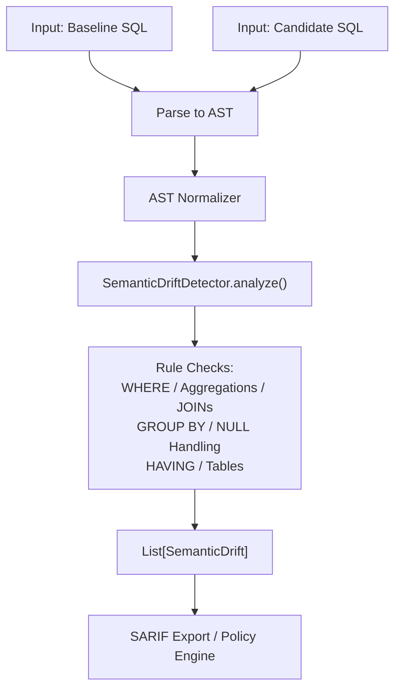
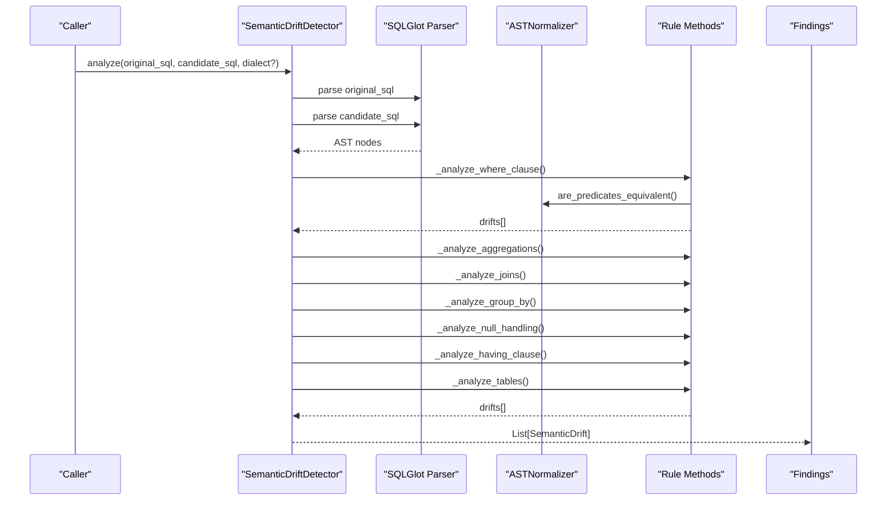
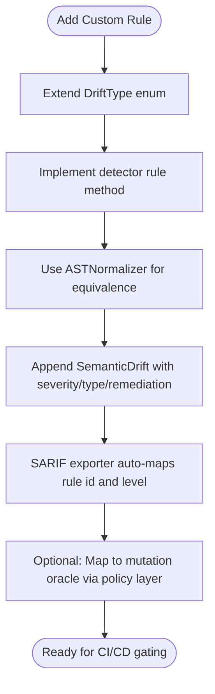
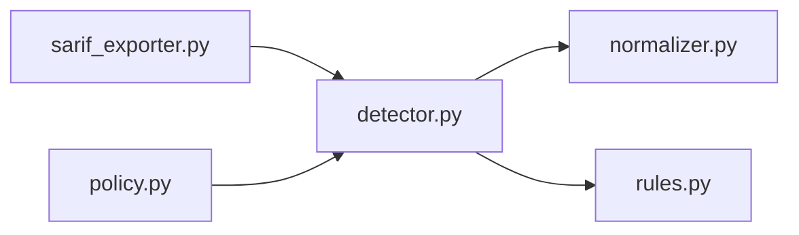

# Semantic Rules System

<cite>
**Referenced Files in This Document**
- [rules.py](file://semantic_reliability/testing/drift/rules.py)
- [detector.py](file://semantic_reliability/testing/drift/detector.py)
- [normalizer.py](file://semantic_reliability/testing/drift/normalizer.py)
- [test_drift_detector.py](file://tests/test_drift_detector.py)
- [sarif_exporter.py](file://semantic_reliability/harness/sarif_exporter.py)
- [policy.py](file://semantic_reliability/firewall/policy.py)
- [models.py](file://semantic_reliability/firewall/models.py)
- [fct_net_revenue_baseline.sql](file://examples/models/fct_net_revenue_baseline.sql)
- [fct_net_revenue_drifted.sql](file://examples/models/fct_net_revenue_drifted.sql)
</cite>

## Table of Contents
1. Introduction
2. Project Structure
3. Core Components
4. Architecture Overview
5. Detailed Component Analysis
6. Dependency Analysis
7. Performance Considerations
8. Troubleshooting Guide
9. Conclusion

## Introduction
This document explains the semantic rules system that detects drift between a baseline SQL query and a candidate SQL query, classifies severity, and maps structural changes to business impact. It covers supported drift categories, severity levels, rule-to-SQL pattern mappings, examples of triggers and remediation guidance, and how to extend the system with custom rules and severities.

## Project Structure
The drift detection logic is implemented as an AST-based analyzer that compares normalized SQL structures across key relational components (filters, aggregations, joins, grouping, null handling, post-aggregation filters, and source tables). The system defines typed enumerations for drift types and severities, and produces structured findings with summaries, details, business impact, and remediation guidance.

**Diagram sources**
- [detector.py:12-46](file://semantic_reliability/testing/drift/detector.py#L12-L46)
- [normalizer.py:9-93](file://semantic_reliability/testing/drift/normalizer.py#L9-L93)
- [sarif_exporter.py:36-65](file://semantic_reliability/harness/sarif_exporter.py#L36-L65)

**Section sources**
- [detector.py:12-46](file://semantic_reliability/testing/drift/detector.py#L12-L46)
- [normalizer.py:9-93](file://semantic_reliability/testing/drift/normalizer.py#L9-L93)

## Core Components
- DriftType enumeration: Defines all supported drift categories detected by the system.
- DriftSeverity enumeration: Defines severity levels used to classify the impact of each drift.
- SemanticDrift model: Structured finding with severity, type, component, summary, details, business impact, snippets, and remediation.
- SemanticDriftDetector: Orchestrates parsing, normalization, and rule checks across SQL components.
- ASTNormalizer: Canonicalizes expressions to avoid false positives from commutative or cosmetic differences.

Key responsibilities:
- Parse both baseline and candidate SQL into ASTs.
- Normalize predicates and expressions for robust comparison.
- Detect specific structural changes and map them to semantic drift types and severities.
- Produce actionable findings including business impact and remediation steps.

**Section sources**
- [rules.py:6-41](file://semantic_reliability/testing/drift/rules.py#L6-L41)
- [detector.py:9-46](file://semantic_reliability/testing/drift/detector.py#L9-L46)
- [normalizer.py:6-93](file://semantic_reliability/testing/drift/normalizer.py#L6-L93)

## Architecture Overview
The detector performs a layered analysis over the SQL AST:

**Diagram sources**
- [detector.py:12-46](file://semantic_reliability/testing/drift/detector.py#L12-L46)
- [normalizer.py:78-93](file://semantic_reliability/testing/drift/normalizer.py#L78-L93)

## Detailed Component Analysis

### DriftType Enumeration
Supported drift categories include:
- FILTER_REMOVAL: All filter constraints removed from WHERE clause.
- FILTER_ADDITION: New filters added to previously unfiltered model.
- SEMANTIC_LOGIC_SHIFT: Filter conditions modified (e.g., changed operators or values).
- AGGREGATION_FUNCTION_SHIFT: Aggregation function changed (e.g., SUM to AVG).
- AGGREGATION_EXPRESSION_SHIFT: Expression inside aggregation changed while function remains same.
- MATHEMATICAL_OPERATOR_SHIFT: Arithmetic operator changed (not directly emitted by current detector; available for extension).
- JOIN_PREDICATE_MUTATION: Join predicate missing on non-CROSS join (cartesian explosion risk).
- JOIN_TYPE_SHIFT: Number of joins changed.
- GRAIN_DRIFT: GROUP BY dimensions changed.
- NULL_HANDLING_DRIFT: COALESCE defaults removed or count reduced.
- HAVING_FILTER_SHIFT: Post-aggregation filter altered or added/removed.
- TABLE_TARGET_SHIFT: Source table lineage changed.

These types are defined centrally and reused across detectors and exporters.

**Section sources**
- [rules.py:15-28](file://semantic_reliability/testing/drift/rules.py#L15-L28)

### DriftSeverity Levels
Severity levels indicate business impact and escalation behavior:
- FATAL: Critical defect that can cause severe metric inflation or duplication; typically blocks execution in strict mode.
- CRITICAL: Significant change to population criteria or reporting grain; requires review or blocking depending on policy.
- HIGH: Meaningful change to aggregation, joins, filters, or source tables; warrants review and potential gating.
- MEDIUM: Moderate change such as reduced null handling; may affect downstream calculations.
- LOW: Minor change with limited impact.
- INFO: Informational observation.

In integration points:
- SARIF export maps severity to tooling levels for consistent reporting.
- Policy engine treats FATAL/CRITICAL as errors that can trigger DENY or REQUIRE_REVIEW decisions.

**Section sources**
- [rules.py:6-13](file://semantic_reliability/testing/drift/rules.py#L6-L13)
- [sarif_exporter.py:36-65](file://semantic_reliability/harness/sarif_exporter.py#L36-L65)
- [policy.py:32-68](file://semantic_reliability/firewall/policy.py#L32-L68)

### Rule-to-SQL Pattern Mapping and Business Impact
- FILTER_REMOVAL (FATAL):
  - Pattern: Baseline has WHERE; candidate lacks WHERE.
  - Impact: Unfiltered data aggregated; massive metric inflation expected.
  - Remediation: Restore population constraints or create dedicated unfiltered model.
  - Example trigger: Removing region/status filters in net revenue model.
  - Section sources
    - [detector.py:54-65](file://semantic_reliability/testing/drift/detector.py#L54-L65)
    - [test_drift_detector.py:17-28](file://tests/test_drift_detector.py#L17-L28)
    - [fct_net_revenue_baseline.sql:1-9](file://examples/models/fct_net_revenue_baseline.sql#L1-L9)
    - [fct_net_revenue_drifted.sql:1-9](file://examples/models/fct_net_revenue_drifted.sql#L1-L9)

- FILTER_ADDITION (HIGH):
  - Pattern: Candidate adds WHERE where baseline had none.
  - Impact: Population restricted; downstream metrics lower than baseline.
  - Remediation: Confirm if filtering is intentional and aligned with business definition.
  - Section sources
    - [detector.py:66-77](file://semantic_reliability/testing/drift/detector.py#L66-L77)

- SEMANTIC_LOGIC_SHIFT (CRITICAL):
  - Pattern: WHERE predicates differ after normalization.
  - Impact: Population criteria changed; dashboards silently include/exclude different entities.
  - Remediation: Verify whether logical criteria change is an approved business metric update.
  - Section sources
    - [detector.py:78-90](file://semantic_reliability/testing/drift/detector.py#L78-L90)
    - [test_drift_detector.py:31-43](file://tests/test_drift_detector.py#L31-L43)

- AGGREGATION_FUNCTION_SHIFT (HIGH):
  - Pattern: Aggregation function type changed (e.g., SUM vs AVG).
  - Impact: Mathematical computation of metric changed.
  - Remediation: Ensure mathematical formula conforms to canonical business metric definition.
  - Section sources
    - [detector.py:99-113](file://semantic_reliability/testing/drift/detector.py#L99-L113)
    - [test_drift_detector.py:46-57](file://tests/test_drift_detector.py#L46-L57)

- AGGREGATION_EXPRESSION_SHIFT (HIGH):
  - Pattern: Same aggregation function but expression payload changed.
  - Impact: Underlying calculation components modified (e.g., CASE statements or amounts).
  - Remediation: Review arithmetic operands and case conditions inside aggregation.
  - Section sources
    - [detector.py:115-129](file://semantic_reliability/testing/drift/detector.py#L115-L129)

- JOIN_PREDICATE_MUTATION (FATAL):
  - Pattern: Non-CROSS join without ON/USING clause.
  - Impact: Cartesian product explosion resulting in duplicate metric counting.
  - Remediation: Add explicit ON clause to join.
  - Section sources
    - [detector.py:150-162](file://semantic_reliability/testing/drift/detector.py#L150-L162)
    - [test_drift_detector.py:74-78](file://tests/test_drift_detector.py#L74-L78)

- JOIN_TYPE_SHIFT (HIGH):
  - Pattern: Number of joins changed.
  - Impact: Table relationships changed; potential fan-out or record loss.
  - Remediation: Verify join cardinality.
  - Section sources
    - [detector.py:139-148](file://semantic_reliability/testing/drift/detector.py#L139-L148)

- GRAIN_DRIFT (CRITICAL):
  - Pattern: GROUP BY dimensions changed.
  - Impact: Output dataset grain changed; downstream dimensional models and BI break.
  - Remediation: Restore required grouping dimensions.
  - Section sources
    - [detector.py:167-186](file://semantic_reliability/testing/drift/detector.py#L167-L186)
    - [test_drift_detector.py:60-71](file://tests/test_drift_detector.py#L60-L71)

- NULL_HANDLING_DRIFT (MEDIUM):
  - Pattern: Reduction in COALESCE usage.
  - Impact: NULL values may propagate to calculations and result in unexpected NULL aggregates.
  - Remediation: Ensure NULL-safe fallbacks are retained.
  - Section sources
    - [detector.py:190-204](file://semantic_reliability/testing/drift/detector.py#L190-L204)

- HAVING_FILTER_SHIFT (HIGH):
  - Pattern: Post-aggregation filter altered or added/removed.
  - Impact: Post-aggregation group retention altered.
  - Remediation: Confirm post-aggregation business thresholds.
  - Section sources
    - [detector.py:207-224](file://semantic_reliability/testing/drift/detector.py#L207-L224)

- TABLE_TARGET_SHIFT (HIGH):
  - Pattern: Source tables changed.
  - Impact: Upstream dependency shifts; metric may read from staging or deprecated tables.
  - Remediation: Verify upstream model lineage and table sources.
  - Section sources
    - [detector.py:227-244](file://semantic_reliability/testing/drift/detector.py#L227-L244)

### Extensibility Model for Custom Rules and Severities
To add new drift categories or severities:
- Extend DriftType with a new enum value in the rules module.
- Optionally extend DriftSeverity if you need additional gradations.
- Implement a new rule method in the detector following existing patterns:
  - Extract relevant AST nodes (e.g., exp.Where, exp.Join, exp.Group).
  - Compare baseline vs candidate using ASTNormalizer for equivalence when appropriate.
  - Append a SemanticDrift with severity, drift_type, component, summary, details, business_impact, snippets, and remediation.
- Integrate with SARIF exporter to ensure new rules appear in reports with proper levels and help text.
- If integrating with runtime governance, consider mapping violations to mutation oracle categories in the policy layer.

**Diagram sources**
- [rules.py:6-28](file://semantic_reliability/testing/drift/rules.py#L6-L28)
- [detector.py:12-46](file://semantic_reliability/testing/drift/detector.py#L12-L46)
- [sarif_exporter.py:36-65](file://semantic_reliability/harness/sarif_exporter.py#L36-L65)
- [policy.py:32-68](file://semantic_reliability/firewall/policy.py#L32-L68)

**Section sources**
- [rules.py:6-28](file://semantic_reliability/testing/drift/rules.py#L6-L28)
- [detector.py:12-46](file://semantic_reliability/testing/drift/detector.py#L12-L46)
- [sarif_exporter.py:36-65](file://semantic_reliability/harness/sarif_exporter.py#L36-L65)
- [policy.py:32-68](file://semantic_reliability/firewall/policy.py#L32-L68)

## Dependency Analysis
The detector depends on:
- sqlglot for parsing and AST traversal.
- ASTNormalizer for canonicalizing expressions and comparing predicates.
- Rules module for shared enums and data model.

Exporters and policy layers consume findings to produce reports and governance decisions.

**Diagram sources**
- [detector.py:1-7](file://semantic_reliability/testing/drift/detector.py#L1-L7)
- [normalizer.py:1-4](file://semantic_reliability/testing/drift/normalizer.py#L1-L4)
- [rules.py:1-5](file://semantic_reliability/testing/drift/rules.py#L1-L5)
- [sarif_exporter.py:36-65](file://semantic_reliability/harness/sarif_exporter.py#L36-L65)
- [policy.py:1-14](file://semantic_reliability/firewall/policy.py#L1-L14)

**Section sources**
- [detector.py:1-7](file://semantic_reliability/testing/drift/detector.py#L1-L7)
- [normalizer.py:1-4](file://semantic_reliability/testing/drift/normalizer.py#L1-L4)
- [rules.py:1-5](file://semantic_reliability/testing/drift/rules.py#L1-L5)

## Performance Considerations
- AST parsing and traversal scale with query complexity; prefer normalizing only necessary nodes.
- Predicate equivalence uses string normalization; keep expressions simple to reduce overhead.
- Avoid excessive find_all scans; reuse parsed ASTs when possible.
- For large corpora, batch analyses and cache normalized forms where feasible.

## Troubleshooting Guide
Common issues and resolutions:
- False positives due to commutative boolean chains:
  - Ensure ASTNormalizer is applied before comparisons; use are_predicates_equivalent for WHERE/HAVING/ON.
  - Section sources
    - [normalizer.py:47-76](file://semantic_reliability/testing/drift/normalizer.py#L47-L76)
    - [normalizer.py:78-93](file://semantic_reliability/testing/drift/normalizer.py#L78-L93)
- Missing join predicates causing cartesian explosions:
  - Treat as FATAL; add explicit ON clauses.
  - Section sources
    - [detector.py:150-162](file://semantic_reliability/testing/drift/detector.py#L150-L162)
- Unexpected grain changes:
  - Restore required GROUP BY dimensions to maintain reporting grain.
  - Section sources
    - [detector.py:167-186](file://semantic_reliability/testing/drift/detector.py#L167-L186)
- Aggregation mismatches:
  - Validate function and expression payloads against canonical definitions.
  - Section sources
    - [detector.py:99-129](file://semantic_reliability/testing/drift/detector.py#L99-L129)
- Integration with reporting tools:
  - Ensure SARIF exporter maps severity correctly and includes remediation help.
  - Section sources
    - [sarif_exporter.py:36-65](file://semantic_reliability/harness/sarif_exporter.py#L36-L65)
- Runtime governance decisions:
  - In strict mode, FATAL/CRITICAL violations block execution; otherwise require review.
  - Section sources
    - [policy.py:32-68](file://semantic_reliability/firewall/policy.py#L32-L68)

## Conclusion
The semantic rules system provides robust, AST-based drift detection across critical SQL components, with clear severity classifications and actionable remediation guidance. By extending the DriftType and DriftSeverity enumerations and implementing new rule methods, teams can tailor detection to their domain needs while leveraging integrated reporting and governance workflows.