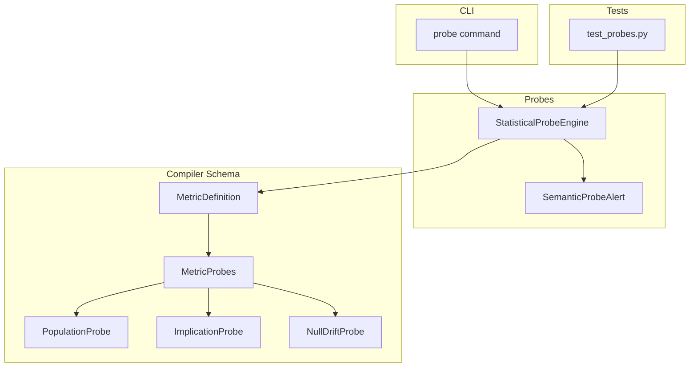
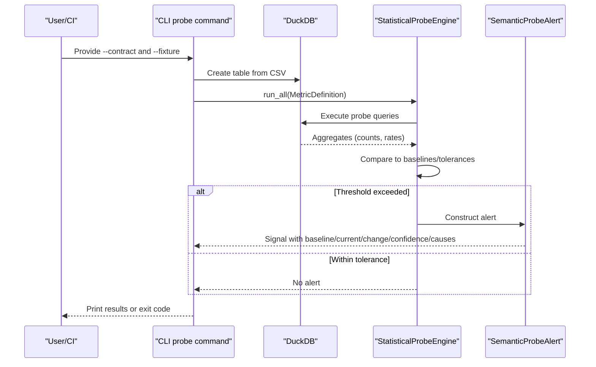
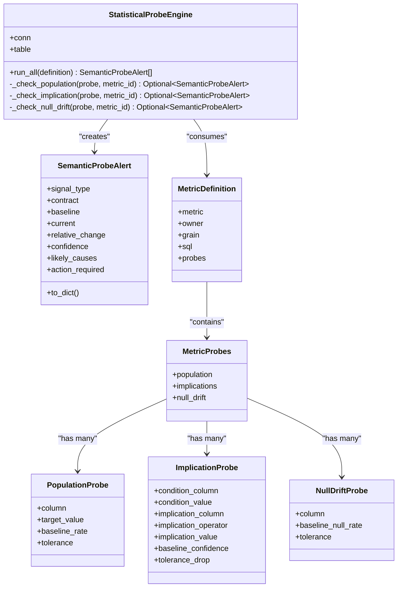
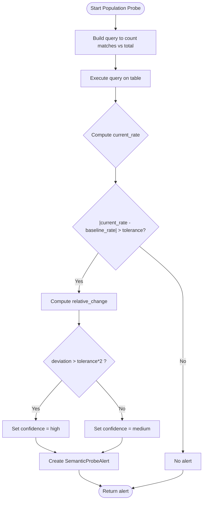
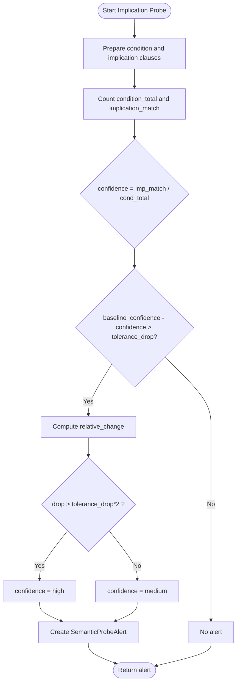
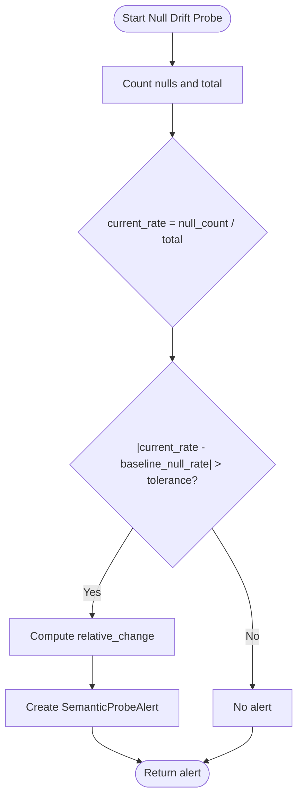
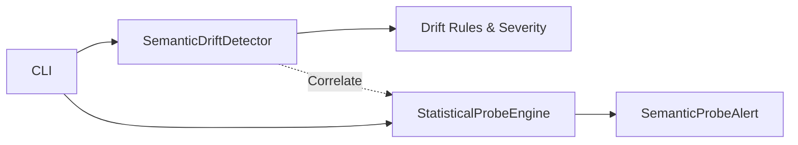

# Statistical Probes

<cite>
**Referenced Files in This Document**
- [engine.py](file://semantic_reliability/probes/engine.py)
- [signals.py](file://semantic_reliability/probes/signals.py)
- [schema.py](file://semantic_reliability/compiler/schema.py)
- [cli.py](file://semantic_reliability/cli.py)
- [test_probes.py](file://tests/test_probes.py)
- [detector.py](file://semantic_reliability/testing/drift/detector.py)
- [rules.py](file://semantic_reliability/testing/drift/rules.py)
</cite>

## Table of Contents
1. [Introduction](#introduction)
2. [Project Structure](#project-structure)
3. [Core Components](#core-components)
4. [Architecture Overview](#architecture-overview)
5. [Detailed Component Analysis](#detailed-component-analysis)
6. [Dependency Analysis](#dependency-analysis)
7. [Performance Considerations](#performance-considerations)
8. [Troubleshooting Guide](#troubleshooting-guide)
9. [Conclusion](#conclusion)
10. [Appendices](#appendices)

## Introduction
This document explains the statistical probes system that validates business logic by executing runtime checks against actual data. Unlike static SQL analysis, which inspects code structure and syntax, statistical probes run queries on live or snapshot data to detect semantic inconsistencies such as distribution shifts, null rate anomalies, and broken business implications. The system is declarative: metric contracts define expected distributions and relationships, and the probe engine executes targeted checks to ensure empirical reality matches those expectations.

Key capabilities include:
- Population distribution checks to detect unexpected proportions of key categories
- Implication checks to validate conditional relationships (e.g., “active implies positive revenue”)
- Null drift monitoring for critical columns
- Structured alert signals with confidence levels and likely causes
- CLI integration to execute probes against fixtures or snapshots
- Integration points with drift detection pipelines for correlation between structural changes and runtime anomalies

## Project Structure
The statistical probes subsystem lives under semantic_reliability/probes and integrates with the compiler schema for metric definitions and the CLI for execution.

**Diagram sources**
- [engine.py:11-38](file://semantic_reliability/probes/engine.py#L11-L38)
- [signals.py:5-17](file://semantic_reliability/probes/signals.py#L5-L17)
- [schema.py:39-69](file://semantic_reliability/compiler/schema.py#L39-L69)
- [cli.py:586-629](file://semantic_reliability/cli.py#L586-L629)
- [test_probes.py:18-28](file://tests/test_probes.py#L18-L28)

**Section sources**
- [engine.py:11-38](file://semantic_reliability/probes/engine.py#L11-L38)
- [signals.py:5-17](file://semantic_reliability/probes/signals.py#L5-L17)
- [schema.py:39-69](file://semantic_reliability/compiler/schema.py#L39-L69)
- [cli.py:586-629](file://semantic_reliability/cli.py#L586-L629)
- [test_probes.py:18-28](file://tests/test_probes.py#L18-L28)

## Core Components
- StatisticalProbeEngine: Executes population, implication, and null drift probes against a DuckDB connection and table. It aggregates alerts into a list of structured signals.
- SemanticProbeAlert: A Pydantic model representing a probe signal with fields for baseline, current, relative change, confidence, and likely causes.
- MetricDefinition and MetricProbes: Declarative configuration for metrics and their associated probes (population, implications, null drift).
- Probe types:
  - PopulationProbe: Validates that a column’s target value occurs at an expected baseline rate within tolerance.
  - ImplicationProbe: Validates that when a condition holds, another attribute satisfies a predicate with expected confidence.
  - NullDriftProbe: Monitors the proportion of nulls in a column against a baseline null rate and tolerance.

Execution flow:
- The CLI loads a metric contract YAML and fixture CSV, registers the CSV as a table in DuckDB, and invokes the engine.
- The engine iterates through each probe type, runs targeted SQL, computes rates/confidence, compares to baselines, and emits alerts if thresholds are exceeded.

**Section sources**
- [engine.py:11-38](file://semantic_reliability/probes/engine.py#L11-L38)
- [signals.py:5-17](file://semantic_reliability/probes/signals.py#L5-L17)
- [schema.py:39-69](file://semantic_reliability/compiler/schema.py#L39-L69)
- [cli.py:586-629](file://semantic_reliability/cli.py#L586-L629)

## Architecture Overview
The probes system complements static drift detection. While drift detection analyzes AST-level changes between baseline and candidate SQL, probes validate runtime behavior against declared expectations. Together they provide a two-layer safety net: structural integrity plus empirical sanity.

**Diagram sources**
- [cli.py:586-629](file://semantic_reliability/cli.py#L586-L629)
- [engine.py:18-38](file://semantic_reliability/probes/engine.py#L18-L38)
- [signals.py:5-17](file://semantic_reliability/probes/signals.py#L5-L17)

## Detailed Component Analysis

### StatisticalProbeEngine
Responsibilities:
- Orchestrate probe execution across three categories: population, implication, null drift.
- Build and execute SQL queries against the configured table.
- Compute observed rates and compare to baselines using tolerances.
- Emit SemanticProbeAlert instances when deviations exceed thresholds.

Key behaviors:
- Population probe: Computes the proportion of rows matching a target value and flags if deviation exceeds tolerance. Confidence is set based on how far beyond tolerance the deviation lies.
- Implication probe: Computes P(implication | condition) and flags if it drops below baseline_confidence minus tolerance_drop.
- Null drift probe: Computes null rate and flags if absolute deviation from baseline_null_rate exceeds tolerance.

Error handling:
- Each probe method catches exceptions and logs errors without failing the entire run, returning None when issues occur.

**Section sources**
- [engine.py:11-38](file://semantic_reliability/probes/engine.py#L11-L38)
- [engine.py:40-71](file://semantic_reliability/probes/engine.py#L40-L71)
- [engine.py:73-110](file://semantic_reliability/probes/engine.py#L73-L110)
- [engine.py:112-137](file://semantic_reliability/probes/engine.py#L112-L137)

#### Class Diagram

**Diagram sources**
- [engine.py:11-38](file://semantic_reliability/probes/engine.py#L11-L38)
- [signals.py:5-17](file://semantic_reliability/probes/signals.py#L5-L17)
- [schema.py:39-69](file://semantic_reliability/compiler/schema.py#L39-L69)

### Signals: SemanticProbeAlert
Purpose:
- Encapsulates a probe result as a structured signal suitable for reporting, storage, and downstream processing.

Fields:
- signal_type: Identifies the kind of anomaly (e.g., population rate shift, null rate shift, implication decay).
- contract: Associates the signal with a specific metric definition.
- baseline/current: Observed vs expected values.
- relative_change: Percentage change from baseline.
- confidence: Qualitative assessment (“high”, “medium”, “low”).
- likely_causes: Human-readable hypotheses for root cause.
- action_required: Default guidance for next steps.

Usage:
- Returned by the engine when thresholds are exceeded; consumed by CLI for display and potential CI gating.

**Section sources**
- [signals.py:5-17](file://semantic_reliability/probes/signals.py#L5-L17)

### Configuration: MetricDefinition and MetricProbes
Declarative configuration enables domain-specific validations without custom code per check.

- MetricDefinition includes metadata like metric name, owner, grain, canonical SQL, and optional probes.
- MetricProbes groups three probe families:
  - population: One or more PopulationProbe entries
  - implications: One or more ImplicationProbe entries
  - null_drift: One or more NullDriftProbe entries

Probe parameters:
- PopulationProbe: column, target_value, baseline_rate, tolerance
- ImplicationProbe: condition_column, condition_value, implication_column, implication_operator, implication_value, baseline_confidence, tolerance_drop
- NullDriftProbe: column, baseline_null_rate, tolerance

These models are validated via Pydantic and used by the engine to generate SQL and compute statistics.

**Section sources**
- [schema.py:39-69](file://semantic_reliability/compiler/schema.py#L39-L69)
- [schema.py:83-98](file://semantic_reliability/compiler/schema.py#L83-L98)

### CLI Integration: probe command
The CLI provides a user-friendly entry point to run probes:
- Loads a metric contract YAML and fixture CSV
- Creates an in-memory DuckDB instance and registers the CSV as a table
- Invokes StatisticalProbeEngine.run_all with the parsed MetricDefinition
- Prints alerts with severity coloring and exits with appropriate codes

Example usage patterns:
- Validate a metric against a sample dataset
- Gate CI pipelines by failing on critical probe signals

**Section sources**
- [cli.py:586-629](file://semantic_reliability/cli.py#L586-L629)
- [test_probes.py:153-184](file://tests/test_probes.py#L153-L184)

### Built-in Probe Types and Detection Logic

#### Population Rate Shift
Detects when the proportion of rows matching a target value deviates from the expected baseline beyond tolerance.

**Diagram sources**
- [engine.py:40-71](file://semantic_reliability/probes/engine.py#L40-L71)

**Section sources**
- [engine.py:40-71](file://semantic_reliability/probes/engine.py#L40-L71)

#### Implication Decay
Validates conditional relationships (P(B|A)) and alerts when confidence drops below baseline_confidence minus tolerance_drop.

**Diagram sources**
- [engine.py:73-110](file://semantic_reliability/probes/engine.py#L73-L110)

**Section sources**
- [engine.py:73-110](file://semantic_reliability/probes/engine.py#L73-L110)

#### Null Drift
Monitors the proportion of nulls in a column and alerts when the absolute deviation from baseline_null_rate exceeds tolerance.

**Diagram sources**
- [engine.py:112-137](file://semantic_reliability/probes/engine.py#L112-L137)

**Section sources**
- [engine.py:112-137](file://semantic_reliability/probes/engine.py#L112-L137)

### Example Scenarios and Tests
The test suite demonstrates typical scenarios:
- Healthy population: no alert when observed rate is within tolerance
- Drifted population: alert triggered when observed rate significantly differs from baseline
- Implication decay: alert when conditional relationship weakens
- Null drift: alert when null rate increases beyond tolerance
- CLI invocation: end-to-end execution with YAML contract and CSV fixture

These tests validate both the engine logic and the CLI interface.

**Section sources**
- [test_probes.py:18-28](file://tests/test_probes.py#L18-L28)
- [test_probes.py:31-80](file://tests/test_probes.py#L31-L80)
- [test_probes.py:82-119](file://tests/test_probes.py#L82-L119)
- [test_probes.py:121-151](file://tests/test_probes.py#L121-L151)
- [test_probes.py:153-184](file://tests/test_probes.py#L153-L184)

## Dependency Analysis
The probes system depends on:
- Compiler schema for metric and probe definitions
- DuckDB for query execution against fixtures or snapshots
- CLI for orchestration and reporting
- Tests for validation and examples

Integration with drift detection:
- Static drift detection analyzes SQL AST differences and produces SemanticDrift objects with severity and remediation guidance.
- Probes complement this by validating runtime behavior against declared expectations.
- Correlation strategy:
  - If drift detection reports structural changes (e.g., filter removal), correlate with probe alerts indicating distribution shifts or null drift.
  - Use probe alerts to confirm whether structural changes have materialized into empirical anomalies.

**Diagram sources**
- [detector.py:9-46](file://semantic_reliability/testing/drift/detector.py#L9-L46)
- [rules.py:6-41](file://semantic_reliability/testing/drift/rules.py#L6-L41)
- [engine.py:11-38](file://semantic_reliability/probes/engine.py#L11-L38)
- [cli.py:586-629](file://semantic_reliability/cli.py#L586-L629)

**Section sources**
- [detector.py:9-46](file://semantic_reliability/testing/drift/detector.py#L9-L46)
- [rules.py:6-41](file://semantic_reliability/testing/drift/rules.py#L6-L41)
- [engine.py:11-38](file://semantic_reliability/probes/engine.py#L11-L38)
- [cli.py:586-629](file://semantic_reliability/cli.py#L586-L629)

## Performance Considerations
- Execution model: Probes run simple COUNT-based aggregations over the configured table. For large datasets, consider:
  - Sampling strategies: Register a sampled subset of the table to reduce query time during development or CI.
  - Indexing: Ensure relevant columns are indexed in production warehouses to speed up counts and filters.
- Tolerance tuning: Adjust tolerances to balance sensitivity and false positives. Tight tolerances increase alert frequency; loose tolerances may miss subtle shifts.
- Batch execution: When evaluating multiple metrics, reuse the same DuckDB connection and table registration to minimize overhead.
- Error isolation: Exceptions in individual probes are logged and do not halt the entire run, enabling partial results even when some checks fail.

[No sources needed since this section provides general guidance]

## Troubleshooting Guide
Common issues and resolutions:
- Probe failures due to missing columns or malformed data:
  - Check that the fixture CSV contains all required columns referenced by probes.
  - Verify table_name matches the registered table in DuckDB.
- Unexpected alerts:
  - Review baseline_rate, baseline_confidence, and baseline_null_rate to ensure they reflect historical norms.
  - Adjust tolerance or tolerance_drop if the environment naturally varies more than expected.
- CLI exit codes:
  - The probe command prints detailed panels for each alert and can be integrated into CI to block on critical signals.

Diagnostic tips:
- Inspect the generated SQL implicitly executed by probes by temporarily logging or printing queries in development builds.
- Use tests as templates to construct minimal fixtures that reproduce issues.

**Section sources**
- [engine.py:69-71](file://semantic_reliability/probes/engine.py#L69-L71)
- [engine.py:108-110](file://semantic_reliability/probes/engine.py#L108-L110)
- [engine.py:135-137](file://semantic_reliability/probes/engine.py#L135-L137)
- [cli.py:609-629](file://semantic_reliability/cli.py#L609-L629)

## Conclusion
The statistical probes system provides a robust mechanism to validate business logic against real data, catching semantic inconsistencies that static analysis alone cannot detect. By combining declarative configurations, targeted runtime checks, and structured alerts, teams can maintain confidence in their metrics as data sources evolve. Integrated with CLI workflows and complementary to drift detection, probes enable proactive detection of upstream changes and data quality issues.

[No sources needed since this section summarizes without analyzing specific files]

## Appendices

### Configuration Options Summary
- PopulationProbe:
  - column: Target column to evaluate
  - target_value: Expected value or NULL check
  - baseline_rate: Expected proportion (0.0–1.0)
  - tolerance: Absolute deviation threshold
- ImplicationProbe:
  - condition_column, condition_value: Antecedent filter
  - implication_column, implication_operator, implication_value: Consequent predicate
  - baseline_confidence: Expected P(consequent | antecedent)
  - tolerance_drop: Allowed drop in confidence
- NullDriftProbe:
  - column: Column to monitor for nulls
  - baseline_null_rate: Expected null proportion
  - tolerance: Absolute deviation threshold

**Section sources**
- [schema.py:39-69](file://semantic_reliability/compiler/schema.py#L39-L69)

### Custom Probe Implementation Guidance
To implement a custom probe:
- Define a new probe model in the schema module with necessary fields and defaults.
- Extend MetricProbes to include the new probe family.
- Add a corresponding check method in StatisticalProbeEngine that:
  - Builds a query to compute the desired statistic
  - Compares against baseline and tolerance
  - Emits a SemanticProbeAlert when thresholds are exceeded
- Update CLI or harness to discover and execute the new probe type.

Ensure tests cover healthy and drifted scenarios to validate behavior.

**Section sources**
- [schema.py:39-69](file://semantic_reliability/compiler/schema.py#L39-L69)
- [engine.py:11-38](file://semantic_reliability/probes/engine.py#L11-L38)
- [signals.py:5-17](file://semantic_reliability/probes/signals.py#L5-L17)