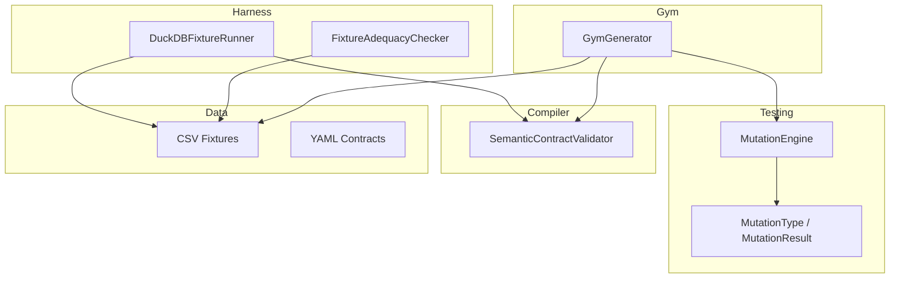
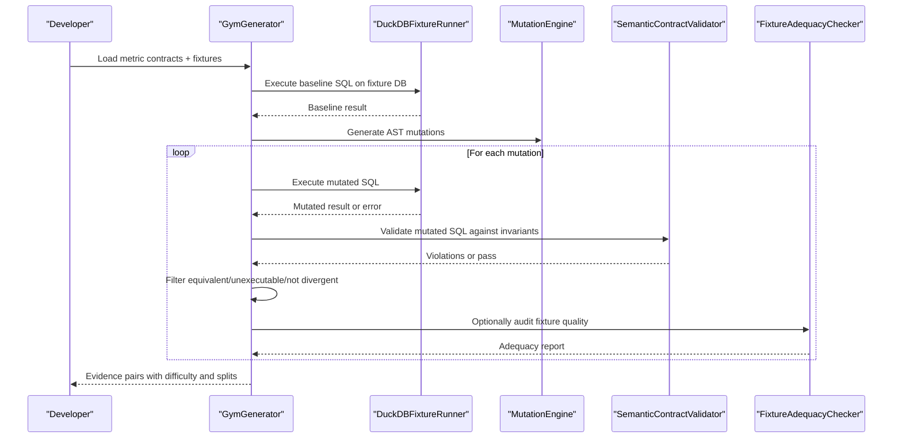
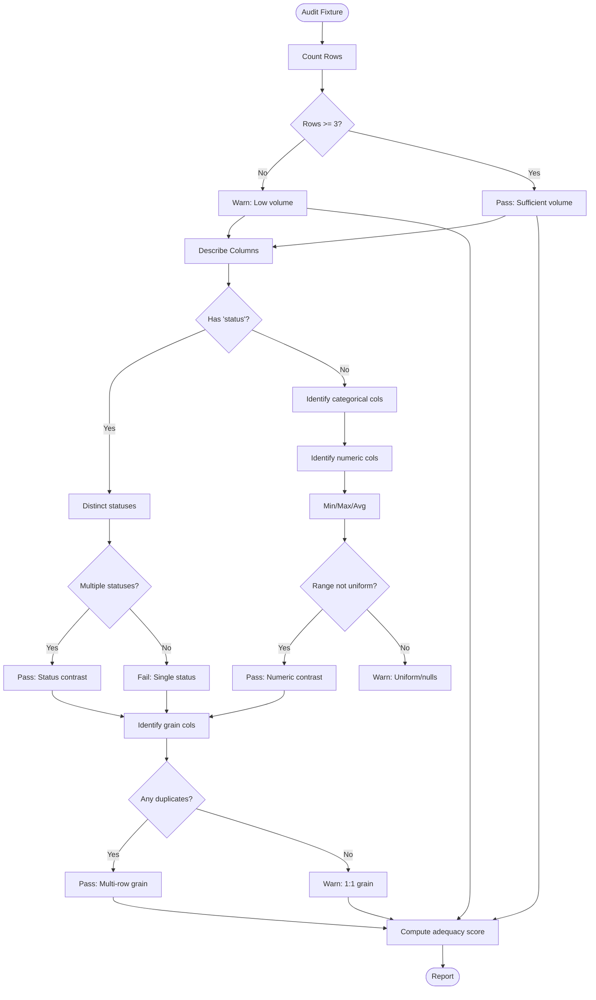
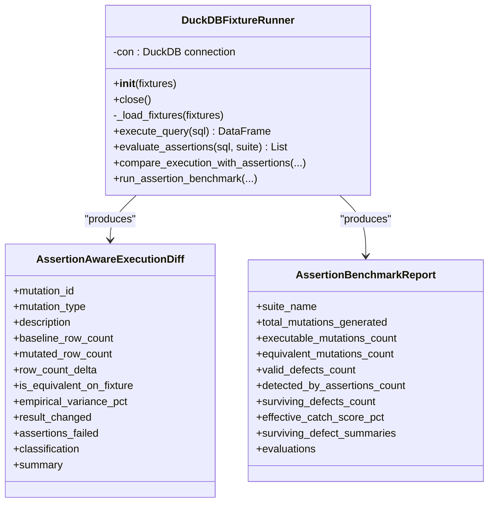
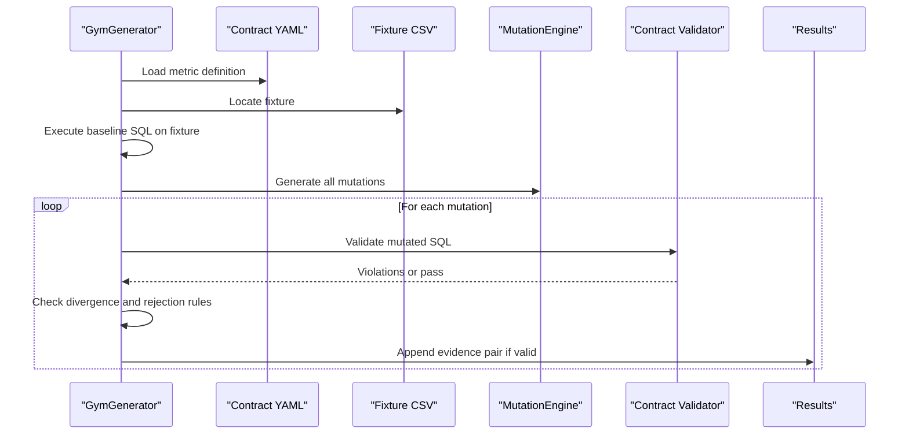
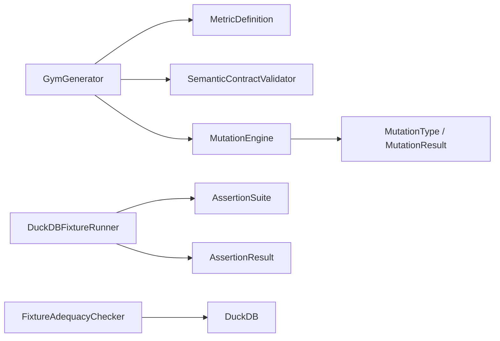

# Fixtures and Data Management

<cite>
**Referenced Files in This Document**
- [fixture_adequacy.py](file://semantic_reliability/harness/fixture_adequacy.py)
- [duckdb_runner.py](file://semantic_reliability/harness/duckdb_runner.py)
- [generator.py](file://semantic_reliability/gym/generator.py)
- [engine.py](file://semantic_reliability/testing/mutations/engine.py)
- [mutators.py](file://semantic_reliability/testing/mutations/mutators.py)
- [contracts.py](file://semantic_reliability/compiler/contracts.py)
- [DATASET_CARD.md](file://datasets/DATASET_CARD.md)
- [transactions.csv](file://examples/fixtures/transactions.csv)
- [test_fixture_adequacy.py](file://tests/test_fixture_adequacy.py)
- [scaffold_corpus.py](file://scripts/scaffold_corpus.py)
- [scaffold_holdout_corpus.py](file://scripts/scaffold_holdout_corpus.py)
</cite>

## Table of Contents
1. [Introduction](#introduction)
2. [Project Structure](#project-structure)
3. [Core Components](#core-components)
4. [Architecture Overview](#architecture-overview)
5. [Detailed Component Analysis](#detailed-component-analysis)
6. [Dependency Analysis](#dependency-analysis)
7. [Performance Considerations](#performance-considerations)
8. [Troubleshooting Guide](#troubleshooting-guide)
9. [Conclusion](#conclusion)
10. [Appendices](#appendices)

## Introduction
This document explains how the repository manages fixtures and test data to evaluate SQL-based metrics reliably. It covers:
- A fixture adequacy assessment system that measures whether a dataset is rich enough to expose semantic defects.
- DuckDB integration for embedded, in-memory database testing and fast data manipulation.
- Test data generation patterns, seeding strategies, and mock data creation techniques used across the codebase.
- Guidance on maintaining realistic datasets, versioning fixtures alongside contracts, and managing fixture lifecycles.
- Performance considerations for large datasets and strategies to optimize test execution speed.

## Project Structure
The fixture and data management features are primarily implemented under:
- Harness layer: DuckDB runner and fixture adequacy checker
- Gym layer: Generator that builds preference pairs using fixtures and contract validation
- Testing mutations: AST-level mutation engine and mutation types
- Compiler: Contract validator enforcing semantic invariants
- Scripts: Corpus scaffolding tools that generate fixtures and metadata
- Examples and corpus: CSV fixtures and YAML contracts

**Diagram sources**
- [duckdb_runner.py:56-114](file://semantic_reliability/harness/duckdb_runner.py#L56-L114)
- [fixture_adequacy.py:24-152](file://semantic_reliability/harness/fixture_adequacy.py#L24-L152)
- [generator.py:26-202](file://semantic_reliability/gym/generator.py#L26-L202)
- [engine.py:8-52](file://semantic_reliability/testing/mutations/engine.py#L8-L52)
- [mutators.py:8-27](file://semantic_reliability/testing/mutations/mutators.py#L8-L27)
- [contracts.py:26-135](file://semantic_reliability/compiler/contracts.py#L26-L135)

**Section sources**
- [duckdb_runner.py:56-114](file://semantic_reliability/harness/duckdb_runner.py#L56-L114)
- [fixture_adequacy.py:24-152](file://semantic_reliability/harness/fixture_adequacy.py#L24-L152)
- [generator.py:26-202](file://semantic_reliability/gym/generator.py#L26-L202)
- [engine.py:8-52](file://semantic_reliability/testing/mutations/engine.py#L8-L52)
- [mutators.py:8-27](file://semantic_reliability/testing/mutations/mutators.py#L8-L27)
- [contracts.py:26-135](file://semantic_reliability/compiler/contracts.py#L26-L135)

## Core Components
- FixtureAdequacyChecker: Audits fixture tables for volume, categorical contrast, numerical distribution, and grain multiplicity to compute an adequacy score.
- DuckDBFixtureRunner: Loads fixtures into an in-memory DuckDB, executes baseline and mutated SQL, compares outputs, evaluates assertions, and classifies mutation outcomes.
- GymGenerator: Discovers metric contracts and associated fixtures, validates baseline SQL, generates AST mutations, filters equivalent or unexecutable cases, and produces evidence pairs with difficulty and split assignments.
- SemanticContractValidator: Enforces population, grain, aggregation, and timezone invariants declared in metric contracts.
- MutationEngine/MutationType: Produces precise AST-level mutations (filter drops, boundary shifts, aggregation swaps, join predicate drops, grain drops, coalesce bypasses, math operator inversions).

Key responsibilities:
- Ensure fixtures provide sufficient contrast to detect semantic defects.
- Provide fast, deterministic evaluation using DuckDB.
- Generate high-quality training/validation/holdout examples grounded by contracts and fixtures.
- Maintain strict separation between chosen (contract-compliant) and rejected (defective) SQL variants.

**Section sources**
- [fixture_adequacy.py:6-22](file://semantic_reliability/harness/fixture_adequacy.py#L6-L22)
- [fixture_adequacy.py:24-152](file://semantic_reliability/harness/fixture_adequacy.py#L24-L152)
- [duckdb_runner.py:14-54](file://semantic_reliability/harness/duckdb_runner.py#L14-L54)
- [duckdb_runner.py:56-256](file://semantic_reliability/harness/duckdb_runner.py#L56-L256)
- [generator.py:26-202](file://semantic_reliability/gym/generator.py#L26-L202)
- [contracts.py:26-135](file://semantic_reliability/compiler/contracts.py#L26-L135)
- [engine.py:8-269](file://semantic_reliability/testing/mutations/engine.py#L8-L269)
- [mutators.py:8-27](file://semantic_reliability/testing/mutations/mutators.py#L8-L27)

## Architecture Overview
The system composes several layers to ensure robust fixture-driven testing:

**Diagram sources**
- [generator.py:34-202](file://semantic_reliability/gym/generator.py#L34-L202)
- [duckdb_runner.py:102-206](file://semantic_reliability/harness/duckdb_runner.py#L102-L206)
- [engine.py:16-52](file://semantic_reliability/testing/mutations/engine.py#L16-L52)
- [contracts.py:29-135](file://semantic_reliability/compiler/contracts.py#L29-L135)
- [fixture_adequacy.py:27-152](file://semantic_reliability/harness/fixture_adequacy.py#L27-L152)

## Detailed Component Analysis

### Fixture Adequacy Assessment System
The adequacy checker inspects a table to determine if it can expose meaningful differences when SQL is mutated. It evaluates:
- Dataset volume: Warns if too few rows risk accidental equivalence.
- Status contrast: Ensures multiple status values exist to catch filter drop bugs.
- Categorical boundary contrast: Checks multi-value columns like region/type/category/channel.
- Numerical distribution contrast: Verifies non-uniform numeric ranges to detect aggregation swaps.
- Multi-row grain multiplicity: Confirms grouping keys have multiple rows to detect grain drops.

It returns a structured report with per-check status and impact, plus an overall adequacy percentage and a boolean threshold for “adequate.”

**Diagram sources**
- [fixture_adequacy.py:27-152](file://semantic_reliability/harness/fixture_adequacy.py#L27-L152)

**Section sources**
- [fixture_adequacy.py:6-22](file://semantic_reliability/harness/fixture_adequacy.py#L6-L22)
- [fixture_adequacy.py:27-152](file://semantic_reliability/harness/fixture_adequacy.py#L27-L152)
- [test_fixture_adequacy.py:6-43](file://tests/test_fixture_adequacy.py#L6-L43)

### DuckDB Integration for Embedded Database Testing
DuckDBFixtureRunner provides:
- In-memory database setup with automatic loading of CSV fixtures or default sample data.
- Query execution returning Pandas DataFrames or errors.
- Assertion-aware comparison of baseline vs mutated SQL, computing row deltas, empirical variance, and classification (equivalent, runtime error, detected defect, surviving defect).
- Benchmarking over many mutations with aggregated metrics and summaries.

**Diagram sources**
- [duckdb_runner.py:14-54](file://semantic_reliability/harness/duckdb_runner.py#L14-L54)
- [duckdb_runner.py:56-256](file://semantic_reliability/harness/duckdb_runner.py#L56-L256)

**Section sources**
- [duckdb_runner.py:56-114](file://semantic_reliability/harness/duckdb_runner.py#L56-L114)
- [duckdb_runner.py:116-206](file://semantic_reliability/harness/duckdb_runner.py#L116-L206)
- [duckdb_runner.py:208-256](file://semantic_reliability/harness/duckdb_runner.py#L208-L256)

### Test Data Generation Patterns and Seeding Strategies
- Contract-first design: Each metric has a YAML contract describing semantics, dialect, and invariants. The generator loads these contracts and locates matching CSV fixtures.
- Fixture discovery: If a named CSV does not exist, any CSV in the same directory is used; otherwise synthetic defaults are applied.
- Baseline validation: The baseline SQL must execute successfully and produce non-empty results; otherwise the example is rejected.
- Mutation generation: AST-level mutations are injected via MutationEngine, producing diverse logical defects.
- Rejection gates: Equivalent-on-fixture, unexecutable, identical pairs, and unresolved preferences are filtered out. Only semantically divergent, contract-violating pairs are retained.
- Split assignment: Deterministic hashing assigns metrics to train/validation/holdout; mutation types are further restricted per split to prevent leakage.

**Diagram sources**
- [generator.py:34-202](file://semantic_reliability/gym/generator.py#L34-L202)
- [engine.py:16-52](file://semantic_reliability/testing/mutations/engine.py#L16-L52)
- [contracts.py:29-135](file://semantic_reliability/compiler/contracts.py#L29-L135)

**Section sources**
- [generator.py:34-202](file://semantic_reliability/gym/generator.py#L34-L202)
- [engine.py:16-52](file://semantic_reliability/testing/mutations/engine.py#L16-L52)
- [contracts.py:29-135](file://semantic_reliability/compiler/contracts.py#L29-L135)
- [DATASET_CARD.md:9-21](file://datasets/DATASET_CARD.md#L9-L21)

### Mock Data Creation Techniques
- Default fallback: When no CSV is provided, DuckDBFixtureRunner creates a small sample table with representative columns and values to enable quick runs.
- Scaffolded fixtures: Scripts generate CSV files alongside contracts and schemas for reproducibility.
- Synthetic diversity: Generated fixtures include varied statuses, regions, amounts, and timestamps to support contrast checks.

**Section sources**
- [duckdb_runner.py:79-100](file://semantic_reliability/harness/duckdb_runner.py#L79-L100)
- [scaffold_corpus.py:273-307](file://scripts/scaffold_corpus.py#L273-L307)
- [scaffold_holdout_corpus.py:229-263](file://scripts/scaffold_holdout_corpus.py#L229-L263)

### Maintaining Realistic Test Datasets
- Include multiple categories and statuses to expose filter and boundary mutations.
- Ensure numeric columns span ranges to detect aggregation swaps.
- Provide multi-row grain keys to reveal grouping key omissions.
- Keep fixtures aligned with contracts and schema definitions to avoid drift.

**Section sources**
- [fixture_adequacy.py:67-142](file://semantic_reliability/harness/fixture_adequacy.py#L67-L142)
- [transactions.csv:1-12](file://examples/fixtures/transactions.csv#L1-L12)

### Data Versioning and Fixture Lifecycle Management
- Co-location: Each metric’s contract YAML lives next to its model SQL and fixture CSV, enabling clear lineage.
- Scaffolding scripts: Generate consistent structures (model SQL, contract YAML, fixture CSV, schema.yml, semantic assertions YAML) to standardize lifecycle steps.
- Holdout separation: Frozen holdout models ensure evaluation integrity and prevent leakage during development.

**Section sources**
- [scaffold_corpus.py:273-307](file://scripts/scaffold_corpus.py#L273-L307)
- [scaffold_holdout_corpus.py:229-263](file://scripts/scaffold_holdout_corpus.py#L229-L263)
- [DATASET_CARD.md:12-21](file://datasets/DATASET_CARD.md#L12-L21)

## Dependency Analysis
The components interact through well-defined interfaces:
- GymGenerator depends on MetricDefinition (from compiler/schema), SemanticContractValidator, and MutationEngine.
- DuckDBFixtureRunner depends on AssertionSuite and AssertionResult from the assertions layer.
- FixtureAdequacyChecker depends on DuckDB for querying fixture tables.
- MutationEngine uses sqlglot to manipulate AST nodes and emits MutationResult objects typed by MutationType.

**Diagram sources**
- [generator.py:11-21](file://semantic_reliability/gym/generator.py#L11-L21)
- [duckdb_runner.py:9-11](file://semantic_reliability/harness/duckdb_runner.py#L9-L11)
- [fixture_adequacy.py:1-3](file://semantic_reliability/harness/fixture_adequacy.py#L1-L3)
- [engine.py:1-5](file://semantic_reliability/testing/mutations/engine.py#L1-L5)
- [mutators.py:1-5](file://semantic_reliability/testing/mutations/mutators.py#L1-L5)

**Section sources**
- [generator.py:11-21](file://semantic_reliability/gym/generator.py#L11-L21)
- [duckdb_runner.py:9-11](file://semantic_reliability/harness/duckdb_runner.py#L9-L11)
- [fixture_adequacy.py:1-3](file://semantic_reliability/harness/fixture_adequacy.py#L1-L3)
- [engine.py:1-5](file://semantic_reliability/testing/mutations/engine.py#L1-L5)
- [mutators.py:1-5](file://semantic_reliability/testing/mutations/mutators.py#L1-L5)

## Performance Considerations
- In-memory execution: DuckDBFixtureRunner uses an in-memory database for fast iteration without disk I/O overhead.
- Minimal fixtures: Default sample tables keep tests lightweight; larger fixtures should be curated to balance realism and speed.
- Early rejection: GymGenerator rejects equivalent or unexecutable mutations quickly to reduce execution time.
- Assertion suites: Use targeted structural assertions to catch defects early without heavy computation.
- Split gating: Restrict mutation types per split to limit unnecessary evaluations and prevent cross-contamination.

[No sources needed since this section provides general guidance]

## Troubleshooting Guide
Common issues and resolutions:
- Runtime errors in queries: The runner classifies mutations causing runtime errors and reports them clearly; inspect the error message and fix syntax or schema mismatches.
- Equivalent-on-fixture outcomes: Indicates insufficient fixture contrast; add more diverse values (statuses, regions, amounts) to expose defects.
- Unexecutable mutations: Often due to missing columns or incompatible dialect; align fixtures with contract schema and dialect settings.
- Contract violations: Review invariant rules (population filters, grain dimensions, aggregation components, timezone constraints) and adjust SQL accordingly.
- Insufficient fixture contrast: Run the adequacy checker to identify weak areas (e.g., single status value, uniform numerics) and enrich the dataset.

**Section sources**
- [duckdb_runner.py:128-144](file://semantic_reliability/harness/duckdb_runner.py#L128-L144)
- [generator.py:107-148](file://semantic_reliability/gym/generator.py#L107-L148)
- [contracts.py:44-127](file://semantic_reliability/compiler/contracts.py#L44-L127)
- [fixture_adequacy.py:48-142](file://semantic_reliability/harness/fixture_adequacy.py#L48-L142)

## Conclusion
The repository implements a comprehensive fixture-driven testing framework that combines:
- Rigorous fixture adequacy assessment to ensure datasets can expose semantic defects.
- Fast, deterministic evaluation using DuckDB for in-memory execution.
- AST-level mutation generation and contract-based validation to produce high-quality preference pairs.
- Clear separation of development and holdout corpora to maintain evaluation integrity.

By following the patterns and guidelines here, teams can maintain realistic, versioned fixtures, optimize test performance, and improve confidence in SQL-based metric reliability.

[No sources needed since this section summarizes without analyzing specific files]

## Appendices

### Appendix A: Example Fixture File
- Sample transactions fixture demonstrates typical columns and values used for testing.

**Section sources**
- [transactions.csv:1-12](file://examples/fixtures/transactions.csv#L1-L12)

### Appendix B: Scaffolding Workflow
- Scripts generate standardized project structures including model SQL, contracts, fixtures, schemas, and assertions for both dev and holdout corpora.

**Section sources**
- [scaffold_corpus.py:273-307](file://scripts/scaffold_corpus.py#L273-L307)
- [scaffold_holdout_corpus.py:229-263](file://scripts/scaffold_holdout_corpus.py#L229-L263)