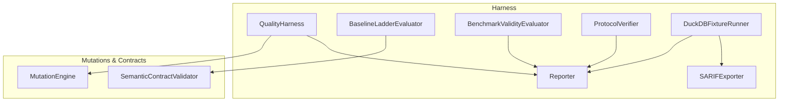
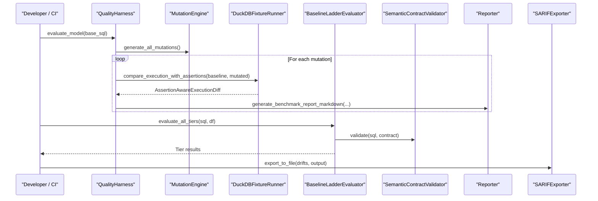
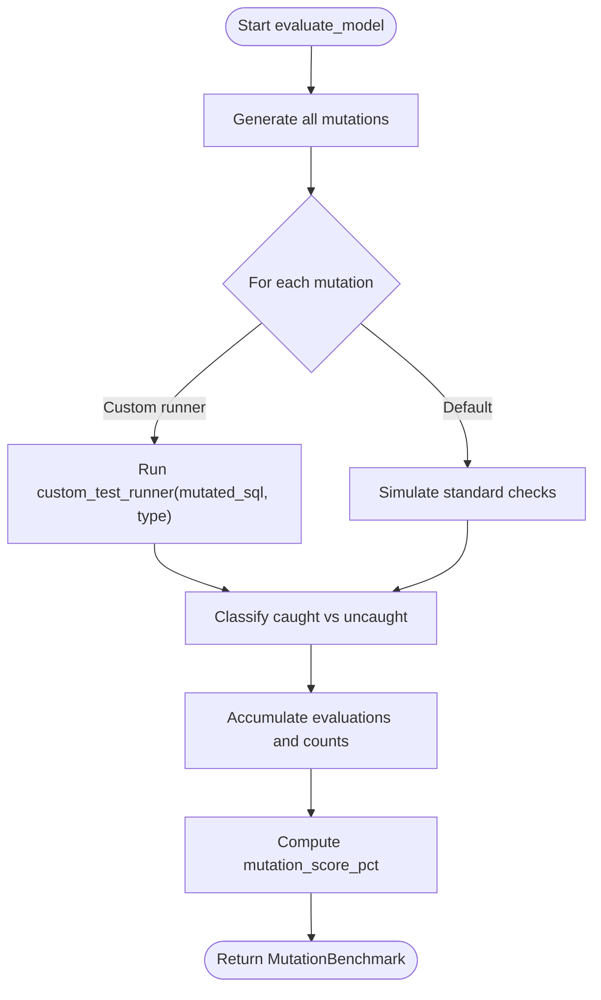
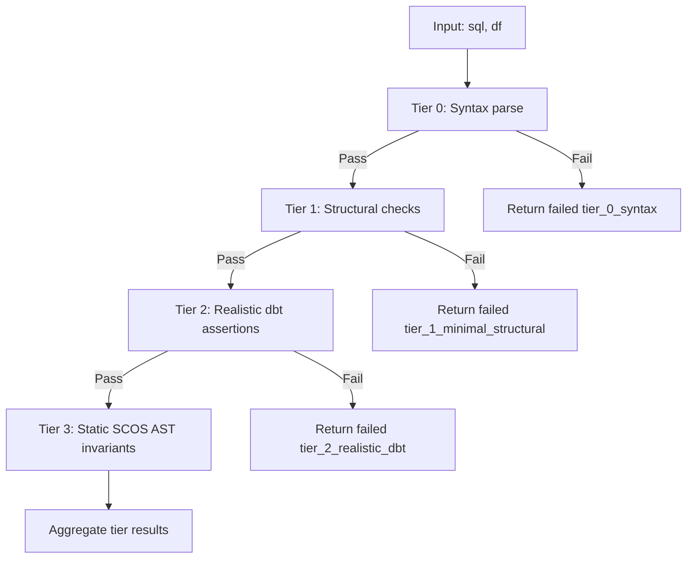
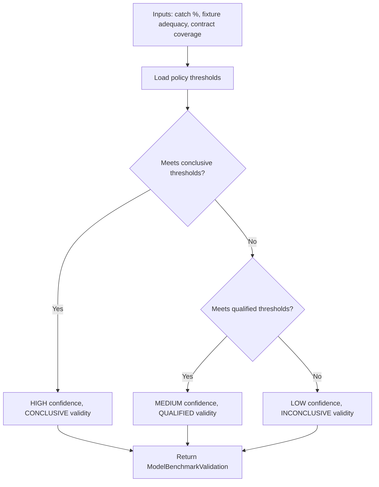
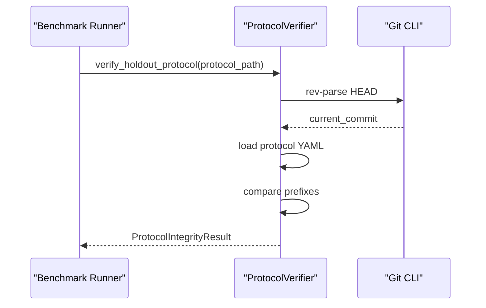
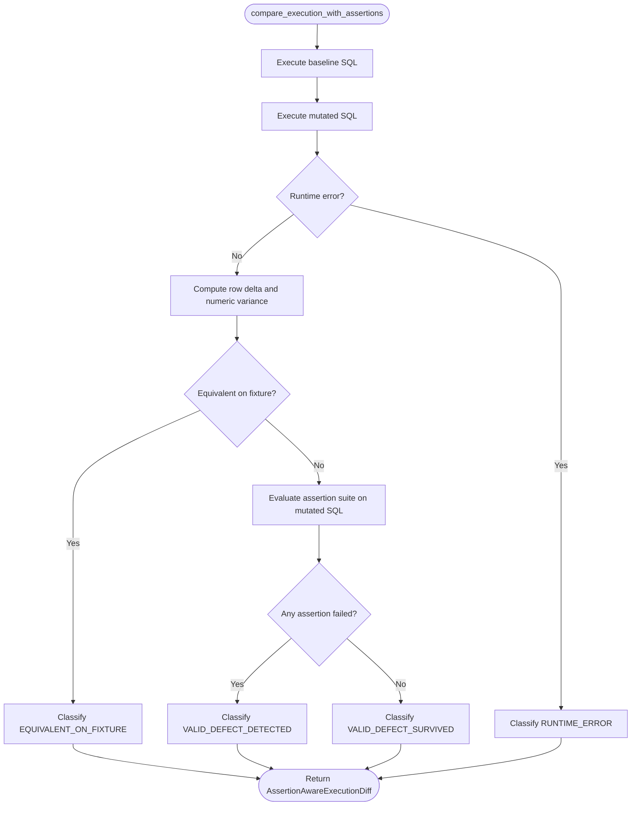
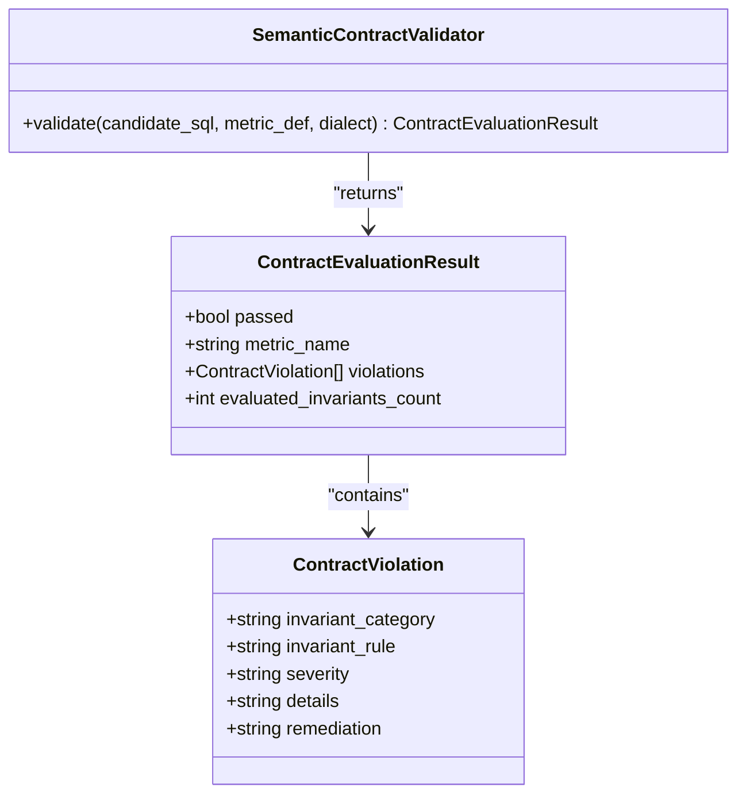
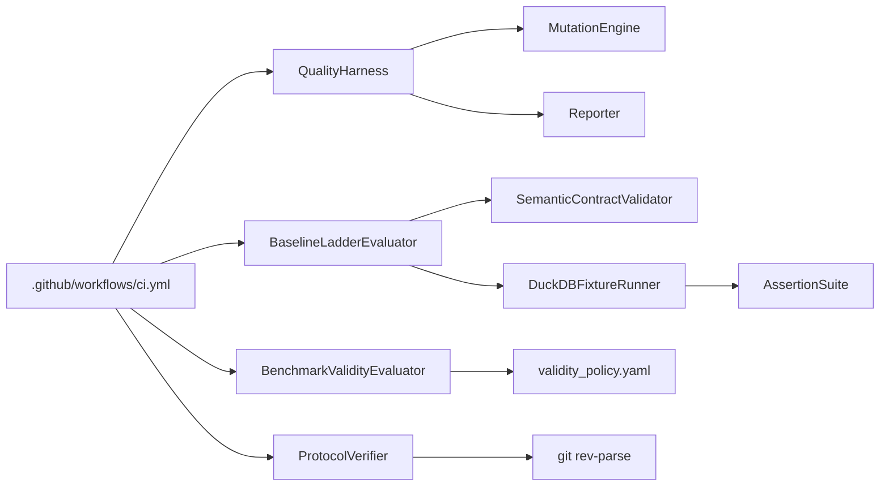

# Quality Harness

<cite>
**Referenced Files in This Document**
- [quality_harness.py](file://semantic_reliability/harness/quality_harness.py)
- [baseline_ladder.py](file://semantic_reliability/harness/baseline_ladder.py)
- [validity.py](file://semantic_reliability/harness/validity.py)
- [protocol_verifier.py](file://semantic_reliability/harness/protocol_verifier.py)
- [duckdb_runner.py](file://semantic_reliability/harness/duckdb_runner.py)
- [reporter.py](file://semantic_reliability/harness/reporter.py)
- [sarif_exporter.py](file://semantic_reliability/harness/sarif_exporter.py)
- [engine.py](file://semantic_reliability/testing/mutations/engine.py)
- [contracts.py](file://semantic_reliability/compiler/contracts.py)
- [ci.yml](file://.github/workflows/ci.yml)
- [README.md](file://README.md)
</cite>

## Table of Contents
1. [Introduction](#introduction)
2. [Project Structure](#project-structure)
3. [Core Components](#core-components)
4. [Architecture Overview](#architecture-overview)
5. [Detailed Component Analysis](#detailed-component-analysis)
6. [Dependency Analysis](#dependency-analysis)
7. [Performance Considerations](#performance-considerations)
8. [Troubleshooting Guide](#troubleshooting-guide)
9. [Conclusion](#conclusion)
10. [Appendices](#appendices)

## Introduction
This document explains the quality harness system that orchestrates comprehensive validation workflows for SQL-based analytics and AI-generated queries. It covers:
- Coordination across multiple validation layers: contract compliance, semantic drift detection, and policy enforcement
- Baseline ladder functionality to compare model performance across progressive tiers of rigor
- Validity checking mechanisms and protocol verification processes
- Custom validation pipelines, configuration options, and CI/CD integration
- Performance optimization techniques and scalability considerations for large-scale runs

The harness is designed to detect silent semantic failures where syntactically valid SQL violates business definitions by enforcing contracts, asserting structural and relational properties at runtime, and evaluating mutations to measure robustness.

## Project Structure
The quality harness lives under a dedicated module with supporting utilities for execution, reporting, and export. Key files include:
- Orchestration and mutation evaluation: quality_harness.py
- Progressive tiered evaluation: baseline_ladder.py
- Validity scoring and policy thresholds: validity.py
- Protocol integrity verification: protocol_verifier.py
- In-memory execution and assertion benchmarking: duckdb_runner.py
- Reporting and SARIF export: reporter.py, sarif_exporter.py
- Mutation generation: engine.py
- Contract validation: contracts.py
- CI/CD integration: ci.yml

**Diagram sources**
- [quality_harness.py:34-113](file://semantic_reliability/harness/quality_harness.py#L34-L113)
- [baseline_ladder.py:25-210](file://semantic_reliability/harness/baseline_ladder.py#L25-L210)
- [validity.py:47-127](file://semantic_reliability/harness/validity.py#L47-L127)
- [protocol_verifier.py:16-76](file://semantic_reliability/harness/protocol_verifier.py#L16-L76)
- [duckdb_runner.py:56-256](file://semantic_reliability/harness/duckdb_runner.py#L56-L256)
- [reporter.py:8-129](file://semantic_reliability/harness/reporter.py#L8-L129)
- [sarif_exporter.py:9-100](file://semantic_reliability/harness/sarif_exporter.py#L9-L100)
- [engine.py:8-52](file://semantic_reliability/testing/mutations/engine.py#L8-L52)
- [contracts.py:26-135](file://semantic_reliability/compiler/contracts.py#L26-L135)

**Section sources**
- [README.md:22-47](file://README.md#L22-L47)

## Core Components
- QualityHarness: Injects AST-level mutations into base SQL and evaluates how well existing checks catch them, producing a mutation score and per-mutation evaluations.
- BaselineLadderEvaluator: Runs candidate SQL through progressive tiers (syntax, minimal structural, realistic dbt assertions, static SCOS AST invariants).
- BenchmarkValidityEvaluator: Applies versioned policy thresholds to classify confidence and validity based on fixture adequacy and contract coverage.
- ProtocolVerifier: Verifies repository state against a declared freeze commit to ensure reproducibility of benchmarks.
- DuckDBFixtureRunner: Executes baseline vs mutated SQL in an in-memory database, compares outputs, and evaluates assertion suites to classify defects.
- Reporter: Generates human-readable markdown reports for PR comments and benchmark summaries.
- SARIFExporter: Converts drift results into standard SARIF JSON for code scanning integrations.

**Section sources**
- [quality_harness.py:34-113](file://semantic_reliability/harness/quality_harness.py#L34-L113)
- [baseline_ladder.py:25-210](file://semantic_reliability/harness/baseline_ladder.py#L25-L210)
- [validity.py:47-127](file://semantic_reliability/harness/validity.py#L47-L127)
- [protocol_verifier.py:16-76](file://semantic_reliability/harness/protocol_verifier.py#L16-L76)
- [duckdb_runner.py:56-256](file://semantic_reliability/harness/duckdb_runner.py#L56-L256)
- [reporter.py:8-129](file://semantic_reliability/harness/reporter.py#L8-L129)
- [sarif_exporter.py:9-100](file://semantic_reliability/harness/sarif_exporter.py#L9-L100)

## Architecture Overview
The harness coordinates multiple validation layers:
- Contract compliance: Static analysis validates SQL against declared metric contracts (population filters, grain dimensions, aggregation components, timezone rules).
- Semantic drift detection: AST normalization and comparison identify deviations from canonical definitions; reporters and SARIF exports surface findings.
- Policy enforcement: Versioned thresholds determine confidence and validity of benchmark outcomes; protocol verifier ensures frozen baselines.

**Diagram sources**
- [quality_harness.py:66-113](file://semantic_reliability/harness/quality_harness.py#L66-L113)
- [engine.py:16-52](file://semantic_reliability/testing/mutations/engine.py#L16-L52)
- [duckdb_runner.py:116-256](file://semantic_reliability/harness/duckdb_runner.py#L116-L256)
- [baseline_ladder.py:185-210](file://semantic_reliability/harness/baseline_ladder.py#L185-L210)
- [contracts.py:29-135](file://semantic_reliability/compiler/contracts.py#L29-L135)
- [reporter.py:86-129](file://semantic_reliability/harness/reporter.py#L86-L129)
- [sarif_exporter.py:91-100](file://semantic_reliability/harness/sarif_exporter.py#L91-L100)

## Detailed Component Analysis

### QualityHarness: Mutation-Based Robustness Evaluation
- Purpose: Measure how effectively a test suite catches semantic mutations injected into SQL.
- Behavior:
  - Uses MutationEngine to generate AST-level mutations (filter drops, boundary shifts, aggregation swaps, distinct drops, join predicate drops, etc.).
  - Optionally supports a custom test runner; otherwise simulates standard checks to demonstrate blind spots.
  - Computes mutation score percentage and produces per-mutation evaluations including catching checks and blind spots.
- Outputs: MutationBenchmark with totals, caught/uncaught counts, and detailed evaluations.

**Diagram sources**
- [quality_harness.py:66-113](file://semantic_reliability/harness/quality_harness.py#L66-L113)
- [engine.py:16-52](file://semantic_reliability/testing/mutations/engine.py#L16-L52)

**Section sources**
- [quality_harness.py:34-113](file://semantic_reliability/harness/quality_harness.py#L34-L113)
- [engine.py:8-200](file://semantic_reliability/testing/mutations/engine.py#L8-L200)

### Baseline Ladder: Progressive Validation Tiers
- Purpose: Compare model performance across tiers of increasing rigor.
- Tiers:
  - Tier 0: Syntactic validity via parser.
  - Tier 1: Minimal structural checks (nulls, row count bounds).
  - Tier 2: Realistic dbt-style assertions executed against DataFrame or SQL using DuckDB.
  - Tier 3: Static SCOS AST invariant validation against a MetricDefinition contract.
- Behavior:
  - Sequential evaluation; early failure short-circuits subsequent tiers unless explicitly configured.
  - Dynamic numeric range checks can be added when no explicit suite is provided.
- Outputs: Aggregated pass/fail status per tier plus detailed results.

**Diagram sources**
- [baseline_ladder.py:40-183](file://semantic_reliability/harness/baseline_ladder.py#L40-L183)
- [baseline_ladder.py:185-210](file://semantic_reliability/harness/baseline_ladder.py#L185-L210)
- [contracts.py:29-135](file://semantic_reliability/compiler/contracts.py#L29-L135)

**Section sources**
- [baseline_ladder.py:25-210](file://semantic_reliability/harness/baseline_ladder.py#L25-L210)

### Validity Checking and Policy Enforcement
- Purpose: Classify benchmark confidence and validity using versioned policy thresholds.
- Inputs: Standard and semantic catch percentages, fixture adequacy, contract coverage, mutation counts.
- Behavior:
  - Loads policy thresholds (conclusive, qualified, inconclusive).
  - Computes incremental gain and assigns confidence/validity accordingly.
  - Returns structured validation result with notes and policy version.

**Diagram sources**
- [validity.py:47-127](file://semantic_reliability/harness/validity.py#L47-L127)
- [validity_policy.yaml:1-17](file://semantic_reliability/harness/validity_policy.yaml#L1-L17)

**Section sources**
- [validity.py:47-127](file://semantic_reliability/harness/validity.py#L47-L127)
- [validity_policy.yaml:1-17](file://semantic_reliability/harness/validity_policy.yaml#L1-L17)

### Protocol Verification: Frozen Baseline Integrity
- Purpose: Ensure benchmark runs are reproducible by verifying the active repository commit matches a declared freeze commit.
- Behavior:
  - Reads holdout protocol YAML containing freeze_commit metadata.
  - Retrieves current git commit and compares prefixes.
  - Returns integrity status: VERIFIED, MODIFIED, or UNVERSIONED with notes.

**Diagram sources**
- [protocol_verifier.py:16-76](file://semantic_reliability/harness/protocol_verifier.py#L16-L76)

**Section sources**
- [protocol_verifier.py:16-76](file://semantic_reliability/harness/protocol_verifier.py#L16-L76)

### DuckDB Fixture Runner: Assertion-Aware Execution Benchmark
- Purpose: Execute baseline and mutated SQL in an in-memory DuckDB instance, compare outputs, and evaluate assertion suites to classify defects.
- Behavior:
  - Loads fixtures (CSV or DataFrames) into tables.
  - Executes queries and captures errors.
  - Computes empirical variance and equivalence on fixtures.
  - Evaluates assertions on mutated SQL; classifies outcomes as equivalent, detected, survived, or runtime error.
  - Produces comprehensive benchmark report with effective catch score and surviving defect summaries.

**Diagram sources**
- [duckdb_runner.py:116-206](file://semantic_reliability/harness/duckdb_runner.py#L116-L206)
- [duckdb_runner.py:208-256](file://semantic_reliability/harness/duckdb_runner.py#L208-L256)

**Section sources**
- [duckdb_runner.py:56-256](file://semantic_reliability/harness/duckdb_runner.py#L56-L256)

### Contract Compliance: Semantic Contract Validator
- Purpose: Validate candidate SQL against declared metric contracts (population filters, grain dimensions, aggregation components, timezone rules).
- Behavior:
  - Parses candidate SQL and extracts relevant AST elements.
  - Checks required filters presence in WHERE clause.
  - Validates grouping dimensions match required grain.
  - Ensures positive/negative aggregation components are included.
  - Enforces timezone constraints (e.g., UTC requirement).
- Output: ContractEvaluationResult with pass/fail and violation details.

**Diagram sources**
- [contracts.py:26-135](file://semantic_reliability/compiler/contracts.py#L26-L135)

**Section sources**
- [contracts.py:26-135](file://semantic_reliability/compiler/contracts.py#L26-L135)

### Reporting and Export: Markdown and SARIF
- Reporter:
  - Generates GitHub PR comment markdown highlighting semantic drift with severity badges and detailed breakdowns.
  - Produces comprehensive benchmark report markdown summarizing mutation scores and evaluations.
- SARIFExporter:
  - Converts drift results into standard SARIF 2.1.0 JSON for code scanning tools.
  - Maps drift severities to SARIF levels and includes rule definitions and locations.

**Section sources**
- [reporter.py:8-129](file://semantic_reliability/harness/reporter.py#L8-L129)
- [sarif_exporter.py:9-100](file://semantic_reliability/harness/sarif_exporter.py#L9-L100)

## Dependency Analysis
Key dependencies and relationships:
- QualityHarness depends on MutationEngine for generating mutations and Reporter for output formatting.
- BaselineLadderEvaluator depends on SemanticContractValidator for static invariants and uses DuckDB for runtime assertions.
- DuckDBFixtureRunner integrates with AssertionSuite to evaluate mutated SQL and produce classification outcomes.
- Validity evaluator loads policy thresholds from a YAML file to compute confidence and validity.
- ProtocolVerifier interacts with Git CLI to verify frozen baselines.
- CI workflow executes tests, provenance audits, and benchmark corpus runs, uploading artifacts.

**Diagram sources**
- [quality_harness.py:34-113](file://semantic_reliability/harness/quality_harness.py#L34-L113)
- [baseline_ladder.py:25-210](file://semantic_reliability/harness/baseline_ladder.py#L25-L210)
- [duckdb_runner.py:56-256](file://semantic_reliability/harness/duckdb_runner.py#L56-L256)
- [validity.py:47-127](file://semantic_reliability/harness/validity.py#L47-L127)
- [protocol_verifier.py:16-76](file://semantic_reliability/harness/protocol_verifier.py#L16-L76)
- [ci.yml:1-51](file://.github/workflows/ci.yml#L1-L51)

**Section sources**
- [ci.yml:1-51](file://.github/workflows/ci.yml#L1-L51)

## Performance Considerations
- In-memory execution: DuckDBFixtureRunner uses an in-memory database to minimize I/O overhead during mutation evaluation.
- Early termination: BaselineLadderEvaluator short-circuits tiers upon failure to avoid unnecessary computation.
- Assertion filtering: Tier 2 skips assertions not applicable to provided columns or datasets to reduce evaluation cost.
- Numeric variance threshold: Empirical equivalence check uses a small tolerance to avoid false positives on floating-point differences.
- Policy-driven escalation: Static contract checks can approve low-risk queries without runtime execution, reducing latency.

[No sources needed since this section provides general guidance]

## Troubleshooting Guide
Common issues and resolutions:
- Runtime errors in mutations: DuckDBFixtureRunner classifies these as RUNTIME_ERROR; review query syntax and fixture schema compatibility.
- Equivalent mutations: If mutations produce equivalent outputs on fixtures, consider expanding fixture contrast or adding targeted assertions.
- Missing assertions: Use AssertionSuite to define domain-specific checks; ensure required columns exist before evaluation.
- Protocol mismatch: If ProtocolVerifier reports MODIFIED or UNVERSIONED, align the active commit with the declared freeze baseline or update the protocol file.
- Invalid policy thresholds: Adjust thresholds in validity_policy.yaml to reflect desired confidence levels and organizational standards.

**Section sources**
- [duckdb_runner.py:116-206](file://semantic_reliability/harness/duckdb_runner.py#L116-L206)
- [protocol_verifier.py:35-76](file://semantic_reliability/harness/protocol_verifier.py#L35-L76)
- [validity_policy.yaml:1-17](file://semantic_reliability/harness/validity_policy.yaml#L1-L17)

## Conclusion
The quality harness provides a robust, multi-layered validation framework for ensuring semantic correctness of SQL analytics and AI-generated queries. By combining contract compliance, progressive tiered testing, mutation-based robustness evaluation, and policy-driven validity assessment, it enables teams to detect and prevent silent semantic failures. Integration with CI/CD and standardized reporting facilitates continuous quality assurance and traceable decision-making.

[No sources needed since this section summarizes without analyzing specific files]

## Appendices

### Example: Custom Validation Pipeline
- Define an AssertionSuite tailored to your domain and pass it to DuckDBFixtureRunner or BaselineLadderEvaluator to evaluate mutated or candidate SQL.
- Use QualityHarness.evaluate_model with a custom_test_runner to integrate your organization’s data quality checks.

**Section sources**
- [duckdb_runner.py:109-114](file://semantic_reliability/harness/duckdb_runner.py#L109-L114)
- [quality_harness.py:66-84](file://semantic_reliability/harness/quality_harness.py#L66-L84)

### Configuration Options
- Validity thresholds: Edit validity_policy.yaml to adjust conclusive/qualified/inconclusive criteria.
- Protocol baseline: Update holdout_protocol.yaml freeze_commit to lock reproducible benchmark environments.
- Assertion suites: Configure suite_path or provide AssertionSuite instances to tailor runtime checks.

**Section sources**
- [validity_policy.yaml:1-17](file://semantic_reliability/harness/validity_policy.yaml#L1-L17)
- [protocol_verifier.py:19-45](file://semantic_reliability/harness/protocol_verifier.py#L19-L45)
- [baseline_ladder.py:28-39](file://semantic_reliability/harness/baseline_ladder.py#L28-L39)

### CI/CD Integration
- The CI workflow installs dependencies, runs unit tests, performs provenance audits, executes benchmark corpus runs, and uploads results as artifacts.
- Integrate SARIF exports into code scanning to surface semantic drift alerts directly in pull requests.

**Section sources**
- [ci.yml:1-51](file://.github/workflows/ci.yml#L1-L51)
- [sarif_exporter.py:91-100](file://semantic_reliability/harness/sarif_exporter.py#L91-L100)