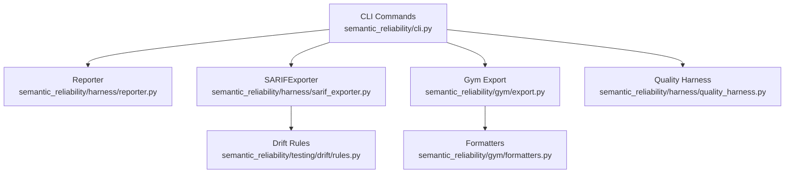
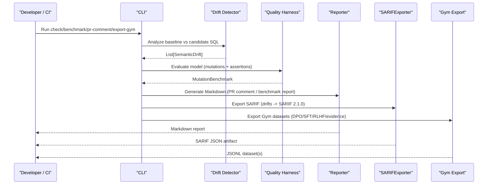
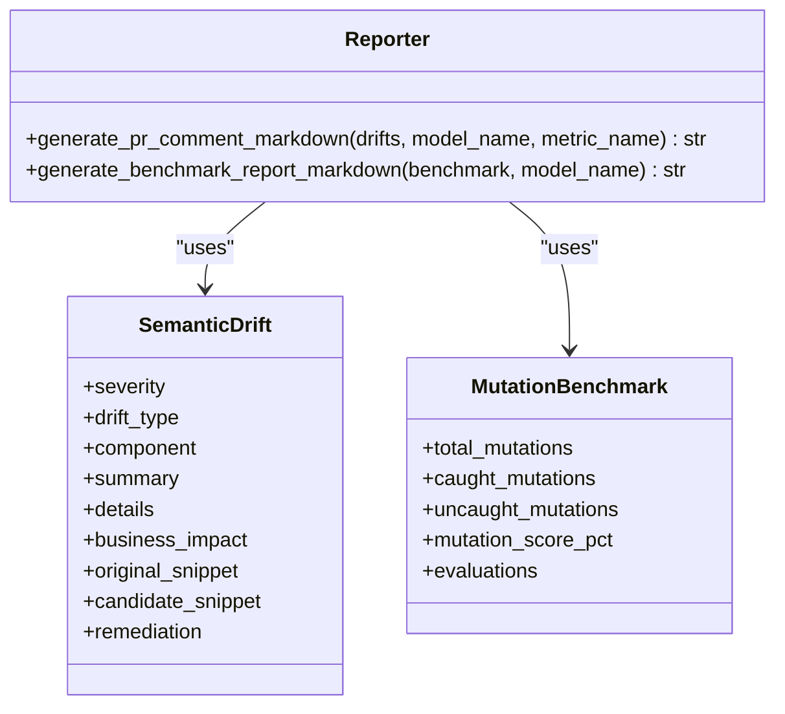
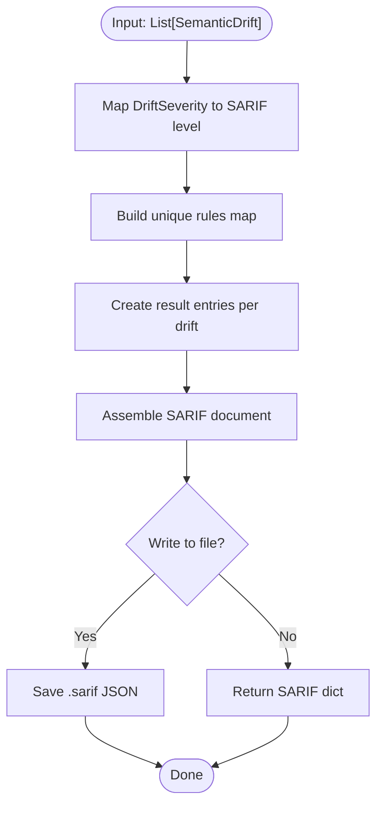
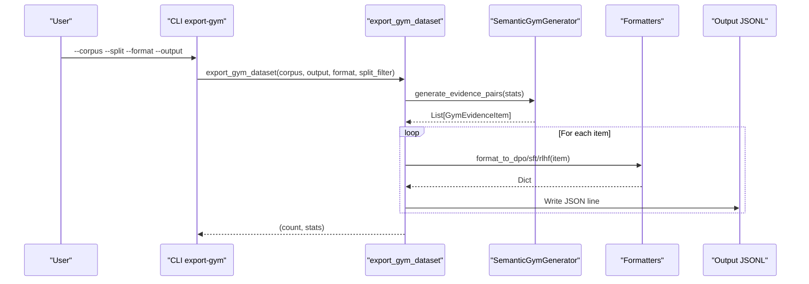
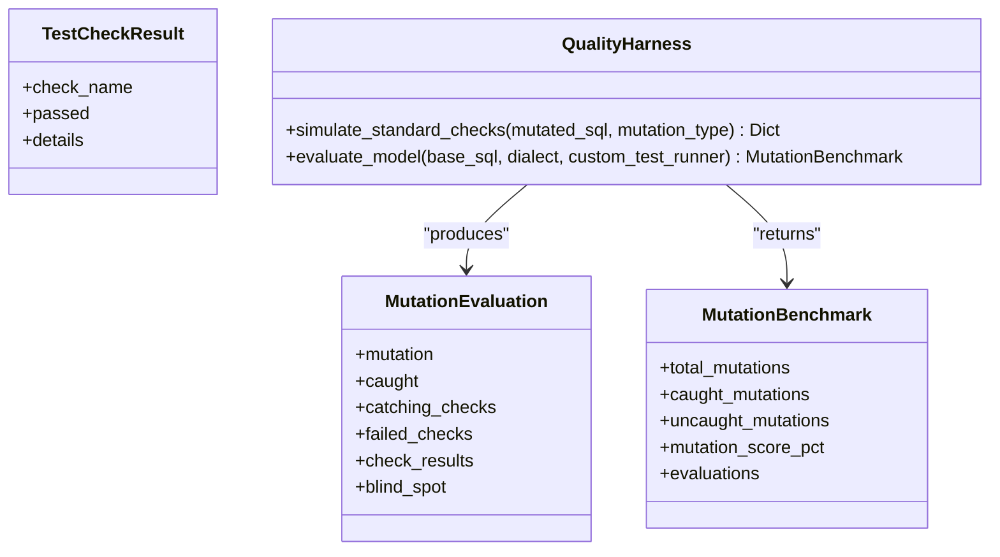
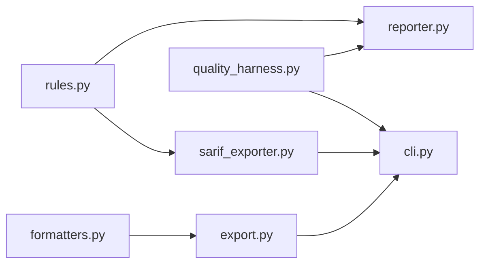

# Reporting and Export

<cite>
**Referenced Files in This Document**
- [reporter.py](file://semantic_reliability/harness/reporter.py)
- [sarif_exporter.py](file://semantic_reliability/harness/sarif_exporter.py)
- [export.py](file://semantic_reliability/gym/export.py)
- [formatters.py](file://semantic_reliability/gym/formatters.py)
- [cli.py](file://semantic_reliability/cli.py)
- [quality_harness.py](file://semantic_reliability/harness/quality_harness.py)
- [rules.py](file://semantic_reliability/testing/drift/rules.py)
- [test_sarif_exporter.py](file://tests/test_sarif_exporter.py)
- [ci.yml](file://.github/workflows/ci.yml)
</cite>

## Table of Contents
1. Introduction
2. Project Structure
3. Core Components
4. Architecture Overview
5. Detailed Component Analysis
6. Dependency Analysis
7. Performance Considerations
8. Troubleshooting Guide
9. Conclusion
10. Appendices

## Introduction
This document explains the reporting and export capabilities of the Semantic Reliability Engine. It covers:
- Human-readable reports for PR comments and benchmark summaries
- SARIF 2.1.0 export for integration with GitHub Code Scanning and CI/CD pipelines
- JSON report generation and structured result formatting
- Gym dataset exports (DPO, SFT, RLHF) for training and evaluation
- Customization options, filtering, and performance considerations for large result sets
- Examples of consumption by external tools, dashboards, and automated alerting systems

## Project Structure
The reporting subsystem spans several modules:
- CLI orchestrates commands that produce human-friendly console output, Markdown reports, JSON artifacts, and SARIF files
- Reporter generates Markdown outputs for PR comments and mutation benchmarks
- SARIFExporter converts drift results into standard SARIF 2.1.0 JSON for tooling integration
- Gym export pipeline produces preference datasets in multiple formats for AI training workflows
- Quality harness models define structured results used by reporters and exporters

**Diagram sources**
- [cli.py:43-131](file://semantic_reliability/cli.py#L43-L131)
- [reporter.py:8-129](file://semantic_reliability/harness/reporter.py#L8-L129)
- [sarif_exporter.py:9-99](file://semantic_reliability/harness/sarif_exporter.py#L9-L99)
- [export.py:14-76](file://semantic_reliability/gym/export.py#L14-L76)
- [formatters.py:5-78](file://semantic_reliability/gym/formatters.py#L5-L78)
- [quality_harness.py:8-113](file://semantic_reliability/harness/quality_harness.py#L8-L113)
- [rules.py:6-41](file://semantic_reliability/testing/drift/rules.py#L6-L41)

**Section sources**
- [cli.py:43-131](file://semantic_reliability/cli.py#L43-L131)
- [reporter.py:8-129](file://semantic_reliability/harness/reporter.py#L8-L129)
- [sarif_exporter.py:9-99](file://semantic_reliability/harness/sarif_exporter.py#L9-L99)
- [export.py:14-76](file://semantic_reliability/gym/export.py#L14-L76)
- [formatters.py:5-78](file://semantic_reliability/gym/formatters.py#L5-L78)
- [quality_harness.py:8-113](file://semantic_reliability/harness/quality_harness.py#L8-L113)
- [rules.py:6-41](file://semantic_reliability/testing/drift/rules.py#L6-L41)

## Core Components
- Reporter: Produces Markdown for GitHub PR comments and comprehensive benchmark reports from MutationBenchmark objects
- SARIFExporter: Converts SemanticDrift instances to SARIF 2.1.0 JSON documents consumable by GitHub Code Scanning and other tools
- Gym Export Pipeline: Scans metric contracts and fixtures, generates evidence pairs, and writes formatted datasets (DPO/SFT/RLHF/evidence)
- Quality Harness: Evaluates mutations against test suites and returns structured results used by reporters and exporters
- Drift Rules: Defines severity levels and drift types used across reporters and exporters

Key responsibilities:
- Human-readable summaries for developers and reviewers
- Standardized machine-readable artifacts for automation
- Flexible formatting for downstream consumption

**Section sources**
- [reporter.py:8-129](file://semantic_reliability/harness/reporter.py#L8-L129)
- [sarif_exporter.py:9-99](file://semantic_reliability/harness/sarif_exporter.py#L9-L99)
- [export.py:14-76](file://semantic_reliability/gym/export.py#L14-L76)
- [quality_harness.py:8-113](file://semantic_reliability/harness/quality_harness.py#L8-L113)
- [rules.py:6-41](file://semantic_reliability/testing/drift/rules.py#L6-L41)

## Architecture Overview
The reporting architecture integrates detection, evaluation, and export:

**Diagram sources**
- [cli.py:43-131](file://semantic_reliability/cli.py#L43-L131)
- [reporter.py:8-129](file://semantic_reliability/harness/reporter.py#L8-L129)
- [sarif_exporter.py:9-99](file://semantic_reliability/harness/sarif_exporter.py#L9-L99)
- [export.py:14-76](file://semantic_reliability/gym/export.py#L14-L76)
- [quality_harness.py:8-113](file://semantic_reliability/harness/quality_harness.py#L8-L113)

## Detailed Component Analysis

### Reporter: Human-Readable Summaries
- Generates GitHub PR comment Markdown highlighting semantic drift with severity badges, tables, and remediation guidance
- Produces comprehensive benchmark Markdown reports summarizing mutation scores, evaluations, and blind spots
- Uses structured inputs like SemanticDrift and MutationBenchmark to render consistent, readable outputs

**Diagram sources**
- [reporter.py:8-129](file://semantic_reliability/harness/reporter.py#L8-L129)
- [rules.py:30-41](file://semantic_reliability/testing/drift/rules.py#L30-L41)
- [quality_harness.py:25-32](file://semantic_reliability/harness/quality_harness.py#L25-L32)

Usage examples:
- PR comment generation via CLI command pr-comment
- Benchmark report generation via CLI command benchmark with --report

**Section sources**
- [reporter.py:8-129](file://semantic_reliability/harness/reporter.py#L8-L129)
- [cli.py:543-568](file://semantic_reliability/cli.py#L543-L568)
- [cli.py:175-283](file://semantic_reliability/cli.py#L175-L283)

### SARIF Exporter: Standardized Tool Integration
- Converts SemanticDrift instances into SARIF 2.1.0 JSON documents
- Maps internal severity levels to SARIF levels (error/warning/note/none)
- Includes rule definitions and result entries with locations and messages
- Writes SARIF files suitable for GitHub Code Scanning and other static analysis tools

**Diagram sources**
- [sarif_exporter.py:9-99](file://semantic_reliability/harness/sarif_exporter.py#L9-L99)
- [rules.py:6-41](file://semantic_reliability/testing/drift/rules.py#L6-L41)

Integration points:
- CLI check command supports --sarif to write SARIF output
- CLI dbt-check command supports --output-sarif for dbt model checks
- Tests validate SARIF schema version and structure

**Section sources**
- [sarif_exporter.py:9-99](file://semantic_reliability/harness/sarif_exporter.py#L9-L99)
- [cli.py:43-131](file://semantic_reliability/cli.py#L43-L131)
- [cli.py:737-786](file://semantic_reliability/cli.py#L737-L786)
- [test_sarif_exporter.py:11-29](file://tests/test_sarif_exporter.py#L11-L29)

### Gym Export: Structured Dataset Generation
- Scans corpus directories for metric contracts and fixtures
- Generates evidence pairs using SemanticGymGenerator
- Exports datasets in DPO, SFT, RLHF, or raw evidence formats as JSONL
- Supports split filtering to target specific subsets (train/validation/holdout/all)

**Diagram sources**
- [export.py:14-76](file://semantic_reliability/gym/export.py#L14-L76)
- [formatters.py:5-78](file://semantic_reliability/gym/formatters.py#L5-L78)
- [cli.py:631-656](file://semantic_reliability/cli.py#L631-L656)

Customization and filtering:
- Split filter selects specific dataset splits
- Format selection chooses between DPO, SFT, RLHF, or evidence
- Rejection statistics are tracked and reported

**Section sources**
- [export.py:14-76](file://semantic_reliability/gym/export.py#L14-L76)
- [formatters.py:5-78](file://semantic_reliability/gym/formatters.py#L5-L78)
- [cli.py:631-656](file://semantic_reliability/cli.py#L631-L656)

### Quality Harness: Structured Result Formatting
- Simulates or executes test suites against mutated SQL
- Computes catch rates and identifies blind spots
- Returns MutationBenchmark containing evaluations and metrics used by reporters and exporters

**Diagram sources**
- [quality_harness.py:8-113](file://semantic_reliability/harness/quality_harness.py#L8-L113)

**Section sources**
- [quality_harness.py:8-113](file://semantic_reliability/harness/quality_harness.py#L8-L113)

## Dependency Analysis
- Reporter depends on SemanticDrift and MutationBenchmark structures
- SARIFExporter depends on SemanticDrift and maps severities to SARIF levels
- Gym Export depends on formatters and generator to produce datasets
- CLI coordinates all components and provides user-facing options for outputs

**Diagram sources**
- [rules.py:6-41](file://semantic_reliability/testing/drift/rules.py#L6-L41)
- [reporter.py:8-129](file://semantic_reliability/harness/reporter.py#L8-L129)
- [sarif_exporter.py:9-99](file://semantic_reliability/harness/sarif_exporter.py#L9-L99)
- [quality_harness.py:8-113](file://semantic_reliability/harness/quality_harness.py#L8-L113)
- [formatters.py:5-78](file://semantic_reliability/gym/formatters.py#L5-L78)
- [export.py:14-76](file://semantic_reliability/gym/export.py#L14-L76)
- [cli.py:43-131](file://semantic_reliability/cli.py#L43-L131)

**Section sources**
- [rules.py:6-41](file://semantic_reliability/testing/drift/rules.py#L6-L41)
- [reporter.py:8-129](file://semantic_reliability/harness/reporter.py#L8-L129)
- [sarif_exporter.py:9-99](file://semantic_reliability/harness/sarif_exporter.py#L9-L99)
- [quality_harness.py:8-113](file://semantic_reliability/harness/quality_harness.py#L8-L113)
- [formatters.py:5-78](file://semantic_reliability/gym/formatters.py#L5-L78)
- [export.py:14-76](file://semantic_reliability/gym/export.py#L14-L76)
- [cli.py:43-131](file://semantic_reliability/cli.py#L43-L131)

## Performance Considerations
- SARIF export builds a deduplicated rules map and iterates once over drifts; complexity is O(n) where n is number of drifts
- Gym export scans contract YAMLs and processes each fixture; consider splitting large corpora and using split filters to reduce memory usage
- Reporter renders Markdown incrementally; for very large drift lists, consider chunking or filtering before rendering
- CLI commands support optional outputs (--json-out, --report, --sarif); use selective outputs to minimize I/O overhead
- For large result sets, prefer exporting structured JSON/SARIF and post-process externally rather than generating massive Markdown in-memory

[No sources needed since this section provides general guidance]

## Troubleshooting Guide
Common issues and resolutions:
- Missing base/metric for drift checks: CLI requires either --base or --metric; ensure one is provided
- SARIF not generated: Ensure --sarif flag is set and path is writable; verify drifts list is non-empty
- Gym export empty output: Confirm corpus contains valid metric YAMLs and matching CSV fixtures; check split filter matches available data
- Benchmark report missing: Use --report flag with benchmark command; ensure QualityHarness evaluation completes successfully

Validation references:
- SARIF exporter tests confirm schema version and structure
- CLI commands integrate reporters and exporters with clear error paths

**Section sources**
- [cli.py:43-131](file://semantic_reliability/cli.py#L43-L131)
- [cli.py:543-568](file://semantic_reliability/cli.py#L543-L568)
- [cli.py:175-283](file://semantic_reliability/cli.py#L175-L283)
- [test_sarif_exporter.py:11-29](file://tests/test_sarif_exporter.py#L11-L29)

## Conclusion
The Semantic Reliability Engine provides a robust reporting and export system:
- Human-readable Markdown for PR reviews and benchmark summaries
- Standardized SARIF 2.1.0 for CI/CD and tooling integration
- Flexible Gym dataset exports for AI training workflows
- Structured result models enabling consistent formatting and customization
- CLI-driven orchestration with optional outputs for efficient processing

Adopt these capabilities to integrate semantic reliability checks into development workflows, automate alerts, and feed dashboards with reliable, standardized artifacts.

[No sources needed since this section summarizes without analyzing specific files]

## Appendices

### Example Consumption by External Tools
- GitHub Code Scanning: Upload SARIF artifacts produced by CLI check/dbt-check commands
- Dashboards: Parse JSON outputs from benchmark-corpus --json-out for trend analysis
- Alerting Systems: Monitor SARIF results and trigger notifications based on severity thresholds

**Section sources**
- [cli.py:43-131](file://semantic_reliability/cli.py#L43-L131)
- [cli.py:737-786](file://semantic_reliability/cli.py#L737-L786)
- [ci.yml:41-49](file://.github/workflows/ci.yml#L41-L49)