# Test Suite Organization

<cite>
**Referenced Files in This Document**
- [test_adapters.py](file://tests/test_adapters.py)
- [test_compiler.py](file://tests/test_compiler.py)
- [test_contracts.py](file://tests/test_contracts.py)
- [test_drift_detector.py](file://tests/test_drift_detector.py)
- [test_firewall.py](file://tests/test_firewall.py)
- [test_mcp_server.py](file://tests/test_mcp_server.py)
- [test_benchmark_corpus.py](file://tests/test_benchmark_corpus.py)
- [test_gym.py](file://tests/test_gym.py)
- [test_replay.py](file://tests/test_replay.py)
- [test_probes.py](file://tests/test_probes.py)
- [test_dbt_adapter.py](file://tests/test_dbt_adapter.py)
- [test_hybrid_router.py](file://tests/test_hybrid_router.py)
- [test_quality_harness.py](file://tests/test_quality_harness.py)
</cite>

## Table of Contents
1. Introduction
2. Project Structure
3. Core Components
4. Architecture Overview
5. Detailed Component Analysis
6. Dependency Analysis
7. Performance Considerations
8. Troubleshooting Guide
9. Conclusion

## Introduction
This document explains the organization and structure of the test suite for the semantic reliability engine. It focuses on how tests are modularized by major components (adapters, compiler, contracts, drift detection, firewall, MCP server), documents testing patterns and conventions, and provides guidance for writing effective unit, integration, and end-to-end tests. It also covers fixture organization, test data management, isolation strategies, mocking approaches, and environment setup across different testing contexts.

## Project Structure
The test suite is organized as a flat directory under tests/, with one primary file per major component or feature area. Each file typically:
- Imports production modules to validate behavior
- Uses pytest fixtures for reusable setup
- Creates temporary files and directories via tmp_path when needed
- Exercises CLI entry points through CliRunner for integration scenarios
- Asserts structured results from adapters, evaluators, and servers

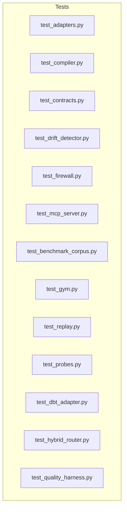

**Section sources**
- [test_adapters.py:1-184](file://tests/test_adapters.py#L1-L184)
- [test_compiler.py:1-60](file://tests/test_compiler.py#L1-L60)
- [test_contracts.py:1-92](file://tests/test_contracts.py#L1-L92)
- [test_drift_detector.py:1-84](file://tests/test_drift_detector.py#L1-L84)
- [test_firewall.py:1-100](file://tests/test_firewall.py#L1-L100)
- [test_mcp_server.py:1-267](file://tests/test_mcp_server.py#L1-L267)
- [test_benchmark_corpus.py:1-28](file://tests/test_benchmark_corpus.py#L1-L28)
- [test_gym.py:1-192](file://tests/test_gym.py#L1-L192)
- [test_replay.py:1-97](file://tests/test_replay.py#L1-L97)
- [test_probes.py:1-184](file://tests/test_probes.py#L1-L184)
- [test_dbt_adapter.py:1-60](file://tests/test_dbt_adapter.py#L1-L60)
- [test_hybrid_router.py:1-94](file://tests/test_hybrid_router.py#L1-L94)
- [test_quality_harness.py:1-44](file://tests/test_quality_harness.py#L1-L44)

## Core Components
- Adapters: Tests validate BigQuery dry-run evaluation, pricing policies, budget enforcement, project ID requirements, and DBT manifest resolution and checks. They use fixtures to construct metric definitions and assert decision outcomes and cost estimates.
- Compiler: Tests parse YAML and dict inputs into MetricCompiler instances, verify table extraction, aggregation node counts, WHERE AST presence, transpilation to target dialects, and error handling for invalid SQL.
- Contracts: Tests define contract YAML with population, grain, and aggregation invariants, then validate that compliant SQL passes and specific violations are detected (missing filters, dropped grain, missing negative components).
- Drift Detection: Tests compare base and candidate SQL to detect filter removal, logic shifts, aggregation changes, grain drift, join predicate mutations, and confirm no drift on identical SQL.
- Firewall: Tests build a ContractRegistry with MetricDefinition and SemanticInvariants, configure PolicyEngine strictness, and evaluate EvaluateRequest objects to assert ALLOW/DENY/REQUIRE_REVIEW decisions, risk levels, audit logs, and parse errors.
- MCP Server: Tests initialize the server, list tools, call validation endpoints, assert domain scoping, JSON-RPC error codes, AST complexity limits, and tamper-evident audit chains with signed checkpoints.
- Benchmark Corpus: Tests invoke CLI commands to run corpus benchmarks and generate reports, asserting exit codes and report content.
- Gym: Tests generate training examples, format them (DPO/SFT/RLHF), assign splits and difficulty, export via CLI, and evaluate baseline agents against fixtures.
- Replay: Tests process audit traces to find blind spots, suggest invariant patches, and run end-to-end replay cycles.
- Probes: Tests create in-memory DuckDB databases, register tables, and run statistical probes (population rate, implication decay, null drift) and CLI probe commands.
- DBT Adapter: Tests parse dbt schema YAML into assertion suites and validate extended generic tests.
- Hybrid Router: Tests fast-path static approvals/rejections and adaptive escalation to runtime checks using DuckDB and assertions.
- Quality Harness: Tests mutation-based evaluation and markdown reporting for PR comments and benchmark summaries.

**Section sources**
- [test_adapters.py:12-83](file://tests/test_adapters.py#L12-L83)
- [test_compiler.py:23-59](file://tests/test_compiler.py#L23-L59)
- [test_contracts.py:36-91](file://tests/test_contracts.py#L36-L91)
- [test_drift_detector.py:17-83](file://tests/test_drift_detector.py#L17-L83)
- [test_firewall.py:8-100](file://tests/test_firewall.py#L8-L100)
- [test_mcp_server.py:10-267](file://tests/test_mcp_server.py#L10-L267)
- [test_benchmark_corpus.py:9-28](file://tests/test_benchmark_corpus.py#L9-L28)
- [test_gym.py:22-192](file://tests/test_gym.py#L22-L192)
- [test_replay.py:9-97](file://tests/test_replay.py#L9-L97)
- [test_probes.py:18-184](file://tests/test_probes.py#L18-L184)
- [test_dbt_adapter.py:6-60](file://tests/test_dbt_adapter.py#L6-L60)
- [test_hybrid_router.py:13-94](file://tests/test_hybrid_router.py#L13-L94)
- [test_quality_harness.py:25-44](file://tests/test_quality_harness.py#L25-L44)

## Architecture Overview
The test suite mirrors the production architecture by validating each layer independently and in combination:
- Unit tests focus on single functions/classes (compiler parsing, drift rules, policy decisions).
- Integration tests exercise multi-component flows (firewall evaluation, hybrid routing with runtime checks, MCP server tool calls).
- End-to-end tests drive CLI commands to orchestrate workflows (benchmark corpus, gym export/audit, probes, replay).

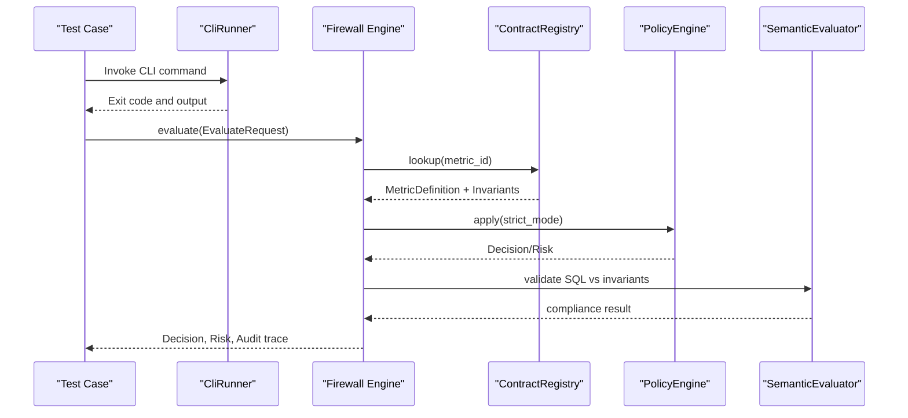

**Diagram sources**
- [test_firewall.py:8-100](file://tests/test_firewall.py#L8-L100)
- [test_mcp_server.py:37-109](file://tests/test_mcp_server.py#L37-L109)

## Detailed Component Analysis

### Adapters Testing
- Patterns:
  - Use fixtures to construct MetricDefinition and pass mock bytes processed to BigQueryDryRunAdapter.evaluate to simulate costs and budgets.
  - Validate decision outcomes (ALLOW/DENY), execution modes, and cost estimate fields.
  - Test DBT manifest resolver and checker with temporary manifests and contracts; assert compiled SQL availability, drift alerts, and exceptions for uncompiled nodes.
  - Exercise CLI dbt-check command with CliRunner, asserting SARIF output generation and exit codes.

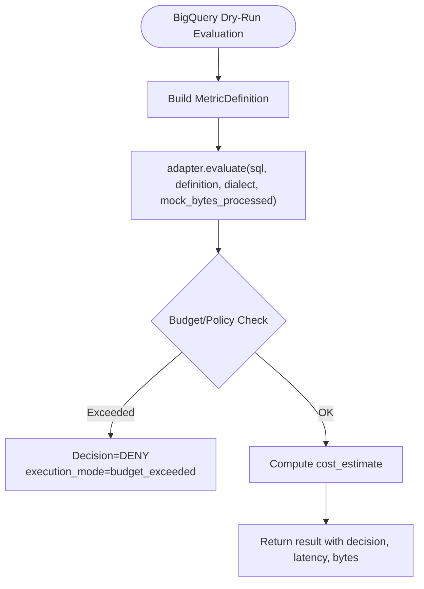

**Diagram sources**
- [test_adapters.py:12-83](file://tests/test_adapters.py#L12-L83)

**Section sources**
- [test_adapters.py:26-83](file://tests/test_adapters.py#L26-L83)
- [test_adapters.py:85-184](file://tests/test_adapters.py#L85-L184)

### Compiler Testing
- Patterns:
  - Parse YAML strings and dicts into MetricCompiler.
  - Verify extracted tables, aggregation nodes, WHERE AST presence, and ground truth SQL generation.
  - Transpile SQL to target dialects (e.g., Snowflake).
  - Assert ValueError for invalid SQL during compilation.

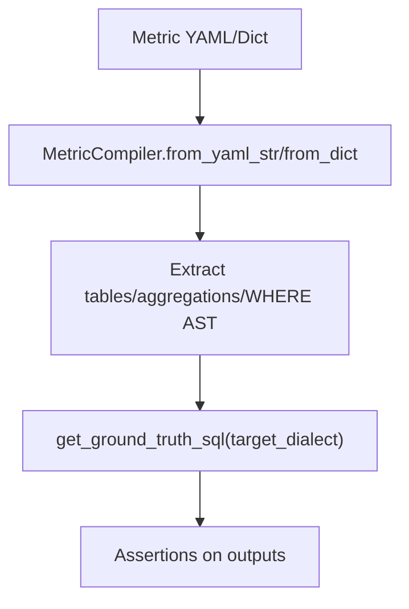

**Diagram sources**
- [test_compiler.py:23-59](file://tests/test_compiler.py#L23-L59)

**Section sources**
- [test_compiler.py:23-59](file://tests/test_compiler.py#L23-L59)

### Contracts Testing
- Patterns:
  - Define comprehensive contracts with population, grain, and aggregation invariants.
  - Validate that compliant SQL passes and specific violations are reported (missing filters, dropped grain, missing negative components).
  - Use MetricCompiler to derive ground truth SQL for consistent comparisons.

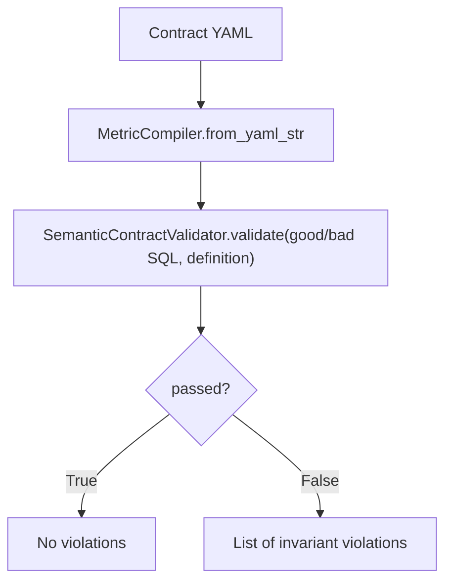

**Diagram sources**
- [test_contracts.py:36-91](file://tests/test_contracts.py#L36-L91)

**Section sources**
- [test_contracts.py:36-91](file://tests/test_contracts.py#L36-L91)

### Drift Detection Testing
- Patterns:
  - Compare base and candidate SQL to detect semantic drift types and severities.
  - Cover filter removal, logic shifts, aggregation function changes, grain drift, join predicate mutations, and identity cases.
  - Use DriftType and DriftSeverity enums to assert expected drift categories.

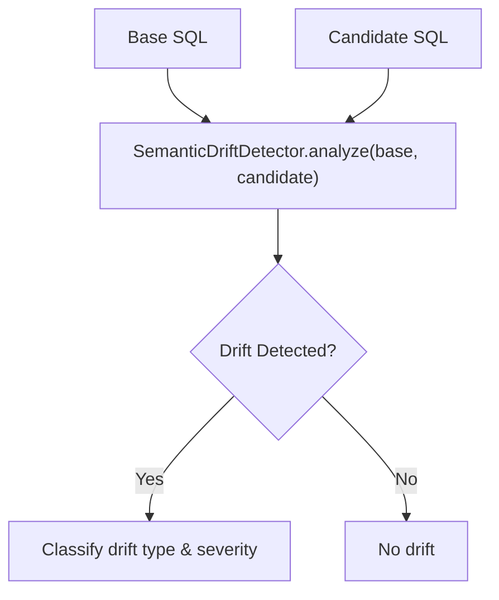

**Diagram sources**
- [test_drift_detector.py:17-83](file://tests/test_drift_detector.py#L17-L83)

**Section sources**
- [test_drift_detector.py:17-83](file://tests/test_drift_detector.py#L17-L83)

### Firewall Testing
- Patterns:
  - Construct ContractRegistry with MetricDefinition and SemanticInvariants.
  - Configure PolicyEngine with strict mode toggles.
  - Evaluate EvaluateRequest objects and assert Decision, execution_allowed, contract_compliant, risk level, violations, and audit trail entries.
  - Handle parse errors and non-strict review workflows.

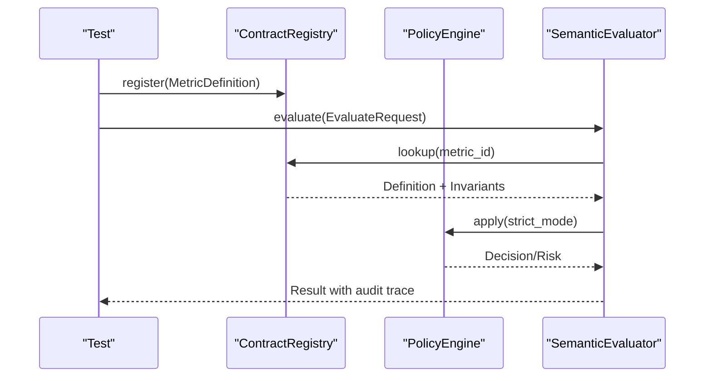

**Diagram sources**
- [test_firewall.py:8-100](file://tests/test_firewall.py#L8-L100)

**Section sources**
- [test_firewall.py:8-100](file://tests/test_firewall.py#L8-L100)

### MCP Server Testing
- Patterns:
  - Initialize server with registry and optional allowed_domains for scoping.
  - List tools and call validation endpoints; assert compliant/violation responses.
  - Validate JSON-RPC error codes for invalid requests, unknown methods, and malformed parameters.
  - Test AST complexity limits and deep nesting handling.
  - Verify tamper-evident audit chain and signed checkpoints.

```mermaid
sequenceDiagram
participant C as "Caller"
participant S as "ScosMcpServer"
participant R as "ContractRegistry"
participant Sec as "Security/Limits"
C->>S : handle_request({method, params})
S->>Sec : enforce_limits(params)
Sec-->>S : OK or raise
S->>R : lookup(metric_id)
R-->>S : MetricDefinition
S-->>C : {compliant, decision, violations, hashes}
Note over S,C : Audit log updated; verify_chain()/create_checkpoint()
```

**Diagram sources**
- [test_mcp_server.py:37-139](file://tests/test_mcp_server.py#L37-L139)
- [test_mcp_server.py:170-230](file://tests/test_mcp_server.py#L170-L230)

**Section sources**
- [test_mcp_server.py:37-139](file://tests/test_mcp_server.py#L37-L139)
- [test_mcp_server.py:170-230](file://tests/test_mcp_server.py#L170-L230)

### Benchmark Corpus Testing
- Patterns:
  - Use CliRunner to invoke benchmark-corpus CLI with a corpus directory.
  - Assert exit code and presence of key metrics in output.
  - Generate report files and validate content includes expected metrics.

**Section sources**
- [test_benchmark_corpus.py:9-28](file://tests/test_benchmark_corpus.py#L9-L28)

### Gym Testing
- Patterns:
  - Create temporary corpus with metric YAML and CSV fixtures.
  - Generate examples, format via DPO/SFT/RLHF formatters, and assert metadata and reward components.
  - Assign splits and difficulty based on mutation types.
  - Export datasets and audit via CLI; assert exported files and audit status.
  - Evaluate baseline agent candidates against fixtures; assert execution success, contract compliance, correctness, and report metrics.

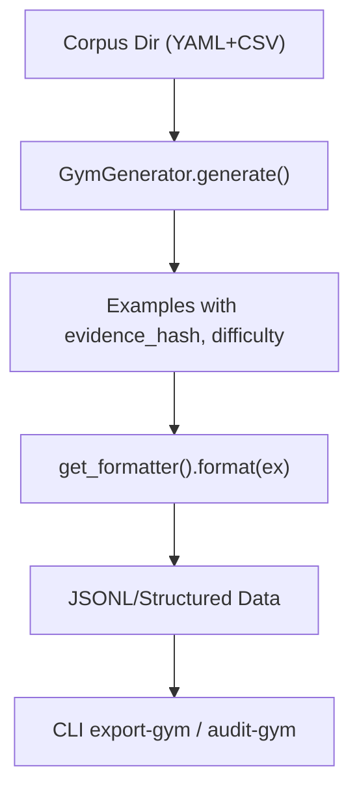

**Diagram sources**
- [test_gym.py:22-124](file://tests/test_gym.py#L22-L124)

**Section sources**
- [test_gym.py:22-124](file://tests/test_gym.py#L22-L124)
- [test_gym.py:126-192](file://tests/test_gym.py#L126-L192)

### Replay Testing
- Patterns:
  - Process denied vs allowed traces; assert ignored or analyzed results.
  - Extract suggestions from blind spots and generate PR bodies.
  - Run end-to-end replay cycle over audit logs and contract definitions.

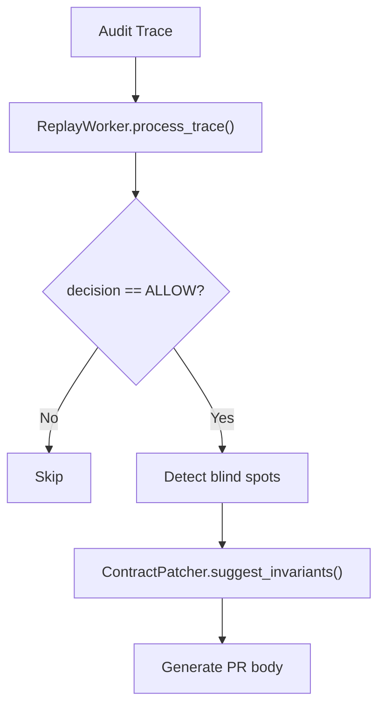

**Diagram sources**
- [test_replay.py:31-83](file://tests/test_replay.py#L31-L83)

**Section sources**
- [test_replay.py:31-83](file://tests/test_replay.py#L31-L83)
- [test_replay.py:85-97](file://tests/test_replay.py#L85-L97)

### Probes Testing
- Patterns:
  - Create in-memory DuckDB connections and register tables with controlled distributions.
  - Run StatisticalProbeEngine with population, implication, and null drift probes; assert alert signals and confidence levels.
  - Execute CLI probe command with contract and fixture files; assert output messages and signal types.

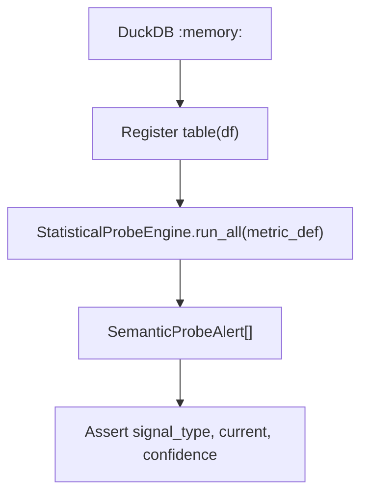

**Diagram sources**
- [test_probes.py:18-119](file://tests/test_probes.py#L18-L119)
- [test_probes.py:153-184](file://tests/test_probes.py#L153-L184)

**Section sources**
- [test_probes.py:18-119](file://tests/test_probes.py#L18-L119)
- [test_probes.py:153-184](file://tests/test_probes.py#L153-L184)

### DBT Adapter Testing
- Patterns:
  - Parse dbt schema YAML into assertion suites for models.
  - Validate both standard and extended generic tests (accepted_values, accepted_range, relationships).

**Section sources**
- [test_dbt_adapter.py:6-60](file://tests/test_dbt_adapter.py#L6-L60)

### Hybrid Router Testing
- Patterns:
  - Fast-path static approval/rejection without runtime queries.
  - Adaptive escalation to Tier 4 when complex graphs (CTEs) are detected; execute runtime assertions using DuckDB.
  - Assert routing tiers, decisions, escalation reasons, and bytes scanned.

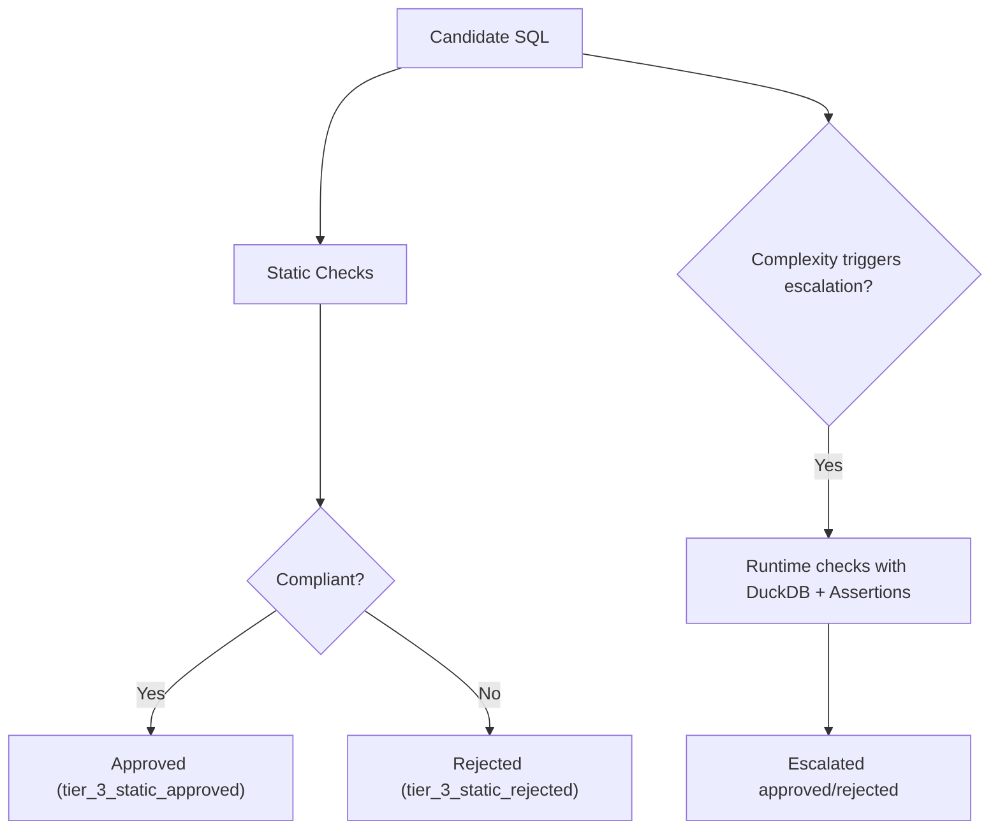

**Diagram sources**
- [test_hybrid_router.py:41-94](file://tests/test_hybrid_router.py#L41-L94)

**Section sources**
- [test_hybrid_router.py:41-94](file://tests/test_hybrid_router.py#L41-L94)

### Quality Harness Testing
- Patterns:
  - Evaluate model quality via mutation-based benchmarking; assert mutation score and evaluations count.
  - Generate markdown PR comments and benchmark reports; assert headings and sections.

**Section sources**
- [test_quality_harness.py:25-44](file://tests/test_quality_harness.py#L25-L44)

## Dependency Analysis
- Test files depend on production modules within semantic_reliability:
  - Adapters: bigquery, dbt_integration
  - Compiler: compiler, schema
  - Contracts: compiler.contracts
  - Drift: testing.drift.detector, testing.drift.rules
  - Firewall: firewall.models, firewall.policy, firewall.engine
  - MCP: mcp.server, mcp.models, mcp.security, mcp.registry
  - Gym: gym.generator, gym.formatters, gym.models
  - Probes: probes.engine, probes.signals
  - DBT: adapters.dbt_adapter
  - Hybrid: firewall.hybrid_router, assertions.registry, assertions.structural
  - Quality: harness.quality_harness, harness.reporter, testing.drift.detector

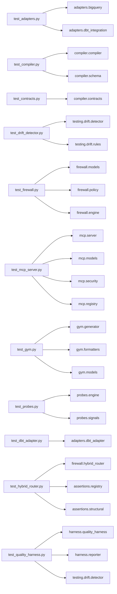

**Diagram sources**
- [test_adapters.py:1-184](file://tests/test_adapters.py#L1-L184)
- [test_compiler.py:1-60](file://tests/test_compiler.py#L1-L60)
- [test_contracts.py:1-92](file://tests/test_contracts.py#L1-L92)
- [test_drift_detector.py:1-84](file://tests/test_drift_detector.py#L1-L84)
- [test_firewall.py:1-100](file://tests/test_firewall.py#L1-L100)
- [test_mcp_server.py:1-267](file://tests/test_mcp_server.py#L1-L267)
- [test_gym.py:1-192](file://tests/test_gym.py#L1-L192)
- [test_probes.py:1-184](file://tests/test_probes.py#L1-L184)
- [test_dbt_adapter.py:1-60](file://tests/test_dbt_adapter.py#L1-L60)
- [test_hybrid_router.py:1-94](file://tests/test_hybrid_router.py#L1-L94)
- [test_quality_harness.py:1-44](file://tests/test_quality_harness.py#L1-L44)

**Section sources**
- [test_adapters.py:1-184](file://tests/test_adapters.py#L1-L184)
- [test_compiler.py:1-60](file://tests/test_compiler.py#L1-L60)
- [test_contracts.py:1-92](file://tests/test_contracts.py#L1-L92)
- [test_drift_detector.py:1-84](file://tests/test_drift_detector.py#L1-L84)
- [test_firewall.py:1-100](file://tests/test_firewall.py#L1-L100)
- [test_mcp_server.py:1-267](file://tests/test_mcp_server.py#L1-L267)
- [test_gym.py:1-192](file://tests/test_gym.py#L1-L192)
- [test_probes.py:1-184](file://tests/test_probes.py#L1-L184)
- [test_dbt_adapter.py:1-60](file://tests/test_dbt_adapter.py#L1-L60)
- [test_hybrid_router.py:1-94](file://tests/test_hybrid_router.py#L1-L94)
- [test_quality_harness.py:1-44](file://tests/test_quality_harness.py#L1-L44)

## Performance Considerations
- Prefer in-memory DuckDB for database-backed tests to avoid I/O overhead and ensure deterministic results.
- Use mock parameters (e.g., mock_bytes_processed) to simulate external service costs without network calls.
- Keep test SQL minimal but representative; leverage tmp_path for isolated fixtures to prevent cross-test interference.
- For large AST or massive predicates, rely on existing complexity limit behaviors validated in MCP tests to guard performance.

[No sources needed since this section provides general guidance]

## Troubleshooting Guide
- Adapters:
  - If budget exceeded, expect DENY with execution_mode indicating budget issues; verify policy configuration and mock bytes.
  - If project_id required, ensure adapter initialization includes project_id or policy allows omission.
- Compiler:
  - Invalid SQL raises ValueError; inspect error message to correct grammar or references.
- Contracts:
  - Missing filters or grain dimensions trigger violations; ensure SQL matches all required invariants.
- Drift Detection:
  - Unexpected drift may indicate subtle semantic changes; compare base and candidate SQL carefully.
- Firewall:
  - Non-strict mode returns REQUIRE_REVIEW; adjust strict_mode based on workflow needs.
  - Parse errors yield DENY; fix SQL syntax before re-evaluation.
- MCP Server:
  - Domain scoping denies access to unauthorized metrics; configure allowed_domains appropriately.
  - JSON-RPC errors have standard codes; validate request structure and method names.
  - Complexity limits deny overly complex SQL; simplify or split queries.
- Probes:
  - Ensure fixture data distribution aligns with baseline rates; otherwise alerts will trigger.
- Hybrid Router:
  - Complex queries escalate to runtime checks; provide DuckDB connection and runtime assertions if needed.
- Quality Harness:
  - Mutation scores reflect robustness; analyze evaluations to identify weak areas.

**Section sources**
- [test_adapters.py:62-83](file://tests/test_adapters.py#L62-L83)
- [test_compiler.py:51-59](file://tests/test_compiler.py#L51-L59)
- [test_contracts.py:45-91](file://tests/test_contracts.py#L45-L91)
- [test_drift_detector.py:17-83](file://tests/test_drift_detector.py#L17-L83)
- [test_firewall.py:60-100](file://tests/test_firewall.py#L60-L100)
- [test_mcp_server.py:170-230](file://tests/test_mcp_server.py#L170-L230)
- [test_probes.py:54-119](file://tests/test_probes.py#L54-L119)
- [test_hybrid_router.py:41-94](file://tests/test_hybrid_router.py#L41-L94)
- [test_quality_harness.py:25-44](file://tests/test_quality_harness.py#L25-L44)

## Conclusion
The test suite is modularly organized by component, consistently uses pytest fixtures and tmp_path for isolation, and exercises both unit and integration paths. It validates adapters, compiler parsing, contract invariants, drift detection, firewall decisions, MCP server interactions, benchmark corpus runs, gym dataset generation, replay analysis, probes, DBT adapter parsing, hybrid routing, and quality reporting. Following these patterns ensures reliable, maintainable, and comprehensive coverage across the semantic reliability engine.

[No sources needed since this section summarizes without analyzing specific files]