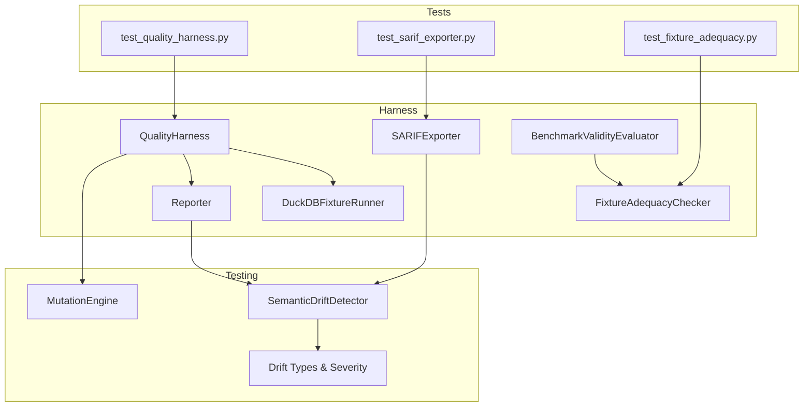
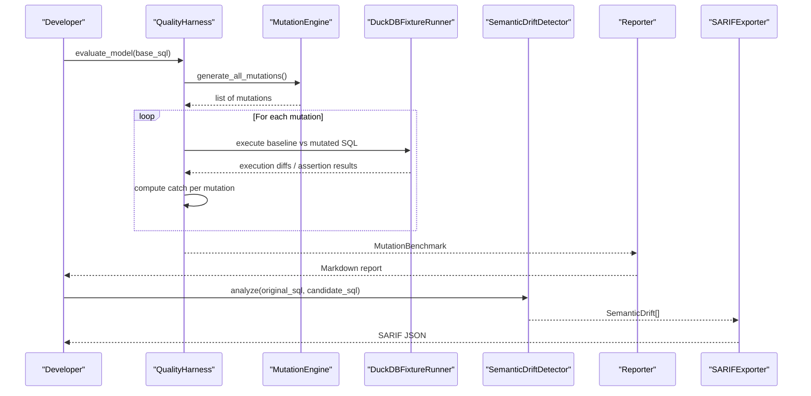
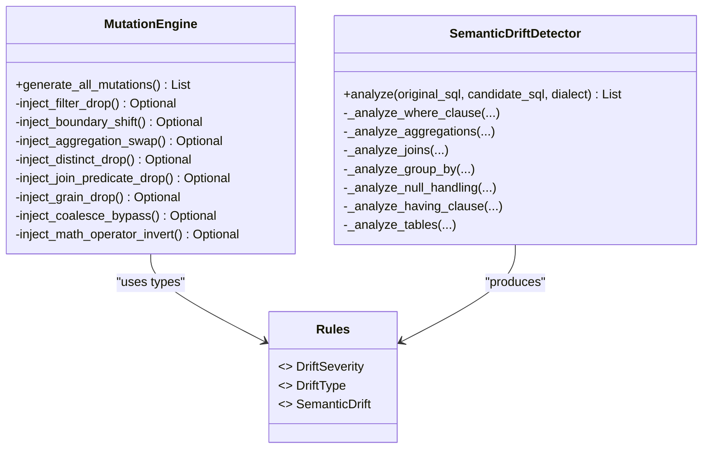
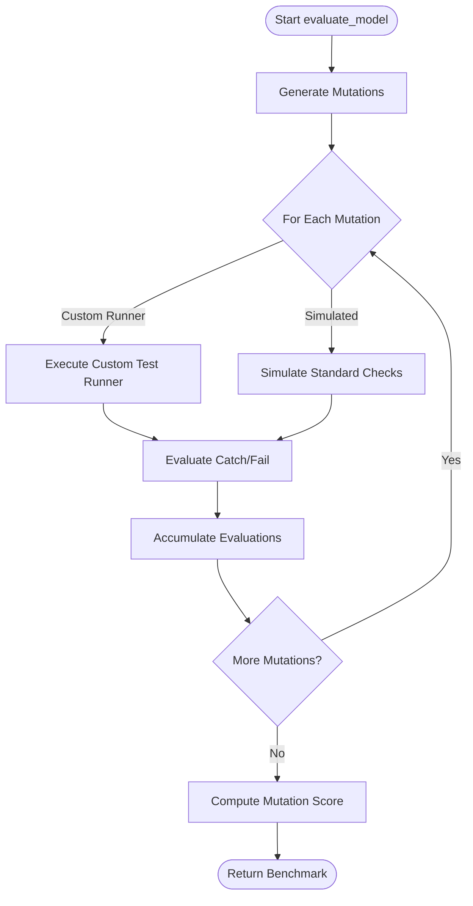
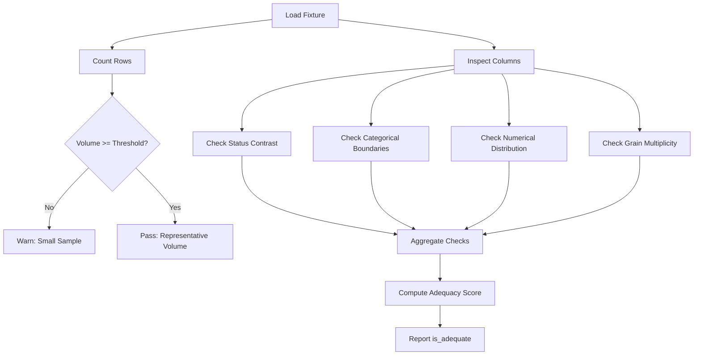
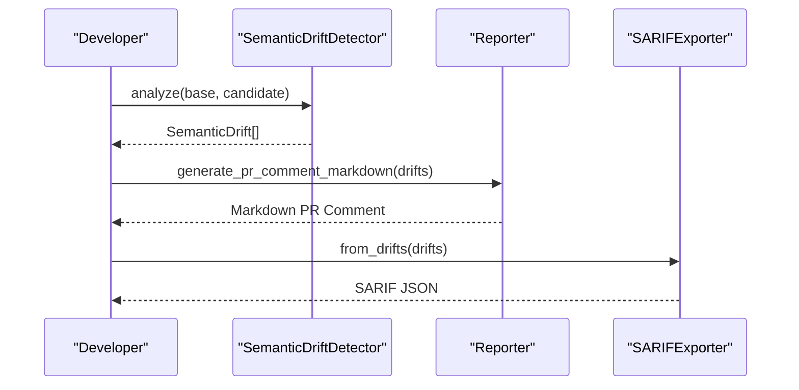
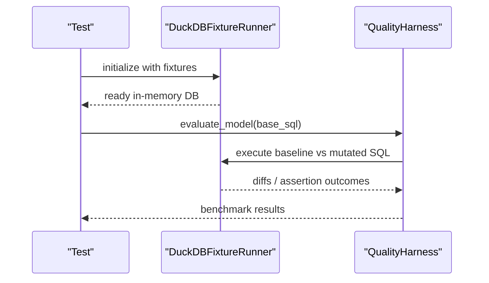
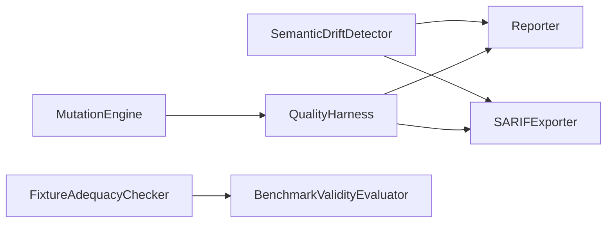

# Testing and Validation

<cite>
**Referenced Files in This Document**
- [quality_harness.py](file://semantic_reliability/harness/quality_harness.py)
- [reporter.py](file://semantic_reliability/harness/reporter.py)
- [sarif_exporter.py](file://semantic_reliability/harness/sarif_exporter.py)
- [fixture_adequacy.py](file://semantic_reliability/harness/fixture_adequacy.py)
- [validity.py](file://semantic_reliability/harness/validity.py)
- [validity_policy.yaml](file://semantic_reliability/harness/validity_policy.yaml)
- [engine.py](file://semantic_reliability/testing/mutations/engine.py)
- [rules.py](file://semantic_reliability/testing/drift/rules.py)
- [detector.py](file://semantic_reliability/testing/drift/detector.py)
- [duckdb_runner.py](file://semantic_reliability/harness/duckdb_runner.py)
- [test_quality_harness.py](file://tests/test_quality_harness.py)
- [test_sarif_exporter.py](file://tests/test_sarif_exporter.py)
- [test_fixture_adequacy.py](file://tests/test_fixture_adequacy.py)
- [pyproject.toml](file://pyproject.toml)
</cite>

## Table of Contents
1. Introduction
2. Project Structure
3. Core Components
4. Architecture Overview
5. Detailed Component Analysis
6. Dependency Analysis
7. Performance Considerations
8. Troubleshooting Guide
9. Conclusion
10. Appendices

## Introduction
This document explains the testing and validation system for SQL data pipelines, focusing on:
- Test suite structure and methodologies
- Quality harness for orchestrating comprehensive validation workflows
- Fixture management and test data generation strategies
- Assertion writing patterns and best practices for data quality tests
- Reporting capabilities including SARIF export, JSON reports, and human-readable summaries
- Guidance for unit, integration, and end-to-end validation scenarios
- Approaches to performance, load, and regression testing

The system combines AST-level semantic drift detection with chaos mutation testing to measure how robust a test suite is against realistic SQL changes that can silently alter metrics.

## Project Structure
The repository organizes testing-related functionality under:
- semantic_reliability/harness: orchestration, reporting, fixture adequacy, validity scoring, DuckDB execution
- semantic_reliability/testing: mutations engine, drift detector and rules
- tests: pytest-based unit and integration tests validating harness components and outputs

**Diagram sources**
- [quality_harness.py:34-113](file://semantic_reliability/harness/quality_harness.py#L34-L113)
- [engine.py:8-52](file://semantic_reliability/testing/mutations/engine.py#L8-L52)
- [detector.py:9-46](file://semantic_reliability/testing/drift/detector.py#L9-L46)
- [rules.py:6-41](file://semantic_reliability/testing/drift/rules.py#L6-L41)
- [reporter.py:8-129](file://semantic_reliability/harness/reporter.py#L8-L129)
- [sarif_exporter.py:9-100](file://semantic_reliability/harness/sarif_exporter.py#L9-L100)
- [fixture_adequacy.py:24-153](file://semantic_reliability/harness/fixture_adequacy.py#L24-L153)
- [duckdb_runner.py:56-74](file://semantic_reliability/harness/duckdb_runner.py#L56-L74)
- [test_quality_harness.py:25-44](file://tests/test_quality_harness.py#L25-L44)
- [test_sarif_exporter.py:11-29](file://tests/test_sarif_exporter.py#L11-L29)
- [test_fixture_adequacy.py:6-44](file://tests/test_fixture_adequacy.py#L6-L44)

**Section sources**
- [pyproject.toml:40-44](file://pyproject.toml#L40-L44)

## Core Components
- MutationEngine: injects precise AST-level logical mutations into SQL (filter drops, boundary shifts, aggregation swaps, join predicate drops, grain drops, coalesce bypasses, math operator inversions).
- SemanticDriftDetector: compares baseline vs candidate SQL via AST analysis to detect semantic drift across WHERE, aggregations, joins, GROUP BY, HAVING, null handling, and table targets.
- QualityHarness: orchestrates mutation evaluation and computes a mutation score; supports custom test runners or simulated checks.
- Reporter: generates GitHub PR comment markdown and benchmark reports from drifts and mutation benchmarks.
- SARIFExporter: converts drift results to SARIF 2.1.0 JSON for code scanning integrations.
- FixtureAdequacyChecker: audits fixtures for contrast coverage (volume, status/categorical boundaries, numerical distribution, grain multiplicity).
- BenchmarkValidityEvaluator: applies versioned policy thresholds to classify benchmark confidence and validity.
- DuckDBFixtureRunner: executes baseline vs mutated SQL in-memory and evaluates assertion suites.

**Section sources**
- [engine.py:8-269](file://semantic_reliability/testing/mutations/engine.py#L8-L269)
- [detector.py:9-246](file://semantic_reliability/testing/drift/detector.py#L9-L246)
- [quality_harness.py:34-113](file://semantic_reliability/harness/quality_harness.py#L34-L113)
- [reporter.py:8-129](file://semantic_reliability/harness/reporter.py#L8-L129)
- [sarif_exporter.py:9-100](file://semantic_reliability/harness/sarif_exporter.py#L9-L100)
- [fixture_adequacy.py:24-153](file://semantic_reliability/harness/fixture_adequacy.py#L24-L153)
- [validity.py:47-127](file://semantic_reliability/harness/validity.py#L47-L127)
- [duckdb_runner.py:56-74](file://semantic_reliability/harness/duckdb_runner.py#L56-L74)

## Architecture Overview
The validation workflow integrates drift detection, mutation testing, fixture adequacy, and reporting:

**Diagram sources**
- [quality_harness.py:66-113](file://semantic_reliability/harness/quality_harness.py#L66-L113)
- [engine.py:16-52](file://semantic_reliability/testing/mutations/engine.py#L16-L52)
- [duckdb_runner.py:56-74](file://semantic_reliability/harness/duckdb_runner.py#L56-L74)
- [detector.py:12-46](file://semantic_reliability/testing/drift/detector.py#L12-L46)
- [reporter.py:87-129](file://semantic_reliability/harness/reporter.py#L87-L129)
- [sarif_exporter.py:16-100](file://semantic_reliability/harness/sarif_exporter.py#L16-L100)

## Detailed Component Analysis

### Mutation Engine and Drift Detection
- MutationEngine performs targeted AST mutations to simulate common SQL defects. It returns structured MutationResult objects describing type, category, target node, and original/mutated SQL.
- SemanticDriftDetector compares baseline and candidate SQL to identify semantic drift across key relational algebra components, producing SemanticDrift instances with severity, component, summary, details, business impact, snippets, and remediation guidance.

**Diagram sources**
- [engine.py:8-269](file://semantic_reliability/testing/mutations/engine.py#L8-L269)
- [detector.py:9-246](file://semantic_reliability/testing/drift/detector.py#L9-L246)
- [rules.py:6-41](file://semantic_reliability/testing/drift/rules.py#L6-L41)

**Section sources**
- [engine.py:8-269](file://semantic_reliability/testing/mutations/engine.py#L8-L269)
- [detector.py:9-246](file://semantic_reliability/testing/drift/detector.py#L9-L246)
- [rules.py:6-41](file://semantic_reliability/testing/drift/rules.py#L6-L41)

### Quality Harness Orchestration
- QualityHarness.evaluate_model runs all mutations against base SQL and calculates a mutation score. It supports plugging in a custom test runner to evaluate mutated SQL against assertions; otherwise it simulates standard checks to demonstrate blind spots.
- The harness aggregates evaluations into a MutationBenchmark containing totals, caught/uncaught counts, percentage score, and per-mutation details.

**Diagram sources**
- [quality_harness.py:66-113](file://semantic_reliability/harness/quality_harness.py#L66-L113)

**Section sources**
- [quality_harness.py:34-113](file://semantic_reliability/harness/quality_harness.py#L34-L113)

### Fixture Adequacy and Validity Scoring
- FixtureAdequacyChecker inspects fixture datasets using DuckDB to assess whether they contain sufficient contrast to expose mutations. It evaluates volume, status/categorical boundaries, numerical distributions, and grain multiplicity, returning an adequacy score and pass/fail/warn checks.
- BenchmarkValidityEvaluator loads a versioned policy and classifies benchmark confidence and validity based on fixture adequacy and contract coverage thresholds.

**Diagram sources**
- [fixture_adequacy.py:27-153](file://semantic_reliability/harness/fixture_adequacy.py#L27-L153)

**Section sources**
- [fixture_adequacy.py:24-153](file://semantic_reliability/harness/fixture_adequacy.py#L24-L153)
- [validity.py:47-127](file://semantic_reliability/harness/validity.py#L47-L127)
- [validity_policy.yaml:1-17](file://semantic_reliability/harness/validity_policy.yaml#L1-L17)

### Reporting and Integrations
- Reporter produces:
  - GitHub PR comment markdown summarizing semantic drift with severity badges and remediation steps
  - Comprehensive Markdown benchmark reports showing mutation scores and per-mutation evaluations
- SARIFExporter converts drift results to SARIF 2.1.0 JSON suitable for GitHub Code Scanning, mapping drift severities to SARIF levels and generating rule definitions and results.

**Diagram sources**
- [detector.py:12-46](file://semantic_reliability/testing/drift/detector.py#L12-L46)
- [reporter.py:11-84](file://semantic_reliability/harness/reporter.py#L11-L84)
- [sarif_exporter.py:16-89](file://semantic_reliability/harness/sarif_exporter.py#L16-L89)

**Section sources**
- [reporter.py:8-129](file://semantic_reliability/harness/reporter.py#L8-L129)
- [sarif_exporter.py:9-100](file://semantic_reliability/harness/sarif_exporter.py#L9-L100)

### Execution and Assertions
- DuckDBFixtureRunner provides an in-memory execution environment to run baseline vs mutated SQL queries and evaluate assertion suites. It supports loading fixtures from CSV or DataFrames and closing resources safely.
- Tests validate harness behavior, SARIF output schema, and fixture adequacy logic.

**Diagram sources**
- [duckdb_runner.py:56-74](file://semantic_reliability/harness/duckdb_runner.py#L56-L74)
- [quality_harness.py:66-113](file://semantic_reliability/harness/quality_harness.py#L66-L113)

**Section sources**
- [duckdb_runner.py:56-74](file://semantic_reliability/harness/duckdb_runner.py#L56-L74)
- [test_quality_harness.py:25-44](file://tests/test_quality_harness.py#L25-L44)
- [test_sarif_exporter.py:11-29](file://tests/test_sarif_exporter.py#L11-L29)
- [test_fixture_adequacy.py:6-44](file://tests/test_fixture_adequacy.py#L6-L44)

## Dependency Analysis
Key dependencies and relationships:
- QualityHarness depends on MutationEngine and optionally a custom test runner; it aggregates results into a benchmark.
- Reporter consumes SemanticDrift and MutationBenchmark to produce human-readable outputs.
- SARIFExporter consumes SemanticDrift to produce standardized JSON for tooling.
- FixtureAdequacyChecker uses DuckDB to inspect fixtures and compute contrast metrics.
- BenchmarkValidityEvaluator reads a YAML policy to classify confidence and validity.

**Diagram sources**
- [quality_harness.py:34-113](file://semantic_reliability/harness/quality_harness.py#L34-L113)
- [engine.py:8-52](file://semantic_reliability/testing/mutations/engine.py#L8-L52)
- [detector.py:9-46](file://semantic_reliability/testing/drift/detector.py#L9-L46)
- [reporter.py:8-129](file://semantic_reliability/harness/reporter.py#L8-L129)
- [sarif_exporter.py:9-100](file://semantic_reliability/harness/sarif_exporter.py#L9-L100)
- [fixture_adequacy.py:24-153](file://semantic_reliability/harness/fixture_adequacy.py#L24-L153)
- [validity.py:47-127](file://semantic_reliability/harness/validity.py#L47-L127)

**Section sources**
- [quality_harness.py:34-113](file://semantic_reliability/harness/quality_harness.py#L34-L113)
- [detector.py:9-46](file://semantic_reliability/testing/drift/detector.py#L9-L46)
- [reporter.py:8-129](file://semantic_reliability/harness/reporter.py#L8-L129)
- [sarif_exporter.py:9-100](file://semantic_reliability/harness/sarif_exporter.py#L9-L100)
- [fixture_adequacy.py:24-153](file://semantic_reliability/harness/fixture_adequacy.py#L24-L153)
- [validity.py:47-127](file://semantic_reliability/harness/validity.py#L47-L127)

## Performance Considerations
- Use in-memory DuckDB for fast iteration during unit and integration tests; avoid heavy disk I/O by keeping fixtures small and representative.
- Limit mutation scope per test to reduce runtime; batch mutation runs only when necessary.
- Cache parsed ASTs where possible to avoid repeated parsing overhead.
- For load testing, scale fixture sizes incrementally and monitor query execution time and memory usage within the in-memory database.
- For regression testing, maintain canonical baseline SQL and compare candidates via drift detection to catch subtle semantic changes quickly.

[No sources needed since this section provides general guidance]

## Troubleshooting Guide
Common issues and resolutions:
- Missing fixtures or inaccessible tables: FixtureAdequacyChecker returns FAIL with details; ensure tables exist and are accessible in the DuckDB connection.
- Low fixture adequacy: Add diverse status values, categorical boundaries, and multi-row grain entries to improve contrast coverage.
- No drift detected between baseline and candidate: Verify that differences exist in WHERE, aggregations, joins, GROUP BY, HAVING, null handling, or source tables.
- SARIF export empty: Ensure drifts list is non-empty before exporting; confirm file path formatting for artifact location.
- Benchmark validity inconclusive: Increase fixture adequacy and contract coverage to meet policy thresholds for qualified or conclusive classification.

**Section sources**
- [fixture_adequacy.py:27-153](file://semantic_reliability/harness/fixture_adequacy.py#L27-L153)
- [validity.py:47-127](file://semantic_reliability/harness/validity.py#L47-L127)
- [sarif_exporter.py:16-100](file://semantic_reliability/harness/sarif_exporter.py#L16-L100)

## Conclusion
The testing and validation framework combines AST-level drift detection with chaos mutation testing to provide rigorous assurance for SQL data pipelines. By leveraging fixture adequacy checks, versioned validity policies, and rich reporting (Markdown and SARIF), teams can build robust test suites that catch semantic regressions early and integrate seamlessly into CI/CD workflows.

[No sources needed since this section summarizes without analyzing specific files]

## Appendices

### Writing Effective Unit Tests
- Validate harness outputs: assert benchmark totals, mutation score bounds, and evaluation counts.
- Assert reporter content: ensure generated markdown includes expected sections and severity indicators.
- Validate SARIF schema: check version, runs count, results length, and tool driver name.

**Section sources**
- [test_quality_harness.py:25-44](file://tests/test_quality_harness.py#L25-L44)
- [test_sarif_exporter.py:11-29](file://tests/test_sarif_exporter.py#L11-L29)

### Integration Tests
- Use DuckDBFixtureRunner to execute baseline vs mutated SQL and evaluate assertion suites.
- Confirm execution diffs and assertion outcomes align with expectations.

**Section sources**
- [duckdb_runner.py:56-74](file://semantic_reliability/harness/duckdb_runner.py#L56-L74)

### End-to-End Validation Scenarios
- Compose a full flow: parse baseline and candidate SQL, detect drift, generate PR comment, export SARIF, and record benchmark results.
- Include fixture adequacy audit to ensure test data supports meaningful mutation exposure.

**Section sources**
- [detector.py:12-46](file://semantic_reliability/testing/drift/detector.py#L12-L46)
- [reporter.py:11-84](file://semantic_reliability/harness/reporter.py#L11-L84)
- [sarif_exporter.py:16-100](file://semantic_reliability/harness/sarif_exporter.py#L16-L100)
- [fixture_adequacy.py:27-153](file://semantic_reliability/harness/fixture_adequacy.py#L27-L153)

### Performance, Load, and Regression Testing
- Performance: keep fixtures minimal, reuse connections, and profile query execution times.
- Load: gradually increase fixture size and measure execution latency and memory usage.
- Regression: maintain canonical baselines and use drift detection to flag unintended semantic changes.

[No sources needed since this section provides general guidance]