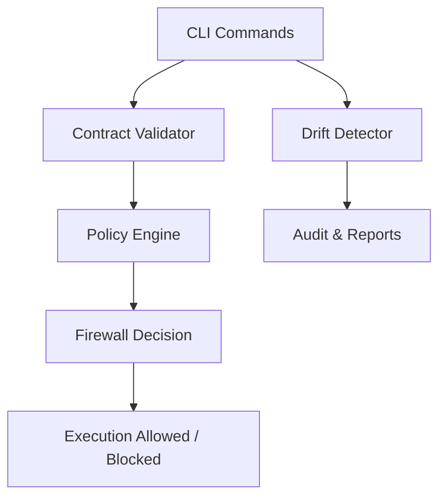
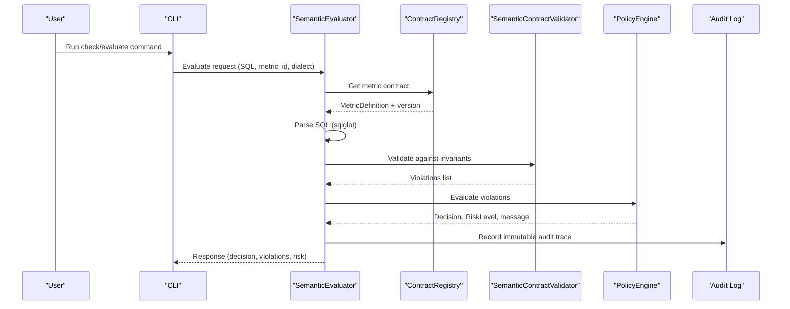
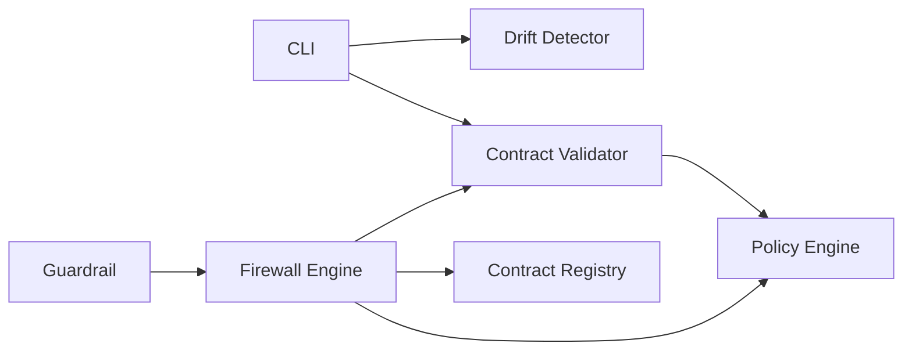

# Common Issues and Solutions

<cite>
**Referenced Files in This Document**
- [contracts.py](file://semantic_reliability/compiler/contracts.py)
- [schema.py](file://semantic_reliability/compiler/schema.py)
- [engine.py](file://semantic_reliability/firewall/engine.py)
- [policy.py](file://semantic_reliability/firewall/policy.py)
- [detector.py](file://semantic_reliability/testing/drift/detector.py)
- [error_analysis.py](file://semantic_reliability/harness/error_analysis.py)
- [cli.py](file://semantic_reliability/cli.py)
- [guardrail.py](file://semantic_reliability/guardrail.py)
- [scos-v1.schema.json](file://spec/scos-v1.schema.json)
- [net_revenue_contract.yaml](file://examples/metrics/net_revenue_contract.yaml)
- [test_contracts.py](file://tests/test_contracts.py)
- [test_drift_detector.py](file://tests/test_drift_detector.py)
</cite>

## Table of Contents
1. [Introduction](#introduction)
2. [Project Structure](#project-structure)
3. [Core Components](#core-components)
4. [Architecture Overview](#architecture-overview)
5. [Detailed Component Analysis](#detailed-component-analysis)
6. [Dependency Analysis](#dependency-analysis)
7. [Performance Considerations](#performance-considerations)
8. [Troubleshooting Guide](#troubleshooting-guide)
9. [Conclusion](#conclusion)

## Introduction
This document consolidates the most common issues encountered when using the Semantic Reliability Engine, focusing on:
- SCOS contract validation failures (population, grain, aggregation, timezone)
- Semantic drift detection failures across WHERE, JOIN, GROUP BY, HAVING, aggregations, and source tables
- Firewall policy violations that block or require review of SQL execution
- Contract schema compliance errors and metric definition problems
- SQL syntax and dialect parsing issues
It provides specific error messages, root causes, step-by-step resolutions, diagnostic commands, and logging techniques to identify and fix issues quickly.

## Project Structure
The engine centers around three layers:
- Contract layer: SCOS YAML definitions and AST-based invariant checks
- Drift layer: AST-level comparison between baseline and candidate SQL
- Firewall layer: Policy-driven decisions (ALLOW, AUDIT, REQUIRE_REVIEW, DENY) with audit traces

**Diagram sources**
- [cli.py:43-131](file://semantic_reliability/cli.py#L43-L131)
- [detector.py:12-46](file://semantic_reliability/testing/drift/detector.py#L12-L46)
- [contracts.py:26-134](file://semantic_reliability/compiler/contracts.py#L26-L134)
- [policy.py:32-67](file://semantic_reliability/firewall/policy.py#L32-L67)
- [engine.py:46-131](file://semantic_reliability/firewall/engine.py#L46-L131)

**Section sources**
- [cli.py:43-131](file://semantic_reliability/cli.py#L43-L131)
- [engine.py:46-131](file://semantic_reliability/firewall/engine.py#L46-L131)

## Core Components
- SCOS Contract Schema: Defines required fields, invariants, probes, and metadata for metrics.
- Contract Validator: Parses SQL into AST and enforces population, grain, aggregation, and timezone invariants.
- Drift Detector: Compares baseline and candidate SQL ASTs to detect semantic changes.
- Firewall Engine: Loads contracts, parses SQL, runs validator, applies policy, records audit trace.
- CLI: Provides commands to check drift, evaluate agents, run benchmarks, and integrate with CI.

**Section sources**
- [schema.py:83-97](file://semantic_reliability/compiler/schema.py#L83-L97)
- [contracts.py:26-134](file://semantic_reliability/compiler/contracts.py#L26-L134)
- [detector.py:12-46](file://semantic_reliability/testing/drift/detector.py#L12-L46)
- [engine.py:18-131](file://semantic_reliability/firewall/engine.py#L18-L131)
- [cli.py:43-131](file://semantic_reliability/cli.py#L43-L131)

## Architecture Overview
End-to-end flow from CLI to firewall decision and audit:

**Diagram sources**
- [engine.py:46-131](file://semantic_reliability/firewall/engine.py#L46-L131)
- [contracts.py:26-134](file://semantic_reliability/compiler/contracts.py#L26-L134)
- [policy.py:32-67](file://semantic_reliability/firewall/policy.py#L32-L67)
- [cli.py:43-131](file://semantic_reliability/cli.py#L43-L131)

## Detailed Component Analysis

### SCOS Contract Validation Errors
Common failures include missing filters, incorrect grouping dimensions, absent positive/negative components, and non-UTC timezones. The validator checks:
- Population invariants: required_filters presence in WHERE
- Grain invariants: required_dimensions present in GROUP BY
- Aggregation invariants: positive_components and negative_components included
- Timezone invariants: UTC requirement enforced

Resolution steps:
- Ensure all required filters are present in WHERE clause
- Include all required dimensions in GROUP BY
- Add positive and negative components to net aggregation expressions
- Align timestamps to UTC if required by contract

Diagnostics:
- Use CLI check with a metric YAML to surface contract violations
- Inspect violation details and remediation hints returned by the validator

**Section sources**
- [contracts.py:44-127](file://semantic_reliability/compiler/contracts.py#L44-L127)
- [schema.py:5-36](file://semantic_reliability/compiler/schema.py#L5-L36)
- [cli.py:75-131](file://semantic_reliability/cli.py#L75-L131)
- [net_revenue_contract.yaml:1-39](file://examples/metrics/net_revenue_contract.yaml#L1-L39)
- [test_contracts.py:45-91](file://tests/test_contracts.py#L45-L91)

### Semantic Drift Detection Failures
Drift detector compares baseline and candidate SQL ASTs and reports:
- Filter removal/addition or logic shift in WHERE
- Aggregation function or expression shifts in SELECT
- Join topology changes or missing predicates
- Grouping dimension changes (grain drift)
- Null handling differences (COALESCE)
- HAVING filter alterations
- Source table lineage changes

Resolution steps:
- Restore dropped filters or confirm intentional filtering changes
- Revert aggregation function or expression changes to canonical business formula
- Add explicit ON clauses to joins to avoid Cartesian products
- Restore required grouping dimensions
- Retain COALESCE defaults to prevent NULL propagation
- Confirm post-aggregation thresholds
- Verify upstream model lineage and table sources

Diagnostics:
- Use CLI check with baseline SQL or metric YAML to detect drift
- Review severity levels and business impact descriptions

**Section sources**
- [detector.py:25-245](file://semantic_reliability/testing/drift/detector.py#L25-L245)
- [cli.py:75-131](file://semantic_reliability/cli.py#L75-L131)
- [test_drift_detector.py:17-83](file://tests/test_drift_detector.py#L17-L83)

### Firewall Policy Violations
The firewall evaluates parsed SQL and contract violations to decide:
- ALLOW: No violations; execution allowed
- AUDIT: Non-critical anomalies; execution allowed but logged
- REQUIRE_REVIEW: Critical anomalies in non-strict mode; manual review required
- DENY: Critical anomalies in strict mode; execution blocked

Root causes:
- Missing or incorrect invariants leading to critical violations
- Unparseable SQL causing automatic DENY
- Unknown metric contract ID

Resolution steps:
- Fix invariant violations before re-running evaluation
- Correct SQL syntax and ensure valid dialect parsing
- Register correct metric contract IDs in the registry

Diagnostics:
- Inspect response decision, risk level, and message
- Check audit logs for immutable traces including violations and decisions

**Section sources**
- [engine.py:54-131](file://semantic_reliability/firewall/engine.py#L54-L131)
- [policy.py:32-67](file://semantic_reliability/firewall/policy.py#L32-L67)
- [guardrail.py:91-152](file://semantic_reliability/guardrail.py#L91-L152)

### Contract Schema Compliance and Metric Definition Problems
SCOS v1 schema requires specific fields and structures:
- Required fields: scos_version, metric, owner, grain, sql
- Optional: id, version, description, domain, dialect, tags, invariants, probes, provenance, metadata
- Invariants structure includes population, temporal, aggregation, deduction
- Probes include population, implications, null_drift

Common issues:
- Missing required fields or invalid types
- Incorrect dialect values not in allowed enum
- Malformed invariants or probes structures

Resolution steps:
- Validate YAML against schema requirements
- Ensure metric identifier follows pattern rules
- Provide correct dialect from supported set
- Define invariants and probes according to specification

Diagnostics:
- Load YAML via compiler and inspect parsed MetricDefinition
- Use CLI compile to verify ground-truth SQL compilation

**Section sources**
- [scos-v1.schema.json:1-163](file://spec/scos-v1.schema.json#L1-L163)
- [schema.py:83-97](file://semantic_reliability/compiler/schema.py#L83-L97)
- [cli.py:571-585](file://semantic_reliability/cli.py#L571-L585)

### SQL Syntax and Dialect Parsing Issues
Parsing uses sqlglot with a specified dialect. Errors occur when:
- SQL is syntactically invalid
- Dialect does not match database engine
- Unsupported features used for chosen dialect

Resolution steps:
- Correct SQL syntax errors
- Set appropriate dialect matching target warehouse
- Avoid dialect-specific constructs unless supported

Diagnostics:
- Firewall returns parse error messages and denies execution
- CLI check surfaces parse exceptions during evaluation

**Section sources**
- [engine.py:57-84](file://semantic_reliability/firewall/engine.py#L57-L84)
- [cli.py:43-131](file://semantic_reliability/cli.py#L43-L131)

### Assertion and Runtime Execution Failures
Agent evaluation can fail at runtime when executing SQL against fixtures:
- Execution errors produce violations and mark execution as failed
- Assertions may not catch contract breaches, leading to silent semantic breaches

Resolution steps:
- Fix runtime errors in SQL (syntax, references, data types)
- Strengthen assertion suites to cover contract invariants
- Review unsupported assumptions surfaced by evaluation

Diagnostics:
- Use evaluate-agent command to get verdict, semantic risk, and failure reasons
- Inspect assertion failures and unsupported assumptions

**Section sources**
- [cli.py:489-540](file://semantic_reliability/cli.py#L489-L540)
- [evaluation agent_eval snippet:89-114](file://semantic_reliability/evaluation/agent_eval.py#L89-L114)

## Dependency Analysis
Key dependencies and relationships:
- CLI depends on drift detector, contract validator, mutation engine, and reporters
- Firewall engine depends on contract registry, policy engine, and contract validator
- Drift detector depends on AST normalization and rule definitions
- Guardrail wraps evaluator and raises exceptions on violations

**Diagram sources**
- [cli.py:21-33](file://semantic_reliability/cli.py#L21-L33)
- [engine.py:10-13](file://semantic_reliability/firewall/engine.py#L10-L13)
- [detector.py:1-7](file://semantic_reliability/testing/drift/detector.py#L1-L7)
- [guardrail.py:7-10](file://semantic_reliability/guardrail.py#L7-L10)

**Section sources**
- [cli.py:21-33](file://semantic_reliability/cli.py#L21-L33)
- [engine.py:10-13](file://semantic_reliability/firewall/engine.py#L10-L13)
- [detector.py:1-7](file://semantic_reliability/testing/drift/detector.py#L1-L7)
- [guardrail.py:7-10](file://semantic_reliability/guardrail.py#L7-L10)

## Performance Considerations
- AST parsing and traversal can be expensive on large queries; prefer minimal dialect usage and targeted checks
- Limit AST complexity via guards (e.g., node count limits in MCP handlers) to avoid excessive resource consumption
- Batch evaluations where possible to reduce repeated parsing overhead
- Use fixture adequacy checks to minimize unnecessary execution costs

[No sources needed since this section provides general guidance]

## Troubleshooting Guide

### Frequent Compilation Errors with SCOS Contracts
Symptoms:
- Missing required filters in WHERE clause
- Missing grouping dimensions in GROUP BY
- Absent positive or negative components in aggregation
- Non-UTC timezone conversions when UTC is required

Root causes:
- Candidate SQL deviates from declared invariants
- Incorrect or incomplete metric definition

Resolutions:
- Add missing filters and dimensions per contract
- Include required positive and negative components
- Align timestamps to UTC
- Validate YAML against SCOS schema

Diagnostic commands:
- Use CLI check with metric YAML to surface violations
- Use CLI compile to verify ground-truth SQL compilation

Logging techniques:
- Inspect violation details and remediation hints from contract validator
- Review audit traces for decision and violations

**Section sources**
- [contracts.py:44-127](file://semantic_reliability/compiler/contracts.py#L44-L127)
- [cli.py:75-131](file://semantic_reliability/cli.py#L75-L131)
- [cli.py:571-585](file://semantic_reliability/cli.py#L571-L585)
- [scos-v1.schema.json:1-163](file://spec/scos-v1.schema.json#L1-L163)

### Semantic Drift Detection Failures
Symptoms:
- Filters removed or altered
- Aggregation functions changed
- Join predicates missing
- Grouping dimensions shifted
- HAVING filters modified
- Source tables changed

Root causes:
- Candidate SQL diverges from baseline relational logic
- Upstream model lineage changes

Resolutions:
- Restore baseline filters and grouping dimensions
- Revert aggregation changes to canonical formula
- Add explicit join predicates
- Confirm and approve any legitimate business updates

Diagnostic commands:
- Use CLI check with baseline SQL or metric YAML
- Generate SARIF reports for integration with code scanning

Logging techniques:
- Review drift severity and business impact
- Export PR comments for review workflows

**Section sources**
- [detector.py:25-245](file://semantic_reliability/testing/drift/detector.py#L25-L245)
- [cli.py:75-131](file://semantic_reliability/cli.py#L75-L131)
- [test_drift_detector.py:17-83](file://tests/test_drift_detector.py#L17-L83)

### Firewall Policy Violations
Symptoms:
- Execution denied due to critical violations
- Require review in non-strict mode
- Parse errors causing automatic denial

Root causes:
- Critical invariant breaches
- Invalid SQL or unknown metric contract

Resolutions:
- Fix invariant violations and SQL syntax
- Register correct metric contracts
- Adjust strict mode if necessary for review workflows

Diagnostic commands:
- Use CLI evaluate-agent or dbt-check to assess compliance
- Inspect firewall responses for decision and risk

Logging techniques:
- Read audit logs for immutable traces
- Use guardrail intercept to raise exceptions on violations

**Section sources**
- [engine.py:54-131](file://semantic_reliability/firewall/engine.py#L54-L131)
- [policy.py:32-67](file://semantic_reliability/firewall/policy.py#L32-L67)
- [guardrail.py:91-152](file://semantic_reliability/guardrail.py#L91-L152)

### Contract Validation Errors, SQL Syntax Issues, and Metric Definition Problems
Symptoms:
- Schema validation failures for YAML
- Dialect mismatches
- Missing or malformed invariants/probes

Root causes:
- Incorrect SCOS structure
- Unsupported dialect values
- Incomplete metric definitions

Resolutions:
- Align YAML to SCOS v1 schema
- Use supported dialects
- Complete required fields and structures

Diagnostic commands:
- Compile metric YAML to validate structure and SQL
- Use CLI check to surface contract violations

Logging techniques:
- Capture parse errors and violation messages
- Review audit traces for contract version and decisions

**Section sources**
- [scos-v1.schema.json:1-163](file://spec/scos-v1.schema.json#L1-L163)
- [schema.py:83-97](file://semantic_reliability/compiler/schema.py#L83-L97)
- [cli.py:571-585](file://semantic_reliability/cli.py#L571-L585)
- [engine.py:57-84](file://semantic_reliability/firewall/engine.py#L57-L84)

### Diagnostic Commands and Logging Techniques
- CLI check: Compare candidate SQL against baseline or metric YAML; outputs drift and contract violations; supports SARIF export and fail-on-drift
- CLI evaluate-agent: Evaluates agent-generated SQL against contracts and assertions; returns verdict, semantic risk, and failures
- CLI dbt-check: Checks compiled dbt models against contracts; supports JSON/SARIF output and threshold gating
- CLI probe: Runs statistical probes to detect data reality shifts
- CLI benchmark/benchmark-corpus: Executes mutation testing and multi-model evaluation; supports error analysis taxonomy

Logging:
- Firewall engine logs immutable audit traces including trace_id, decision, violations, and contract version
- Guardrail intercept raises structured exceptions with remediation hints
- CLI prints rich panels and tables summarizing results

**Section sources**
- [cli.py:43-131](file://semantic_reliability/cli.py#L43-L131)
- [cli.py:489-540](file://semantic_reliability/cli.py#L489-L540)
- [cli.py:737-786](file://semantic_reliability/cli.py#L737-L786)
- [cli.py:587-629](file://semantic_reliability/cli.py#L587-L629)
- [engine.py:118-131](file://semantic_reliability/firewall/engine.py#L118-L131)
- [guardrail.py:138-152](file://semantic_reliability/guardrail.py#L138-L152)

## Conclusion
The Semantic Reliability Engine provides robust mechanisms to prevent silent metric corruption through contract validation, drift detection, and policy-driven execution control. By addressing common issues—contract violations, drift anomalies, firewall denials, schema compliance, and SQL syntax errors—you can maintain reliable analytics pipelines. Use the provided diagnostic commands and logging techniques to quickly identify root causes and apply targeted fixes.