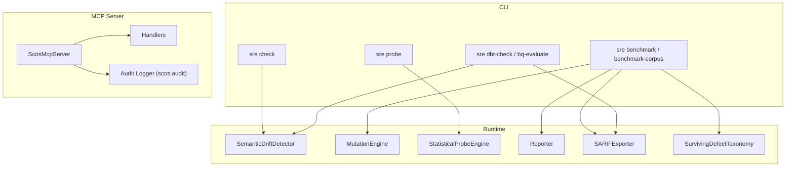
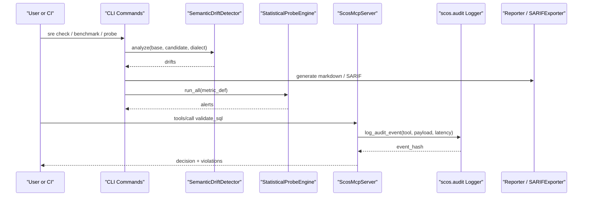
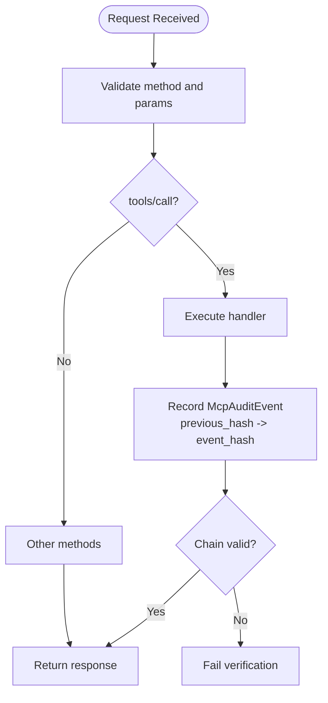
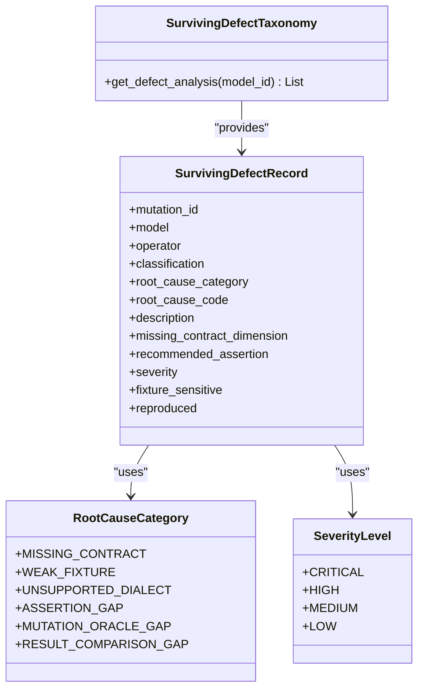
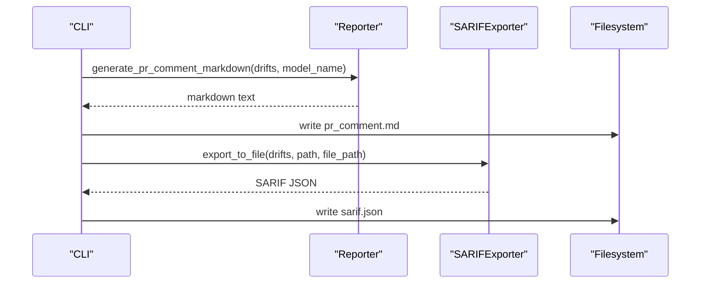
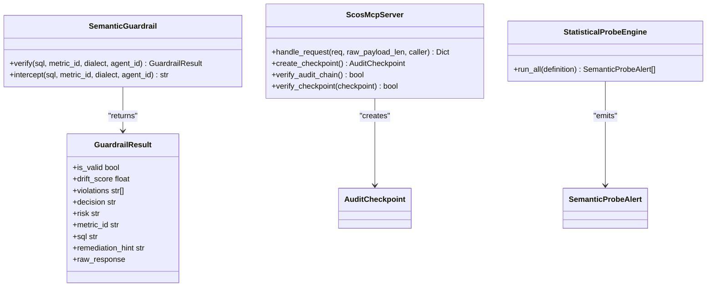
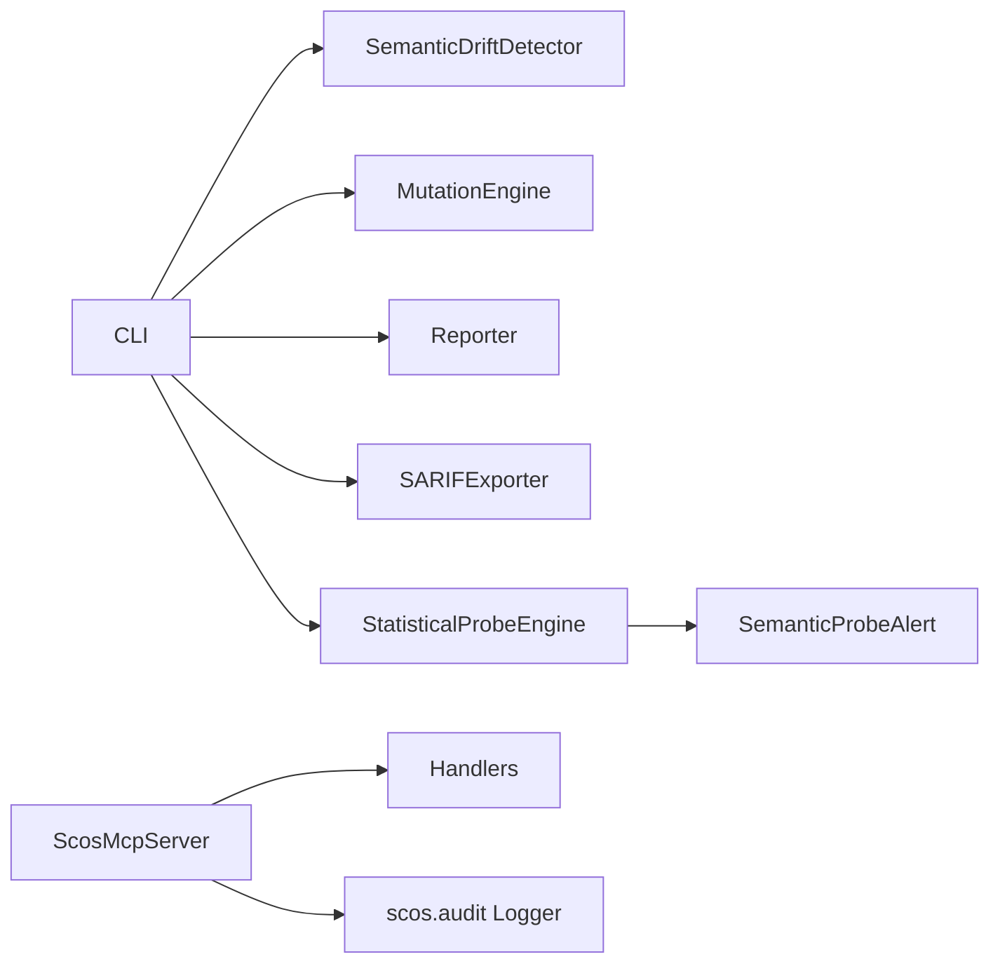

# Diagnostic Tools and Logging

<cite>
**Referenced Files in This Document**
- [cli.py](file://semantic_reliability/cli.py)
- [server.py](file://semantic_reliability/mcp/server.py)
- [security.py](file://semantic_reliability/mcp/security.py)
- [handlers.py](file://semantic_reliability/mcp/handlers.py)
- [engine.py](file://semantic_reliability/probes/engine.py)
- [signals.py](file://semantic_reliability/probes/signals.py)
- [error_analysis.py](file://semantic_reliability/harness/error_analysis.py)
- [reporter.py](file://semantic_reliability/harness/reporter.py)
- [sarif_exporter.py](file://semantic_reliability/harness/sarif_exporter.py)
- [guardrail.py](file://semantic_reliability/guardrail.py)
- [__init__.py](file://semantic_reliability/__init__.py)
- [README.md](file://README.md)
</cite>

## Table of Contents
1. [Introduction](#introduction)
2. [Project Structure](#project-structure)
3. [Core Components](#core-components)
4. [Architecture Overview](#architecture-overview)
5. [Detailed Component Analysis](#detailed-component-analysis)
6. [Dependency Analysis](#dependency-analysis)
7. [Performance Considerations](#performance-considerations)
8. [Troubleshooting Guide](#troubleshooting-guide)
9. [Conclusion](#conclusion)
10. [Appendices](#appendices)

## Introduction
This document explains the diagnostic tools and logging capabilities of the Semantic Reliability Engine (SRE). It covers:
- Logging configuration options, log levels, and output formats used across the engine
- The audit trail system with tamper-evident hash chaining and checkpoints
- Error analysis tools and reporting mechanisms for surviving defects and drift
- Command-line diagnostic utilities and programmatic debugging interfaces
- Integration points with external monitoring systems (CI/CD, SARIF, MCP server)
- Effective logging strategies and troubleshooting workflows

The goal is to help you instrument, observe, and troubleshoot SRE reliably in development, CI, and production-like environments.

## Project Structure
SRE exposes diagnostics through:
- A CLI surface for drift checks, mutation benchmarking, corpus evaluation, and report generation
- An MCP server that provides a read-only tool interface with structured audit events
- Probes that detect statistical reality shifts and emit alerts
- Reporters and exporters that produce human-readable and machine-readable outputs (Markdown, SARIF, JSON)
- Guardrails that enforce semantic contracts and raise exceptions when violations are detected

**Diagram sources**
- [cli.py:36-800](file://semantic_reliability/cli.py#L36-L800)
- [server.py:16-257](file://semantic_reliability/mcp/server.py#L16-L257)
- [security.py:8-56](file://semantic_reliability/mcp/security.py#L8-L56)
- [handlers.py:101-289](file://semantic_reliability/mcp/handlers.py#L101-L289)
- [engine.py:11-138](file://semantic_reliability/probes/engine.py#L11-L138)
- [reporter.py:8-129](file://semantic_reliability/harness/reporter.py#L8-L129)
- [sarif_exporter.py:36-65](file://semantic_reliability/harness/sarif_exporter.py#L36-L65)
- [error_analysis.py:6-92](file://semantic_reliability/harness/error_analysis.py#L6-L92)

**Section sources**
- [cli.py:36-800](file://semantic_reliability/cli.py#L36-L800)
- [server.py:16-257](file://semantic_reliability/mcp/server.py#L16-L257)
- [README.md:93-112](file://README.md#L93-L112)

## Core Components
- CLI diagnostics: Drift detection, mutation benchmarking, corpus evaluation, PR comment generation, contract compilation, probes execution, and BigQuery dry-run evaluation
- Audit trail: Structured JSON audit logger with SQL redaction and cryptographic hash chaining; signed checkpoints for integrity verification
- Probes: Statistical probes that compare live data distributions against baseline assumptions and emit alerts
- Reporting: Markdown reports for PR comments and benchmarks; SARIF export for CI scanning; JSON outputs for automation
- Programmatic interfaces: Guardrail verify/intercept, MCP server request handling, and handler tools for validation and explanation

**Section sources**
- [cli.py:36-800](file://semantic_reliability/cli.py#L36-L800)
- [server.py:50-180](file://semantic_reliability/mcp/server.py#L50-L180)
- [security.py:8-56](file://semantic_reliability/mcp/security.py#L8-L56)
- [engine.py:11-138](file://semantic_reliability/probes/engine.py#L11-L138)
- [reporter.py:8-129](file://semantic_reliability/harness/reporter.py#L8-L129)
- [sarif_exporter.py:36-65](file://semantic_reliability/harness/sarif_exporter.py#L36-L65)
- [guardrail.py:45-153](file://semantic_reliability/guardrail.py#L45-L153)

## Architecture Overview
The diagnostic architecture integrates static AST-based drift detection, dynamic statistical probing, and an auditable control plane via MCP. Outputs include terminal panels, Markdown, SARIF, and JSON artifacts suitable for CI and dashboards.

**Diagram sources**
- [cli.py:43-132](file://semantic_reliability/cli.py#L43-L132)
- [cli.py:175-284](file://semantic_reliability/cli.py#L175-L284)
- [cli.py:571-630](file://semantic_reliability/cli.py#L571-L630)
- [server.py:95-128](file://semantic_reliability/mcp/server.py#L95-L128)
- [security.py:37-56](file://semantic_reliability/mcp/security.py#L37-L56)
- [reporter.py:11-84](file://semantic_reliability/harness/reporter.py#L11-L84)
- [sarif_exporter.py:36-65](file://semantic_reliability/harness/sarif_exporter.py#L36-L65)

## Detailed Component Analysis

### Logging Configuration, Levels, and Output Formats
- Structured audit logger:
  - Logger name: scos.audit
  - Level: INFO
  - Format: JSON with fields time, event, data
  - Redaction: raw SQL replaced by SHA-256 hash before logging
  - Chaining: each event includes previous_hash and computes event_hash
  - Limits: enforced payload size and SQL length limits
- MCP server logger:
  - Logger name: sre.mcp
  - Used for internal error tracing during request handling
- Probe engine logger:
  - Logger name: sre.probes
  - Logs errors when individual probes fail

Configuration notes:
- Handlers and formatters are set up at module import time for the audit logger; adjust handlers/formatters at startup if integrating with centralized logging.
- No global log level toggles are exposed via CLI; configure Python logging at application entry point to route logs to files, streams, or collectors.

Output formats:
- Audit events: JSON lines on stdout (or configured handler)
- CLI panels: Rich console tables and panels for human readability
- Reports: Markdown for PR comments and benchmark summaries
- Machine-readable: SARIF 2.1.0 for code scanning, JSON for automation

**Section sources**
- [security.py:8-56](file://semantic_reliability/mcp/security.py#L8-L56)
- [server.py:13-14](file://semantic_reliability/mcp/server.py#L13-L14)
- [engine.py:1-9](file://semantic_reliability/probes/engine.py#L1-L9)
- [cli.py:67-132](file://semantic_reliability/cli.py#L67-L132)
- [reporter.py:11-84](file://semantic_reliability/harness/reporter.py#L11-L84)
- [sarif_exporter.py:36-65](file://semantic_reliability/harness/sarif_exporter.py#L36-L65)

### Audit Trail System
- Tamper-evident chain:
  - Each MCP tool call appends an event with a computed hash chained to the previous event
  - Genesis hash anchors the start of the chain
  - Checkpoints can be created to sign and anchor the current chain state
  - Verification functions validate both chain integrity and checkpoint signatures
- Security boundaries:
  - SQL redacted from logs using SHA-256 hashing
  - Request size and SQL length limits enforced
  - Caller identity and tenant scoping recorded in audit events

**Diagram sources**
- [server.py:50-180](file://semantic_reliability/mcp/server.py#L50-L180)
- [server.py:182-220](file://semantic_reliability/mcp/server.py#L182-L220)
- [security.py:37-56](file://semantic_reliability/mcp/security.py#L37-L56)

**Section sources**
- [server.py:50-220](file://semantic_reliability/mcp/server.py#L50-L220)
- [security.py:16-56](file://semantic_reliability/mcp/security.py#L16-L56)

### Error Analysis Tools
- Surviving defect taxonomy:
  - Categorizes known holdout surviving defects by root cause categories such as missing contract, weak fixture, assertion gaps, and mutation oracle gaps
  - Provides severity levels and recommended assertions to close gaps
- Usage in CLI:
  - benchmark-corpus command can display surviving defect root-cause analysis when enabled

**Diagram sources**
- [error_analysis.py:6-92](file://semantic_reliability/harness/error_analysis.py#L6-L92)

**Section sources**
- [error_analysis.py:6-92](file://semantic_reliability/harness/error_analysis.py#L6-L92)
- [cli.py:286-486](file://semantic_reliability/cli.py#L286-L486)

### Reporting Mechanisms
- Markdown reports:
  - PR comment generator summarizes drift severity, components, business impact, and remediation guidance
  - Benchmark report details mutation catch rates, blind spots, and per-mutation evaluations
- SARIF export:
  - Maps drift findings to SARIF rules with severity levels and remediation hints
  - Integrates with GitHub Code Scanning and other SARIF consumers
- JSON outputs:
  - CLI commands support writing results to JSON for automation and dashboards

**Diagram sources**
- [reporter.py:11-84](file://semantic_reliability/harness/reporter.py#L11-L84)
- [sarif_exporter.py:36-65](file://semantic_reliability/harness/sarif_exporter.py#L36-L65)
- [cli.py:43-132](file://semantic_reliability/cli.py#L43-L132)

**Section sources**
- [reporter.py:8-129](file://semantic_reliability/harness/reporter.py#L8-L129)
- [sarif_exporter.py:36-65](file://semantic_reliability/harness/sarif_exporter.py#L36-L65)
- [cli.py:43-132](file://semantic_reliability/cli.py#L43-L132)

### Command-Line Diagnostic Utilities
Key commands and their diagnostic value:
- sre check: Detects semantic drift between baseline and candidate SQL; optional SARIF output and fail-on-drift behavior
- sre mutate: Generates AST-level mutations for robustness testing
- sre benchmark: Runs assertion suites against mutations; supports comparative mode and Markdown report output
- sre benchmark-corpus: Executes multi-model cross-evaluation across dev and holdout tracks; supports error analysis, JSON output, and Markdown report
- sre evaluate-agent: Evaluates agent-generated SQL against contracts and assertion suites
- sre pr-comment: Generates GitHub PR review comment markdown
- sre compile: Compiles metric definitions into standard SQL
- sre probe: Executes declarative statistical probes to detect upstream data reality shifts
- sre export-gym / audit-gym: Exports and audits training datasets for agents
- sre bq-evaluate: Dry-run evaluation against BigQuery with semantic contract checks
- sre dbt-check: Checks compiled dbt models for semantic drift; supports JSON/SARIF outputs and threshold gating
- sre mcp-serve: Starts the read-only SCOS MCP server for pre-execution validation and auditing

**Section sources**
- [cli.py:36-800](file://semantic_reliability/cli.py#L36-L800)
- [README.md:93-112](file://README.md#L93-L112)

### Programmatic Debugging Interfaces
- SemanticGuardrail:
  - verify(sql, metric_id, dialect, agent_id): Returns a result with validity, drift score, violations, decision, risk, and remediation hint
  - intercept(sql, ...): Raises a typed exception on violation, enabling early blocking in pipelines
- MCP server:
  - handle_request(req, raw_payload_len, caller): Processes JSON-RPC requests, enforces limits, records audit events, and returns standardized responses
  - create_checkpoint(), verify_audit_chain(), verify_checkpoint(): Anchor and verify tamper-evident audit chains
- StatisticalProbeEngine:
  - run_all(definition): Executes population, implication, and null drift probes; returns structured alerts

**Diagram sources**
- [guardrail.py:28-153](file://semantic_reliability/guardrail.py#L28-L153)
- [server.py:16-257](file://semantic_reliability/mcp/server.py#L16-L257)
- [engine.py:11-138](file://semantic_reliability/probes/engine.py#L11-L138)
- [signals.py:5-18](file://semantic_reliability/probes/signals.py#L5-L18)

**Section sources**
- [guardrail.py:28-153](file://semantic_reliability/guardrail.py#L28-L153)
- [server.py:16-257](file://semantic_reliability/mcp/server.py#L16-L257)
- [engine.py:11-138](file://semantic_reliability/probes/engine.py#L11-L138)
- [signals.py:5-18](file://semantic_reliability/probes/signals.py#L5-L18)

### Integration with External Monitoring Systems
- CI/CD gating:
  - dbt-check exits non-zero based on severity thresholds; supports JSON and SARIF outputs for integration with CI scanners
  - check command supports --fail-on-drift to block pipelines on critical/high drift
- SARIF consumption:
  - Exported SARIF maps drift types to rule IDs and severities; compatible with GitHub Code Scanning and other SARIF consumers
- MCP server:
  - Read-only JSON-RPC 2.0 interface for pre-execution validation; emits structured audit events consumable by log aggregators
- BigQuery dry-run:
  - bq-evaluate performs syntax and capability checks against BigQuery while enforcing semantic contracts

**Section sources**
- [cli.py:737-786](file://semantic_reliability/cli.py#L737-L786)
- [cli.py:706-734](file://semantic_reliability/cli.py#L706-L734)
- [sarif_exporter.py:36-65](file://semantic_reliability/harness/sarif_exporter.py#L36-L65)
- [server.py:239-257](file://semantic_reliability/mcp/server.py#L239-L257)

## Dependency Analysis
- CLI depends on:
  - Drift detector, mutation engine, assertion suite runner, reporter, SARIF exporter, and various adapters
- MCP server depends on:
  - Contract registry, handlers, and security utilities for audit logging and limits
- Probes depend on:
  - Metric definition schema and DuckDB connection for statistical checks
- Reporting depends on:
  - Drift rules and benchmark results to produce Markdown and SARIF

**Diagram sources**
- [cli.py:21-34](file://semantic_reliability/cli.py#L21-L34)
- [server.py:9-12](file://semantic_reliability/mcp/server.py#L9-L12)
- [engine.py:1-9](file://semantic_reliability/probes/engine.py#L1-L9)
- [signals.py:5-18](file://semantic_reliability/probes/signals.py#L5-L18)

**Section sources**
- [cli.py:21-34](file://semantic_reliability/cli.py#L21-L34)
- [server.py:9-12](file://semantic_reliability/mcp/server.py#L9-L12)
- [engine.py:1-9](file://semantic_reliability/probes/engine.py#L1-L9)

## Performance Considerations
- Audit logging overhead:
  - Hash chaining and JSON serialization add minimal overhead; ensure efficient log sinks in high-throughput environments
- Payload and SQL limits:
  - Enforced limits prevent excessive memory usage and slow processing; tune max_request_bytes and constants if needed
- Probe queries:
  - Statistical probes execute SQL against connections; ensure appropriate indexing and dataset sizes to keep latency low
- SARIF and Markdown generation:
  - Batch operations where possible; avoid generating large reports in tight loops

[No sources needed since this section provides general guidance]

## Troubleshooting Guide
Common issues and how to diagnose them:
- Missing contract or metric:
  - Use sre compile to validate metric YAML; use sre evaluate-agent to assess agent-generated SQL against contracts
- Drift detected in CI:
  - Run sre check with --sarif to produce SARIF; integrate with CI scanner; use sre pr-comment to generate actionable feedback
- Surviving defects in benchmarks:
  - Enable error analysis in benchmark-corpus to classify root causes; add recommended assertions to close gaps
- Probe failures:
  - Inspect sre.probes logs for query errors; verify table names and fixtures; adjust tolerances in metric definitions
- MCP audit chain verification:
  - Use server.verify_audit_chain() and server.verify_checkpoint() to ensure integrity; check signing secret configuration

Actionable steps:
- Capture structured audit logs and forward to your log aggregator
- Export SARIF and Markdown reports for traceability
- Use guardrail.intercept() to fail fast on violations in pipelines
- Re-run benchmarks with updated assertions and re-export reports

**Section sources**
- [cli.py:43-132](file://semantic_reliability/cli.py#L43-L132)
- [cli.py:286-486](file://semantic_reliability/cli.py#L286-L486)
- [engine.py:69-137](file://semantic_reliability/probes/engine.py#L69-L137)
- [server.py:182-220](file://semantic_reliability/mcp/server.py#L182-L220)
- [guardrail.py:138-153](file://semantic_reliability/guardrail.py#L138-L153)

## Conclusion
SRE provides a comprehensive diagnostic toolkit combining deterministic drift detection, statistical probing, tamper-evident auditing, and rich reporting. By configuring logging appropriately, leveraging CLI utilities, and integrating with CI/CD and monitoring systems, teams can proactively detect and resolve semantic issues before they reach production.

[No sources needed since this section summarizes without analyzing specific files]

## Appendices

### Effective Logging Strategies
- Centralize structured audit logs:
  - Configure a single handler for scos.audit to emit JSON lines to a log collector
- Correlate events:
  - Include request IDs, tenant IDs, and client IDs in custom contexts when extending handlers
- Redaction policy:
  - Keep SQL hashed in logs; store raw payloads securely if needed for investigations
- Alerting:
  - Monitor for high-severity drifts and probe alerts; integrate with incident systems

**Section sources**
- [security.py:8-56](file://semantic_reliability/mcp/security.py#L8-L56)
- [server.py:50-180](file://semantic_reliability/mcp/server.py#L50-L180)

### Troubleshooting Workflows
- End-to-end drift investigation:
  - Run sre check to identify drift; export SARIF; review PR comment; update contracts or SQL accordingly
- Benchmark-driven improvement:
  - Run sre benchmark-corpus with error analysis; add recommended assertions; re-run to validate improvements
- Production-like validation:
  - Use sre bq-evaluate for dry-run checks; gate CI with sre dbt-check thresholds

**Section sources**
- [cli.py:43-132](file://semantic_reliability/cli.py#L43-L132)
- [cli.py:286-486](file://semantic_reliability/cli.py#L286-L486)
- [cli.py:706-786](file://semantic_reliability/cli.py#L706-L786)