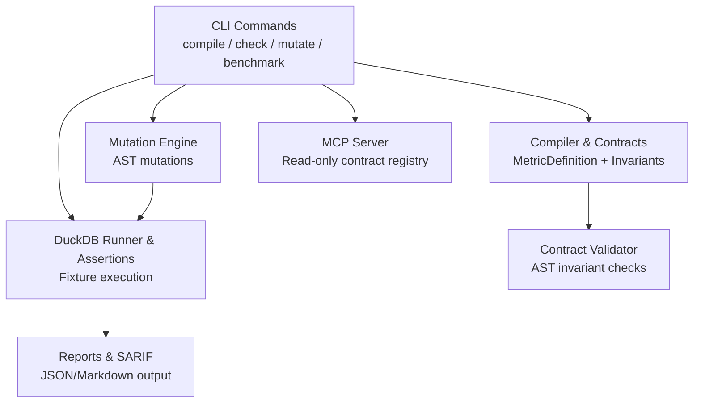
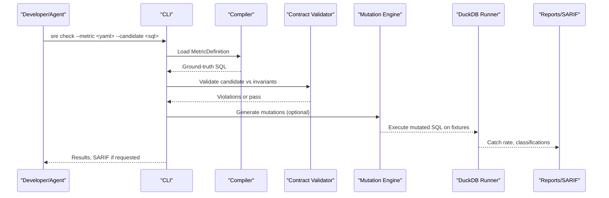
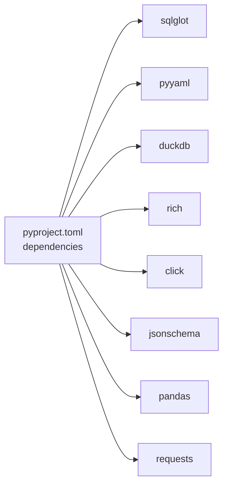

# Frequently Asked Questions

<cite>
**Referenced Files in This Document**
- [README.md](file://README.md)
- [SCOS_V1_SPECIFICATION.md](file://spec/SCOS_V1_SPECIFICATION.md)
- [cli.py](file://semantic_reliability/cli.py)
- [contracts.py](file://semantic_reliability/compiler/contracts.py)
- [engine.py](file://semantic_reliability/testing/mutations/engine.py)
- [duckdb_runner.py](file://semantic_reliability/harness/duckdb_runner.py)
- [quality_harness.py](file://semantic_reliability/harness/quality_harness.py)
- [net_revenue_contract.yaml](file://benchmark_corpus/dev/net_revenue/contract.yaml)
- [net_revenue_contract_example.yaml](file://examples/metrics/net_revenue_contract.yaml)
- [semantic_assertions.yaml](file://examples/assertions/semantic_assertions.yaml)
- [ENTERPRISE_ARCHITECTURE_AND_CISO_WHITEPAPER.md](file://docs/ENTERPRISE_ARCHITECTURE_AND_CISO_WHITEPAPER.md)
- [ENTERPRISE_ARCHITECTURE_WHITEPAPER.md](file://docs/ENTERPRISE_ARCHITECTURE_WHITEPAPER.md)
- [pyproject.toml](file://pyproject.toml)
</cite>

## Table of Contents
1. [Introduction](#introduction)
2. [Project Structure](#project-structure)
3. [Core Components](#core-components)
4. [Architecture Overview](#architecture-overview)
5. [Detailed Component Analysis](#detailed-component-analysis)
6. [Dependency Analysis](#dependency-analysis)
7. [Performance Considerations](#performance-considerations)
8. [Troubleshooting Guide](#troubleshooting-guide)
9. [Conclusion](#conclusion)
10. [Appendices](#appendices)

## Introduction
This FAQ answers common questions about setting up, authoring contracts, tuning performance, and integrating the Semantic Reliability Engine (SRE) into CI/CD, agents, and enterprise systems. It focuses on SCOS v1.0 contracts, AST-based semantic guardrails, mutation testing, and practical deployment patterns.

## Project Structure
At a high level:
- CLI commands expose compile, drift check, mutation generation, benchmarking, and MCP server capabilities.
- Contracts define business metrics with invariants and probes.
- Mutation engine injects realistic SQL logic errors to validate test suites.
- Harness executes assertions against fixtures and reports catch rates.
- Enterprise docs describe control plane, sidecar proxy, and CI gates.

**Diagram sources**
- [cli.py:36-131](file://semantic_reliability/cli.py#L36-L131)
- [contracts.py:26-135](file://semantic_reliability/compiler/contracts.py#L26-L135)
- [engine.py:8-52](file://semantic_reliability/testing/mutations/engine.py#L8-L52)
- [duckdb_runner.py:185-214](file://semantic_reliability/harness/duckdb_runner.py#L185-L214)

**Section sources**
- [README.md:22-46](file://README.md#L22-L46)
- [cli.py:36-131](file://semantic_reliability/cli.py#L36-L131)

## Core Components
- Contract authoring: Define metric identity, canonical SQL, invariants, and probes.
- Drift detection: Compare candidate SQL to baseline or contract ground truth.
- Mutation testing: Generate AST-level logical mutations to stress-test assertions.
- Assertion harness: Execute tests against fixtures and compute catch scores.
- MCP server: Provide read-only access to contracts for AI agents.

**Section sources**
- [SCOS_V1_SPECIFICATION.md:31-114](file://spec/SCOS_V1_SPECIFICATION.md#L31-L114)
- [cli.py:43-131](file://semantic_reliability/cli.py#L43-L131)
- [engine.py:8-52](file://semantic_reliability/testing/mutations/engine.py#L8-L52)
- [duckdb_runner.py:185-214](file://semantic_reliability/harness/duckdb_runner.py#L185-L214)

## Architecture Overview
The SRE control plane enforces deterministic pre-execution checks using AST normalization and invariant rules, then optionally runs statistical probes for runtime observability.

**Diagram sources**
- [cli.py:43-131](file://semantic_reliability/cli.py#L43-L131)
- [contracts.py:26-135](file://semantic_reliability/compiler/contracts.py#L26-L135)
- [engine.py:8-52](file://semantic_reliability/testing/mutations/engine.py#L8-L52)
- [duckdb_runner.py:185-214](file://semantic_reliability/harness/duckdb_runner.py#L185-L214)

## Detailed Component Analysis

### How do I install and run the CLI?
- Install via project dependencies; the CLI entry points are registered as sre and semantic-reliability.
- Use commands like compile, check, mutate, benchmark, and mcp-serve.

Quick references:
- Entry points and dependencies: [pyproject.toml:5-34](file://pyproject.toml#L5-L34)
- CLI group and commands: [cli.py:36-131](file://semantic_reliability/cli.py#L36-L131)

**Section sources**
- [pyproject.toml:5-34](file://pyproject.toml#L5-L34)
- [cli.py:36-131](file://semantic_reliability/cli.py#L36-L131)

### What is SCOS and how do I author a contract?
SCOS defines:
- Identity and governance header (version, id, metric, grain, dialect).
- Canonical SQL as ground truth.
- Invariants: required filters, forbidden filters, grain dimensions, aggregation components, timezone.
- Probes: population rates, implications, null drift.

Best practices:
- Keep invariants minimal but precise; prefer explicit required_filters and grouping dimensions.
- Use units/timezone fields to prevent silent boundary drift.
- Include probes to detect upstream data reality shifts.

References:
- Specification overview and layers: [SCOS_V1_SPECIFICATION.md:31-114](file://spec/SCOS_V1_SPECIFICATION.md#L31-L114)
- Example contracts: 
  - [net_revenue_contract.yaml](file://benchmark_corpus/dev/net_revenue/contract.yaml)
  - [net_revenue_contract_example.yaml](file://examples/metrics/net_revenue_contract.yaml)

**Section sources**
- [SCOS_V1_SPECIFICATION.md:31-114](file://spec/SCOS_V1_SPECIFICATION.md#L31-L114)
- [net_revenue_contract.yaml](file://benchmark_corpus/dev/net_revenue/contract.yaml)
- [net_revenue_contract_example.yaml](file://examples/metrics/net_revenue_contract.yaml)

### How does drift detection work?
- The CLI compares candidate SQL to a baseline SQL or compiled metric ground truth.
- It uses an AST-based drift detector to identify semantic changes and severity.
- If a contract is provided, it also validates invariants and reports violations.

References:
- CLI check command flow: [cli.py:43-131](file://semantic_reliability/cli.py#L43-L131)

**Section sources**
- [cli.py:43-131](file://semantic_reliability/cli.py#L43-L131)

### How do I write effective assertion suites?
- Combine structural checks (not_null, expected_grain) with semantic checks (required_population, metric_value bounds).
- Use source_table and join_key to tie filters back to upstream tables.
- Add tolerance for metric_value assertions when appropriate.

References:
- Example assertions suite: [semantic_assertions.yaml](file://examples/assertions/semantic_assertions.yaml)

**Section sources**
- [semantic_assertions.yaml](file://examples/assertions/semantic_assertions.yaml)

### What is mutation testing and how do I use it?
- The mutation engine injects realistic SQL logic errors (filter drops, boundary shifts, aggregation swaps, distinct drops, join predicate drops, grain drops, coalesce bypasses, math operator inversions).
- Run benchmarks to measure how well your assertions catch these defects.

References:
- Mutation generation: [engine.py:8-52](file://semantic_reliability/testing/mutations/engine.py#L8-L52)
- Benchmark command and reporting: [cli.py:134-283](file://semantic_reliability/cli.py#L134-L283)

**Section sources**
- [engine.py:8-52](file://semantic_reliability/testing/mutations/engine.py#L8-L52)
- [cli.py:134-283](file://semantic_reliability/cli.py#L134-L283)

### How are mutation results classified?
- Equivalent on fixture: no change in result on provided data.
- Detected by assertions: one or more assertions failed.
- Surviving defect: passed all tests despite measurable variance.

References:
- Classification logic: [duckdb_runner.py:185-214](file://semantic_reliability/harness/duckdb_runner.py#L185-L214)

**Section sources**
- [duckdb_runner.py:185-214](file://semantic_reliability/harness/duckdb_runner.py#L185-L214)

### How do I integrate with dbt and CI/CD?
- Use the dbt-check command to validate compiled models against contracts and fail CI on critical drift.
- Export SARIF for GitHub Code Scanning integration.

References:
- dbt-check command: [cli.py:737-786](file://semantic_reliability/cli.py#L737-L786)

**Section sources**
- [cli.py:737-786](file://semantic_reliability/cli.py#L737-L786)

### How can I protect agent-generated SQL at runtime?
- Use the MCP server to provide read-only contract discovery and validation to agents before execution.
- Optionally wrap agent tools to return self-correction feedback without raising exceptions.

References:
- MCP serve command: [cli.py:789-800](file://semantic_reliability/cli.py#L789-L800)
- Agent tool wrapper example in README: [README.md:67-79](file://README.md#L67-L79)

**Section sources**
- [cli.py:789-800](file://semantic_reliability/cli.py#L789-L800)
- [README.md:67-79](file://README.md#L67-L79)

### What are enterprise deployment patterns?
- Kubernetes sidecar proxy: intercept queries before warehouse execution.
- CI/CD pipeline gate: block PRs on semantic drift.
- Asynchronous replay worker: replay production queries against snapshots to find blind spots.

References:
- Patterns and architecture: [ENTERPRISE_ARCHITECTURE_WHITEPAPER.md:173-194](file://docs/ENTERPRISE_ARCHITECTURE_WHITEPAPER.md#L173-L194)
- Control plane diagram: [ENTERPRISE_ARCHITECTURE_AND_CISO_WHITEPAPER.md:50-94](file://docs/ENTERPRISE_ARCHITECTURE_AND_CISO_WHITEPAPER.md#L50-L94)

**Section sources**
- [ENTERPRISE_ARCHITECTURE_WHITEPAPER.md:173-194](file://docs/ENTERPRISE_ARCHITECTURE_WHITEPAPER.md#L173-L194)
- [ENTERPRISE_ARCHITECTURE_AND_CISO_WHITEPAPER.md:50-94](file://docs/ENTERPRISE_ARCHITECTURE_AND_CISO_WHITEPAPER.md#L50-L94)

## Dependency Analysis
Key runtime dependencies include SQL parsing, YAML handling, DuckDB for fixtures, and rich CLI output. Optional integrations exist for BigQuery dry-run and dbt manifests.

**Diagram sources**
- [pyproject.toml:15-25](file://pyproject.toml#L15-L25)

**Section sources**
- [pyproject.toml:15-25](file://pyproject.toml#L15-L25)

## Performance Considerations
- Prefer small, focused fixtures to speed up mutation runs.
- Limit mutation scope per model; run targeted mutation sets for PR gates.
- Use equivalent-on-fixture filtering to avoid re-running non-changing mutations.
- Cache compiled contracts and reuse across evaluations.
- For large datasets, consider offline replay with historical snapshots rather than live warehouse queries.

[No sources needed since this section provides general guidance]

## Troubleshooting Guide
Common issues and resolutions:
- Missing base or metric in drift check: ensure either baseline SQL or metric YAML is provided.
- No drift detected but unexpected results: verify fixture adequacy and assertion coverage.
- High surviving defect count: add semantic assertions for required filters, grain, and value bounds.
- CI blocks unexpectedly: adjust fail-on thresholds and review severity mapping.

References:
- CLI error handling and exit codes: [cli.py:43-131](file://semantic_reliability/cli.py#L43-L131), [cli.py:737-786](file://semantic_reliability/cli.py#L737-L786)
- Assertion classification and summaries: [duckdb_runner.py:185-214](file://semantic_reliability/harness/duckdb_runner.py#L185-L214)

**Section sources**
- [cli.py:43-131](file://semantic_reliability/cli.py#L43-L131)
- [cli.py:737-786](file://semantic_reliability/cli.py#L737-L786)
- [duckdb_runner.py:185-214](file://semantic_reliability/harness/duckdb_runner.py#L185-L214)

## Conclusion
Use SCOS contracts to codify business semantics, enforce them deterministically via AST invariants, and validate robustness through mutation testing. Integrate into CI/CD and agent workflows for continuous protection against semantic drift and silent failures.

[No sources needed since this section summarizes without analyzing specific files]

## Appendices

### Quick Command Reference
- Compile metric: sre compile --metric <yaml> [--target-dialect]
- Check drift: sre check --base <sql> --candidate <sql> [--metric <yaml>] [--fail-on-drift]
- Mutate SQL: sre mutate --sql <sql> [--output-dir]
- Benchmark assertions: sre benchmark --sql <sql> [--assertions <yaml>] [--compare]
- Corpus evaluation: sre benchmark-corpus --corpus <dir> [--split dev|holdout|all]
- DBT check: sre dbt-check --manifest <path> --model <name> --contract <yaml>
- MCP server: sre mcp-serve --contracts <dir>

**Section sources**
- [cli.py:43-131](file://semantic_reliability/cli.py#L43-L131)
- [cli.py:134-283](file://semantic_reliability/cli.py#L134-L283)
- [cli.py:286-486](file://semantic_reliability/cli.py#L286-L486)
- [cli.py:737-786](file://semantic_reliability/cli.py#L737-L786)
- [cli.py:789-800](file://semantic_reliability/cli.py#L789-L800)