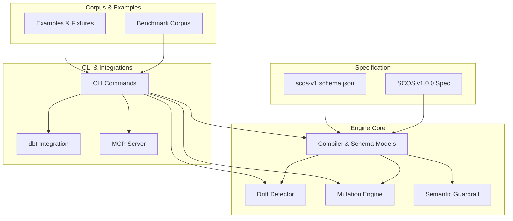
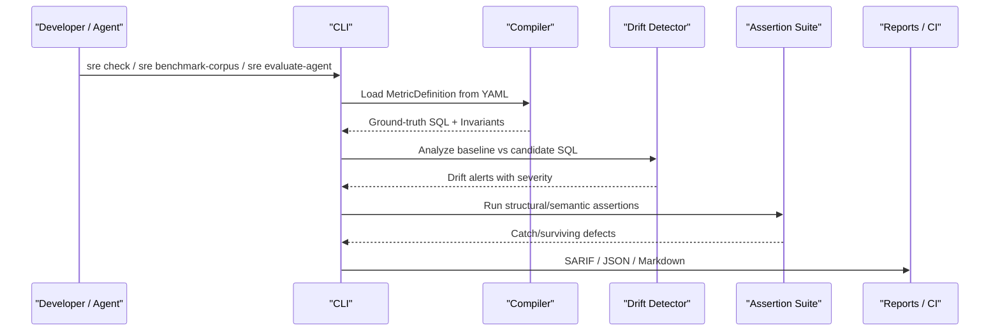

# Migration Guides and Version Upgrades

<cite>
**Referenced Files in This Document**
- [README.md](file://README.md)
- [pyproject.toml](file://pyproject.toml)
- [requirements.txt](file://requirements.txt)
- [SCOS_V1_SPECIFICATION.md](file://spec/SCOS_V1_SPECIFICATION.md)
- [scos-v1.schema.json](file://spec/scos-v1.schema.json)
- [RELEASE_NOTES_v1.0.0.md](file://docs/RELEASE_NOTES_v1.0.0.md)
- [RELEASE_NOTES_v1.0.0-phase7.md](file://docs/RELEASE_NOTES_v1.0.0-phase7.md)
- [cli.py](file://semantic_reliability/cli.py)
- [__init__.py](file://semantic_reliability/__init__.py)
- [schema.py](file://semantic_reliability/compiler/schema.py)
- [contract.yaml (net_revenue)](file://benchmark_corpus/dev/net_revenue/contract.yaml)
</cite>

## Table of Contents
1. Introduction
2. Project Structure
3. Core Components
4. Architecture Overview
5. Detailed Component Analysis
6. Dependency Analysis
7. Performance Considerations
8. Troubleshooting Guide
9. Conclusion
10. Appendices

## Introduction
This document provides migration guides for upgrading between versions of the Semantic Reliability Engine (SRE). It focuses on breaking changes, deprecated features, new capabilities, compatibility matrices, dependency updates, data format changes, schema evolution, API versioning, and backward compatibility considerations. The guidance is grounded in the repository’s current specification, release notes, CLI surface, and core schemas.

Key takeaways:
- SRE currently targets SCOS v1.0.0 as the canonical contract standard.
- The engine exposes a stable CLI with commands for drift checks, mutation benchmarking, corpus evaluation, agent evaluation, dbt integration, and MCP server usage.
- Contracts are validated against a JSON Schema; migrations should preserve required fields and enum constraints.
- Python SDK entry points are exposed via the package namespace for programmatic use.

[No sources needed since this section summarizes without analyzing specific files]

## Project Structure
The repository organizes functionality into modules for compilation, assertions, drift detection, mutation testing, harnessing, integrations, and an MCP server. Configuration and contracts live under spec/ and benchmark_corpus/. Release notes and documentation describe scope, limitations, and reproducibility.

**Diagram sources**
- [SCOS_V1_SPECIFICATION.md:1-134](file://spec/SCOS_V1_SPECIFICATION.md#L1-L134)
- [scos-v1.schema.json:1-163](file://spec/scos-v1.schema.json#L1-L163)
- [cli.py:36-800](file://semantic_reliability/cli.py#L36-L800)
- [schema.py:1-98](file://semantic_reliability/compiler/schema.py#L1-L98)

**Section sources**
- [README.md:22-126](file://README.md#L22-L126)
- [pyproject.toml:5-34](file://pyproject.toml#L5-L34)

## Core Components
- Contract Standard: SCOS v1.0.0 defines identity, canonical SQL, semantic invariants, and statistical probes. Contracts must validate against scos-v1.schema.json.
- Compiler and Models: MetricDefinition and related invariant/probe models define the runtime representation used by drift detection, assertion suites, and benchmarks.
- Drift Detection: AST-level comparison identifies population, aggregation, temporal, and source table shifts with severity classifications.
- Mutation Engine: Generates AST mutations to stress-test test suites and agents.
- CLI Surface: Provides commands for drift checks, mutation generation/benchmarking, corpus evaluation, agent evaluation, dbt checks, and MCP serving.
- Integrations: dbt adapter and MCP server enable CI/CD and agent workflows.

**Section sources**
- [SCOS_V1_SPECIFICATION.md:31-134](file://spec/SCOS_V1_SPECIFICATION.md#L31-L134)
- [schema.py:1-98](file://semantic_reliability/compiler/schema.py#L1-L98)
- [cli.py:43-800](file://semantic_reliability/cli.py#L43-L800)

## Architecture Overview
The engine compiles declarative metric contracts into executable invariants and probes, then evaluates candidate SQL or agent-generated queries for semantic drift and contract compliance. Results can be exported to SARIF or consumed by CI gates.

**Diagram sources**
- [cli.py:43-132](file://semantic_reliability/cli.py#L43-L132)
- [cli.py:286-486](file://semantic_reliability/cli.py#L286-L486)
- [cli.py:489-540](file://semantic_reliability/cli.py#L489-L540)

## Detailed Component Analysis

### SCOS Contract Schema Evolution and Migration
- Current standard: SCOS v1.0.0 with strict required fields and enums.
- Required fields include identity, owner, grain, sql, and optional metadata/invariants/probes.
- Dialects supported include snowflake, bigquery, postgres, duckdb, redshift, databricks.
- Invariants cover population filters, temporal rules, aggregation expectations, and deductions.
- Probes monitor population rates, implications, and null drift.

Migration steps:
- Ensure all contracts set scos_version to "1.0.0".
- Validate that required fields exist and match patterns/enums.
- If adding new invariants or probes, confirm they conform to the schema structure.
- For dialect-specific logic, ensure target_dialect aligns with supported values.

Compatibility matrix:
- SCOS v1.0.0 contracts are enforced by schema validation and compiler models.
- Backward compatibility: Adding optional fields (tags, metadata, provenance) does not break existing tools.
- Breaking change risk: Changing required fields or enums requires coordinated upgrades across consumers.

**Section sources**
- [SCOS_V1_SPECIFICATION.md:92-134](file://spec/SCOS_V1_SPECIFICATION.md#L92-L134)
- [scos-v1.schema.json:1-163](file://spec/scos-v1.schema.json#L1-L163)
- [schema.py:1-98](file://semantic_reliability/compiler/schema.py#L1-L98)

### CLI Command Migration and Usage
- Version flag reports the CLI version.
- Key commands:
  - check: Compare baseline/metric to candidate SQL; supports SARIF output and fail-on-drift gating.
  - mutate: Generate AST mutations and manifest.
  - benchmark: Evaluate assertion suite catch rate; supports comparative mode.
  - benchmark-corpus: Multi-model evaluation across dev/holdout tracks with validity scoring and error analysis.
  - evaluate-agent: Evaluate agent-generated SQL against contracts and assertions.
  - dbt-check: Check compiled dbt model against contract; supports SARIF and JSON outputs.
  - mcp-serve: Start read-only SCOS MCP server over a contracts directory.

Migration steps:
- Update scripts to use updated command names and options if any flags change.
- Integrate SARIF outputs into CI tooling when migrating to stricter thresholds.
- For dbt integration, ensure manifest paths and model names remain consistent.

**Section sources**
- [cli.py:36-800](file://semantic_reliability/cli.py#L36-L800)

### Python SDK Entry Points and Compatibility
- Package exports key classes for programmatic use: MetricCompiler, SemanticDriftDetector, MutationEngine, QualityHarness, MutationBenchmark, SemanticGuardrail, GuardrailResult, SemanticDriftException.
- Use these APIs to embed guardrailing and evaluation directly in applications or pipelines.

Migration steps:
- Pin imports to the package namespace to avoid internal path churn.
- When updating dependencies, verify that exported symbols remain stable.

**Section sources**
- [__init__.py:1-21](file://semantic_reliability/__init__.py#L1-L21)

### Example Contract and Field Mapping
- Example net_revenue contract demonstrates required fields and invariants such as population filters and aggregation components.
- Use this as a reference when migrating or validating custom contracts.

Migration steps:
- Align your contracts with the example’s structure: metric, owner, grain, sql, and invariants.
- Ensure filters and aggregation components reflect business semantics accurately.

**Section sources**
- [contract.yaml (net_revenue):1-19](file://benchmark_corpus/dev/net_revenue/contract.yaml#L1-L19)

### Release Notes and Scope
- v1.0.0 and v1.0.0-phase7 provide research preview context, including dual-track benchmark findings, frozen holdout protocol, AST normalization, and agentic analytics evaluation.
- These releases emphasize deterministic AST normalization and policy-driven evaluation.

Migration steps:
- Treat these as pre-release guidance; validate behavior in non-production environments first.
- Adopt recommended practices like using --error-analysis and SARIF outputs for robust CI gating.

**Section sources**
- [RELEASE_NOTES_v1.0.0.md:1-88](file://docs/RELEASE_NOTES_v1.0.0.md#L1-L88)
- [RELEASE_NOTES_v1.0.0-phase7.md:1-76](file://docs/RELEASE_NOTES_v1.0.0-phase7.md#L1-L76)

## Dependency Analysis
- Python version: Requires Python 3.10+.
- Core dependencies include sqlglot, pyyaml, pydantic, click, rich, duckdb, pandas, jsonschema, requests.
- Optional dev dependencies include pytest.

Dependency update guidance:
- Upgrade major versions cautiously; verify AST parsing and schema validation still pass tests.
- Keep minimum versions aligned with requirements.txt and pyproject.toml.
- When introducing optional integrations (e.g., LLM proxies), add them as optional extras to avoid forcing heavy dependencies.

Compatibility considerations:
- sqlglot version impacts AST normalization and transpilation behavior; pin or constrain ranges to maintain stability.
- pydantic v2+ affects model definitions; ensure schema models remain compatible.

**Section sources**
- [pyproject.toml:5-34](file://pyproject.toml#L5-L34)
- [requirements.txt:1-11](file://requirements.txt#L1-L11)

## Performance Considerations
- AST normalization reduces false positives from cosmetic differences (commutative boolean chains, parentheses).
- Mutation-based benchmarking helps identify weak assertions early; prefer targeted semantic assertions over broad structural checks.
- Use DuckDB fixtures for fast local evaluation before running against warehouse engines.

Optimization tips:
- Limit mutation scope to relevant operators for faster feedback loops.
- Cache compiled MetricDefinitions when evaluating multiple candidates.
- Use SARIF outputs to integrate with CI systems for incremental checks.

[No sources needed since this section provides general guidance]

## Troubleshooting Guide
Common issues and resolutions:
- Schema validation failures: Ensure scos_version matches the supported value and required fields are present.
- Drift detection false positives: Verify dialect alignment and normalize SQL formatting; rely on AST normalization.
- Assertion gaps: Add semantic assertions targeting missing filters, deductions, or temporal boundaries.
- dbt integration errors: Confirm manifest path correctness and model name mapping.

Diagnostic tools:
- Use --error-analysis in benchmark-corpus to classify surviving defects and get remediation recommendations.
- Export SARIF reports for static analysis integration.

**Section sources**
- [cli.py:286-486](file://semantic_reliability/cli.py#L286-L486)
- [cli.py:43-132](file://semantic_reliability/cli.py#L43-L132)

## Conclusion
For upgrading between versions of the Semantic Reliability Engine:
- Maintain SCOS v1.0.0 compliance and validate contracts against the provided schema.
- Adopt CLI best practices: SARIF outputs, error analysis, and dbt integration for robust CI gating.
- Pin and upgrade dependencies carefully, focusing on sqlglot and pydantic compatibility.
- Use the Python SDK exports for stable programmatic integration.
- Follow release note guidance for research preview features and experimental scopes.

[No sources needed since this section summarizes without analyzing specific files]

## Appendices

### Step-by-Step Migration Procedures

#### Updating Contracts
- Set scos_version to "1.0.0".
- Ensure required fields: metric, owner, grain, sql.
- Define invariants for population filters, temporal rules, and aggregation components.
- Optionally add probes for population rates, implications, and null drift.
- Validate with schema and compile commands.

**Section sources**
- [SCOS_V1_SPECIFICATION.md:92-134](file://spec/SCOS_V1_SPECIFICATION.md#L92-L134)
- [scos-v1.schema.json:1-163](file://spec/scos-v1.schema.json#L1-L163)

#### Updating Configurations
- Align dialect settings with supported values.
- Configure CLI flags for SARIF output and fail-on-drift thresholds appropriate to your environment.
- For dbt, ensure manifest paths and model names are correct.

**Section sources**
- [cli.py:43-132](file://semantic_reliability/cli.py#L43-L132)
- [cli.py:737-786](file://semantic_reliability/cli.py#L737-L786)

#### Updating Integrations
- Use the Python SDK exports for embedding guardrails in applications.
- Integrate MCP server for agent workflows; load contracts from a directory.
- For dbt, run dbt-check in CI to block merges with critical/high drift.

**Section sources**
- [__init__.py:1-21](file://semantic_reliability/__init__.py#L1-L21)
- [cli.py:789-800](file://semantic_reliability/cli.py#L789-L800)

#### Data Format Changes
- Contracts must adhere to SCOS v1.0.0 schema; additions should be optional to preserve backward compatibility.
- Probes and invariants follow defined structures; avoid renaming fields without coordinating upgrades.

**Section sources**
- [scos-v1.schema.json:1-163](file://spec/scos-v1.schema.json#L1-L163)
- [schema.py:1-98](file://semantic_reliability/compiler/schema.py#L1-L98)

#### API Versioning and Backward Compatibility
- CLI version is exposed via version option; plan deprecations with clear migration windows.
- Keep exported symbols stable; prefer package-level imports to reduce breakage risk.
- When changing schema, introduce new fields as optional and enforce via validation only after adoption.

**Section sources**
- [cli.py:36-40](file://semantic_reliability/cli.py#L36-L40)
- [__init__.py:1-21](file://semantic_reliability/__init__.py#L1-L21)