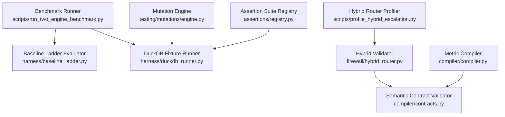
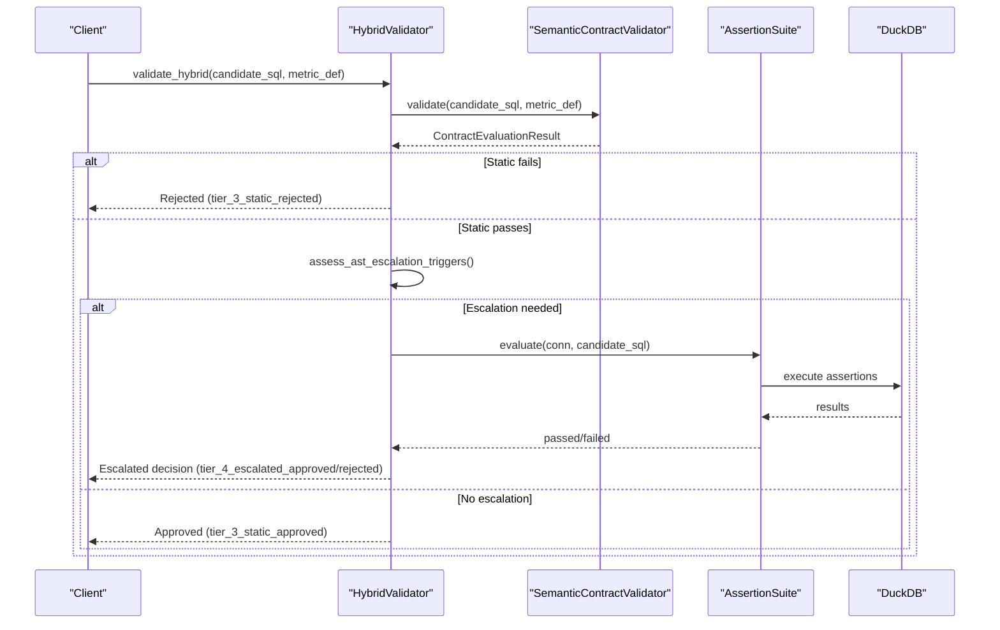
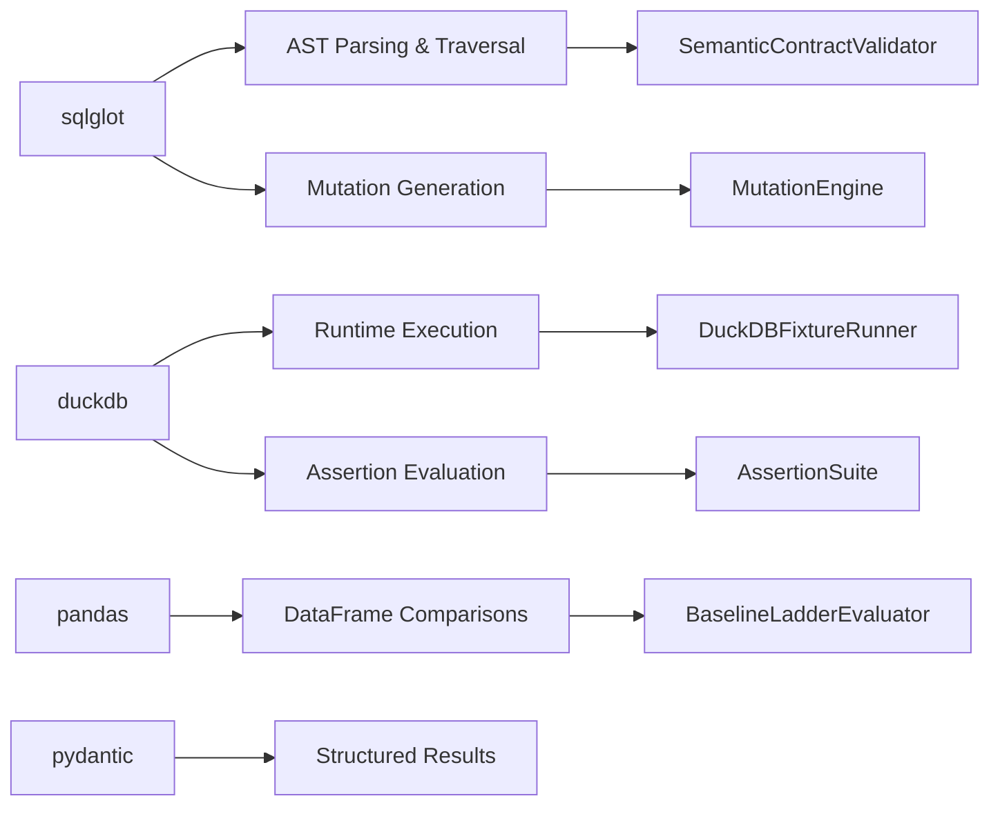

# Performance Debugging and Optimization

<cite>
**Referenced Files in This Document**
- [evaluator.py](file://semantic_reliability/benchmark/evaluator.py)
- [engine.py](file://semantic_reliability/testing/mutations/engine.py)
- [compiler.py](file://semantic_reliability/compiler/compiler.py)
- [hybrid_router.py](file://semantic_reliability/firewall/hybrid_router.py)
- [baseline_ladder.py](file://semantic_reliability/harness/baseline_ladder.py)
- [duckdb_runner.py](file://semantic_reliability/harness/duckdb_runner.py)
- [contracts.py](file://semantic_reliability/compiler/contracts.py)
- [registry.py](file://semantic_reliability/assertions/registry.py)
- [profile_hybrid_escalation.py](file://scripts/profile_hybrid_escalation.py)
- [run_two_engine_benchmark.py](file://scripts/run_two_engine_benchmark.py)
</cite>

## Table of Contents
1. Introduction
2. Project Structure
3. Core Components
4. Architecture Overview
5. Detailed Component Analysis
6. Dependency Analysis
7. Performance Considerations
8. Troubleshooting Guide
9. Conclusion
10. Appendices

## Introduction
This document provides performance debugging guidance for identifying bottlenecks in semantic analysis, mutation testing, and benchmark execution within the repository. It focuses on memory usage optimization, query performance tuning, resource allocation strategies, profiling techniques for slow operations, handling large datasets, and improving throughput for concurrent processing. The guidance is grounded in the codebase’s AST-based semantic validation, adaptive hybrid routing, mutation generation, and benchmark harnesses.

## Project Structure
The project organizes performance-critical logic into:
- Semantic contract compilation and AST inspection
- Mutation engine that injects precise AST-level changes to SQL
- Hybrid router that routes queries through static pre-flight checks with adaptive escalation to runtime evaluation
- Benchmark harnesses that measure tiered validation effectiveness and latency
- DuckDB-backed fixture runner for assertion-driven evaluation

**Diagram sources**
- [run_two_engine_benchmark.py:33-190](file://scripts/run_two_engine_benchmark.py#L33-L190)
- [baseline_ladder.py:25-210](file://semantic_reliability/harness/baseline_ladder.py#L25-L210)
- [duckdb_runner.py:56-256](file://semantic_reliability/harness/duckdb_runner.py#L56-L256)
- [profile_hybrid_escalation.py:37-247](file://scripts/profile_hybrid_escalation.py#L37-L247)
- [hybrid_router.py:34-156](file://semantic_reliability/firewall/hybrid_router.py#L34-L156)
- [contracts.py:26-135](file://semantic_reliability/compiler/contracts.py#L26-L135)
- [engine.py:8-269](file://semantic_reliability/testing/mutations/engine.py#L8-L269)
- [compiler.py:10-72](file://semantic_reliability/compiler/compiler.py#L10-L72)
- [registry.py:22-160](file://semantic_reliability/assertions/registry.py#L22-L160)

**Section sources**
- [run_two_engine_benchmark.py:33-190](file://scripts/run_two_engine_benchmark.py#L33-L190)
- [baseline_ladder.py:25-210](file://semantic_reliability/harness/baseline_ladder.py#L25-L210)
- [duckdb_runner.py:56-256](file://semantic_reliability/harness/duckdb_runner.py#L56-L256)
- [profile_hybrid_escalation.py:37-247](file://scripts/profile_hybrid_escalation.py#L37-L247)
- [hybrid_router.py:34-156](file://semantic_reliability/firewall/hybrid_router.py#L34-L156)
- [contracts.py:26-135](file://semantic_reliability/compiler/contracts.py#L26-L135)
- [engine.py:8-269](file://semantic_reliability/testing/mutations/engine.py#L8-L269)
- [compiler.py:10-72](file://semantic_reliability/compiler/compiler.py#L10-L72)
- [registry.py:22-160](file://semantic_reliability/assertions/registry.py#L22-L160)

## Core Components
- MetricCompiler parses and exposes canonical metric SQL as an AST, enabling efficient AST traversal for downstream checks.
- SemanticContractValidator enforces declared invariants (population filters, grain dimensions, aggregation components, timezone rules) via AST inspection.
- MutationEngine generates targeted AST mutations (filter drop, boundary shift, aggregation swap, distinct drop, join predicate drop, grain drop, coalesce bypass, math operator invert).
- HybridValidator performs fast static checks and escalates to runtime evaluation when AST complexity or policy triggers require relational contrastive evaluation.
- BaselineLadderEvaluator measures tiered validation effectiveness across syntax, structural, realistic dbt suite, static SCOS AST, and runtime oracle tiers.
- DuckDBFixtureRunner executes baseline vs mutated queries against in-memory fixtures and evaluates assertions to classify defects.
- AssertionSuiteRegistry composes suites of structural and semantic assertions used by runners and evaluators.
- BenchmarkEvaluator computes scorecards including latency percentiles and governance benefit metrics.

**Section sources**
- [compiler.py:10-72](file://semantic_reliability/compiler/compiler.py#L10-L72)
- [contracts.py:26-135](file://semantic_reliability/compiler/contracts.py#L26-L135)
- [engine.py:8-269](file://semantic_reliability/testing/mutations/engine.py#L8-L269)
- [hybrid_router.py:34-156](file://semantic_reliability/firewall/hybrid_router.py#L34-L156)
- [baseline_ladder.py:25-210](file://semantic_reliability/harness/baseline_ladder.py#L25-L210)
- [duckdb_runner.py:56-256](file://semantic_reliability/harness/duckdb_runner.py#L56-L256)
- [registry.py:22-160](file://semantic_reliability/assertions/registry.py#L22-L160)
- [evaluator.py:7-80](file://semantic_reliability/benchmark/evaluator.py#L7-L80)

## Architecture Overview
The system uses a layered approach to balance correctness and performance:
- Tier 0–3: Fast, low-cost checks using AST parsing and deterministic rules.
- Tier 4: Expensive runtime evaluation using DuckDB and assertion suites.
- HybridRouter dynamically decides whether to escalate to Tier 4 based on AST complexity and policy.

**Diagram sources**
- [hybrid_router.py:62-156](file://semantic_reliability/firewall/hybrid_router.py#L62-L156)
- [contracts.py:29-135](file://semantic_reliability/compiler/contracts.py#L29-L135)
- [registry.py:22-160](file://semantic_reliability/assertions/registry.py#L22-L160)
- [duckdb_runner.py:102-114](file://semantic_reliability/harness/duckdb_runner.py#L102-L114)

## Detailed Component Analysis

### Semantic Analysis Bottlenecks
- Parsing overhead: Each validation path parses SQL via sqlglot; repeated parsing can dominate CPU time under high throughput.
- AST traversal cost: Deeply nested queries, multiple CTEs, window functions, and complex CASE expressions trigger escalation and additional runtime work.
- Invariant checks: String normalization and substring matching in contracts can be optimized if applied selectively to relevant nodes.

Optimization recommendations:
- Cache parsed ASTs per candidate SQL where safe to reuse.
- Limit AST scans to targeted node types (e.g., WHERE, GROUP BY, AggFunc) rather than broad find_all traversals.
- Precompute normalized forms for required filters/dimensions once per metric definition.

**Section sources**
- [compiler.py:37-72](file://semantic_reliability/compiler/compiler.py#L37-L72)
- [contracts.py:44-127](file://semantic_reliability/compiler/contracts.py#L44-L127)
- [hybrid_router.py:38-60](file://semantic_reliability/firewall/hybrid_router.py#L38-L60)

### Mutation Testing Throughput
- Mutation generation creates copies of the AST and applies targeted transformations; each mutation produces a new SQL string.
- Large numbers of mutations increase CPU and memory pressure due to repeated parsing and string formatting.

Optimization recommendations:
- Batch mutation generation and defer pretty-printing until necessary.
- Use incremental AST modifications instead of full copy-and-replace where possible.
- Filter out unexecutable mutations early to avoid expensive runtime evaluation.

**Section sources**
- [engine.py:16-52](file://semantic_reliability/testing/mutations/engine.py#L16-L52)
- [engine.py:54-269](file://semantic_reliability/testing/mutations/engine.py#L54-L269)

### Benchmark Execution Latency
- Two-engine benchmark runs all tiers sequentially per mutation; latency accumulates across tiers.
- Pure runtime evaluation (Tier 4) dominates total latency due to database execution and assertion evaluation.

Optimization recommendations:
- Short-circuit early tiers to reduce unnecessary Tier 4 calls.
- Parallelize independent mutation evaluations where safe.
- Profile per-tier latencies to identify hotspots and tune assertion suites.

**Section sources**
- [run_two_engine_benchmark.py:109-190](file://scripts/run_two_engine_benchmark.py#L109-L190)
- [baseline_ladder.py:40-183](file://semantic_reliability/harness/baseline_ladder.py#L40-L183)

### Hybrid Router Efficiency
- Fast-path static approvals/rejections avoid database scans entirely, reducing compute cost and latency.
- Escalation decisions are based on AST characteristics; misclassification leads to unnecessary runtime work.

Optimization recommendations:
- Tune escalation triggers to minimize false positives (unnecessary escalations).
- Track bytes_scanned and latency_ms to quantify savings and adjust thresholds.

**Section sources**
- [hybrid_router.py:62-156](file://semantic_reliability/firewall/hybrid_router.py#L62-L156)
- [profile_hybrid_escalation.py:99-167](file://scripts/profile_hybrid_escalation.py#L99-L167)

### DuckDB Fixture Evaluation
- In-memory DuckDB connections are created per model; repeated setup/teardown adds overhead.
- DataFrame comparisons and numeric variance calculations can be costly for large outputs.

Optimization recommendations:
- Reuse connections and tables across related evaluations when safe.
- Limit comparison scope to numeric columns and use vectorized operations.
- Unregister temporary tables promptly to free memory.

**Section sources**
- [duckdb_runner.py:59-101](file://semantic_reliability/harness/duckdb_runner.py#L59-L101)
- [duckdb_runner.py:116-206](file://semantic_reliability/harness/duckdb_runner.py#L116-L206)

### Assertion Suite Composition
- Suites aggregate structural and semantic assertions; each assertion may execute SQL or operate on DataFrames.
- Default suites include range checks, relationships, and singular SQL tests that can add significant runtime cost.

Optimization recommendations:
- Compose minimal suites for fast paths; enable comprehensive suites only for escalated cases.
- Cache assertion definitions and pre-validate column presence before evaluation.

**Section sources**
- [registry.py:22-160](file://semantic_reliability/assertions/registry.py#L22-L160)
- [baseline_ladder.py:60-171](file://semantic_reliability/harness/baseline_ladder.py#L60-L171)

## Dependency Analysis
Key dependencies and their roles:
- sqlglot: Used extensively for AST parsing and transformation; central to both static checks and mutation generation.
- duckdb: Provides in-memory execution environment for runtime evaluation and assertion checks.
- pandas: Used for DataFrame comparisons and structural checks; can be memory-intensive with large datasets.
- pydantic: Defines structured result models for consistent reporting and serialization.

**Diagram sources**
- [contracts.py:29-135](file://semantic_reliability/compiler/contracts.py#L29-L135)
- [engine.py:8-269](file://semantic_reliability/testing/mutations/engine.py#L8-L269)
- [duckdb_runner.py:56-256](file://semantic_reliability/harness/duckdb_runner.py#L56-L256)
- [baseline_ladder.py:25-210](file://semantic_reliability/harness/baseline_ladder.py#L25-L210)
- [registry.py:22-160](file://semantic_reliability/assertions/registry.py#L22-L160)

**Section sources**
- [contracts.py:29-135](file://semantic_reliability/compiler/contracts.py#L29-L135)
- [engine.py:8-269](file://semantic_reliability/testing/mutations/engine.py#L8-L269)
- [duckdb_runner.py:56-256](file://semantic_reliability/harness/duckdb_runner.py#L56-L256)
- [baseline_ladder.py:25-210](file://semantic_reliability/harness/baseline_ladder.py#L25-L210)
- [registry.py:22-160](file://semantic_reliability/assertions/registry.py#L22-L160)

## Performance Considerations
- Memory footprint:
  - Avoid holding large DataFrames in memory longer than necessary; unregister temporary tables after use.
  - Prefer streaming or chunked processing for large result sets when feasible.
  - Reuse parsed ASTs and metric definitions to reduce repeated parsing overhead.
- Query performance tuning:
  - Minimize unnecessary escalations by refining AST-based triggers.
  - Keep assertion suites lean for fast paths; expand only when needed.
  - Use targeted AST node searches instead of broad traversals.
- Resource allocation strategies:
  - Pool DuckDB connections for batched evaluations to reduce setup costs.
  - Limit concurrent evaluations to match available memory and CPU cores.
  - Monitor bytes_scanned and latency_ms to detect regressions.
- Profiling tools and techniques:
  - Use time.perf_counter around critical sections to measure per-tier latencies.
  - Export scorecards to track P50/P95 latency trends over time.
  - Instrument escalation reasons to understand why runtime evaluation is triggered.
- Large dataset handling:
  - Prefer numeric variance checks over full DataFrame equality when appropriate.
  - Reduce comparison scope to relevant columns and rows.
  - Consider sampling or stratified evaluation for very large fixtures.
- Concurrent processing issues:
  - Ensure isolation between concurrent evaluations to avoid shared state conflicts.
  - Use connection pooling and transaction boundaries to prevent contention.
  - Profile lock contention and I/O bottlenecks during parallel runs.

[No sources needed since this section provides general guidance]

## Troubleshooting Guide
Common issues and resolutions:
- Slow static checks:
  - Check for excessive AST traversals; narrow search scopes to specific node types.
  - Validate dialect settings to avoid parse failures and retries.
- High memory usage:
  - Identify large DataFrames retained in memory; ensure timely cleanup.
  - Reduce assertion suite size for fast paths.
- Frequent escalations:
  - Review escalation triggers; tune thresholds to reduce false positives.
  - Analyze escalation_reason to understand complexity patterns.
- Benchmark latency spikes:
  - Isolate slow tiers using per-tier timing; optimize or skip non-critical assertions.
  - Profile DuckDB execution plans for expensive queries.

**Section sources**
- [hybrid_router.py:38-60](file://semantic_reliability/firewall/hybrid_router.py#L38-L60)
- [baseline_ladder.py:40-183](file://semantic_reliability/harness/baseline_ladder.py#L40-L183)
- [duckdb_runner.py:116-206](file://semantic_reliability/harness/duckdb_runner.py#L116-L206)
- [evaluator.py:13-80](file://semantic_reliability/benchmark/evaluator.py#L13-L80)

## Conclusion
Performance debugging in this codebase centers on balancing fast static analysis with targeted runtime evaluation. By optimizing AST operations, refining escalation triggers, managing memory carefully, and profiling per-tier latencies, teams can significantly improve throughput and reduce resource consumption. The provided scripts and harnesses offer concrete measurement points to guide iterative improvements and ensure scalable deployments.

[No sources needed since this section summarizes without analyzing specific files]

## Appendices

### Key Metrics and Reporting
- BenchmarkEvaluator computes latency percentiles and governance benefit metrics to quantify performance trade-offs.
- Hybrid router profiler exports scorecards tracking fast-path rates, escalation frequencies, and latency reductions.

**Section sources**
- [evaluator.py:13-80](file://semantic_reliability/benchmark/evaluator.py#L13-L80)
- [profile_hybrid_escalation.py:194-247](file://scripts/profile_hybrid_escalation.py#L194-L247)