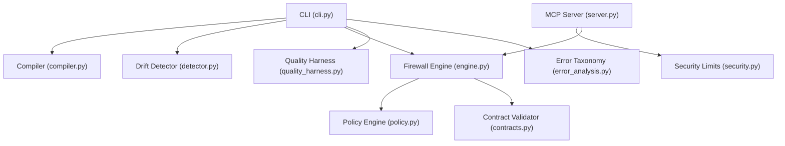
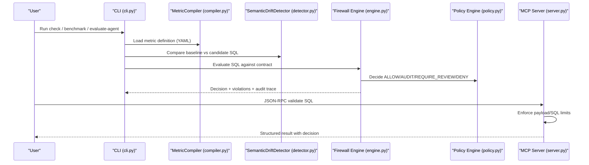
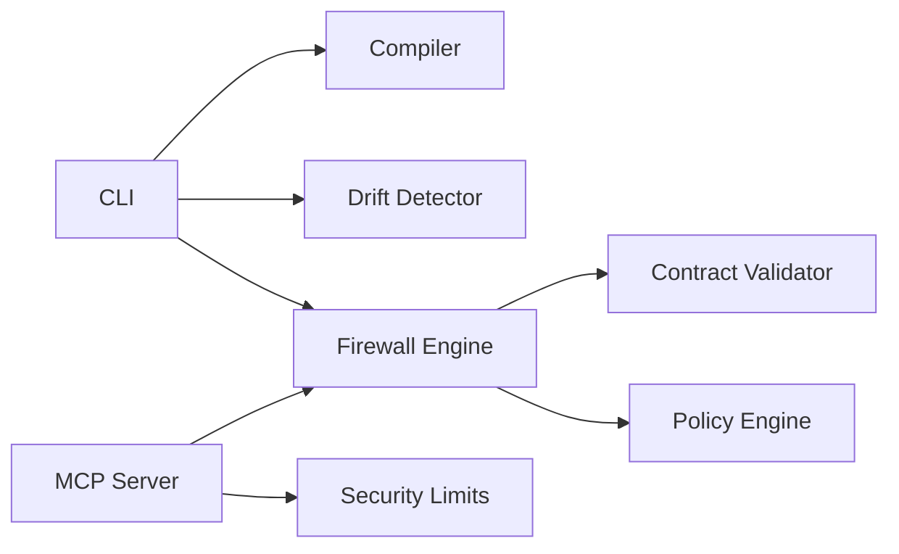

# Troubleshooting

<cite>
**Referenced Files in This Document**
- [README.md](file://README.md)
- [cli.py](file://semantic_reliability/cli.py)
- [compiler.py](file://semantic_reliability/compiler/compiler.py)
- [contracts.py](file://semantic_reliability/compiler/contracts.py)
- [detector.py](file://semantic_reliability/testing/drift/detector.py)
- [engine.py](file://semantic_reliability/firewall/engine.py)
- [policy.py](file://semantic_reliability/firewall/policy.py)
- [server.py](file://semantic_reliability/mcp/server.py)
- [security.py](file://semantic_reliability/mcp/security.py)
- [error_analysis.py](file://semantic_reliability/harness/error_analysis.py)
- [quality_harness.py](file://semantic_reliability/harness/quality_harness.py)
- [RELEASE_NOTES_v1.0.0.md](file://docs/RELEASE_NOTES_v1.0.0.md)
- [RELEASE_NOTES_v1.0.0-phase7.md](file://docs/RELEASE_NOTES_v1.0.0-phase7.md)
</cite>

## Table of Contents
1. Introduction
2. Project Structure
3. Core Components
4. Architecture Overview
5. Detailed Component Analysis
6. Dependency Analysis
7. Performance Considerations
8. Troubleshooting Guide
9. Conclusion
10. Appendices

## Introduction
This document provides comprehensive troubleshooting guidance for the Semantic Reliability Engine (SRE). It focuses on resolving common issues across contract compilation, semantic drift detection, and firewall policy enforcement. It also covers debugging techniques for performance problems, memory usage optimization, migration guidance between versions, known limitations and workarounds, diagnostic tools, logging configuration, and a FAQ section.

## Project Structure
The SRE is organized around several core subsystems:
- CLI orchestration and user-facing commands
- Contract compilation and validation
- AST-based semantic drift detection
- Firewall engine with policy decisions and audit trails
- MCP server for read-only SCOS protocol interactions with security limits
- Benchmarking and quality harness utilities
- Release notes documenting version changes and known limitations

**Diagram sources**
- [cli.py:36-800](file://semantic_reliability/cli.py#L36-L800)
- [compiler.py:10-72](file://semantic_reliability/compiler/compiler.py#L10-L72)
- [detector.py:9-46](file://semantic_reliability/testing/drift/detector.py#L9-L46)
- [engine.py:18-132](file://semantic_reliability/firewall/engine.py#L18-L132)
- [policy.py:32-68](file://semantic_reliability/firewall/policy.py#L32-L68)
- [server.py:43-70](file://semantic_reliability/mcp/server.py#L43-L70)
- [security.py:8-34](file://semantic_reliability/mcp/security.py#L8-L34)
- [contracts.py:26-135](file://semantic_reliability/compiler/contracts.py#L26-L135)
- [quality_harness.py:34-113](file://semantic_reliability/harness/quality_harness.py#L34-L113)
- [error_analysis.py:6-92](file://semantic_reliability/harness/error_analysis.py#L6-L92)

**Section sources**
- [README.md:22-46](file://README.md#L22-L46)
- [cli.py:36-800](file://semantic_reliability/cli.py#L36-L800)

## Core Components
- MetricCompiler parses YAML metric definitions into SQL ASTs and supports transpilation to target dialects.
- SemanticContractValidator enforces declared invariants (population filters, grain dimensions, aggregation components, timezone constraints).
- SemanticDriftDetector compares baseline and candidate SQL ASTs to detect structural and semantic drift across WHERE, JOIN, GROUP BY, HAVING, aggregations, null handling, and source tables.
- Firewall engine evaluates requests against registered contracts and policies, producing decisions (ALLOW, AUDIT, REQUIRE_REVIEW, DENY) and immutable audit traces.
- MCP server enforces request size and SQL length limits, maps JSON-RPC errors, and logs structured audit events.
- Quality harness simulates or executes test suites against mutations to compute catch scores and identify blind spots.
- Error taxonomy classifies surviving defects and recommends remediation.

**Section sources**
- [compiler.py:10-72](file://semantic_reliability/compiler/compiler.py#L10-L72)
- [contracts.py:26-135](file://semantic_reliability/compiler/contracts.py#L26-L135)
- [detector.py:9-246](file://semantic_reliability/testing/drift/detector.py#L9-L246)
- [engine.py:18-132](file://semantic_reliability/firewall/engine.py#L18-L132)
- [policy.py:32-68](file://semantic_reliability/firewall/policy.py#L32-L68)
- [server.py:43-70](file://semantic_reliability/mcp/server.py#L43-L70)
- [security.py:8-34](file://semantic_reliability/mcp/security.py#L8-L34)
- [quality_harness.py:34-113](file://semantic_reliability/harness/quality_harness.py#L34-L113)
- [error_analysis.py:6-92](file://semantic_reliability/harness/error_analysis.py#L6-L92)

## Architecture Overview
The system integrates CLI-driven workflows with AST-based analysis and policy-backed execution control. The MCP server provides a secure boundary for read-only operations with strict payload and SQL limits.

**Diagram sources**
- [cli.py:43-132](file://semantic_reliability/cli.py#L43-L132)
- [compiler.py:18-47](file://semantic_reliability/compiler/compiler.py#L18-L47)
- [detector.py:12-46](file://semantic_reliability/testing/drift/detector.py#L12-L46)
- [engine.py:46-132](file://semantic_reliability/firewall/engine.py#L46-L132)
- [policy.py:32-68](file://semantic_reliability/firewall/policy.py#L32-L68)
- [server.py:43-70](file://semantic_reliability/mcp/server.py#L43-L70)

## Detailed Component Analysis

### Contract Compilation Failures
Symptoms:
- ValueError when parsing ground-truth SQL from metric YAML.
- Unexpected failures during transpilation to target dialects.

Causes:
- Invalid SQL syntax in metric definition.
- Unsupported dialect mismatch between definition and target.

Resolution steps:
- Validate metric YAML structure and ensure SQL is syntactically correct for the specified dialect.
- Use the compile command to generate canonical SQL and verify output before deployment.
- If targeting a different dialect, specify target_dialect explicitly to trigger safe transpilation.

Debugging tips:
- Inspect parsed AST via compiler methods to isolate problematic clauses.
- Reduce SQL to minimal failing fragment to pinpoint syntax issues.

**Section sources**
- [compiler.py:37-47](file://semantic_reliability/compiler/compiler.py#L37-L47)
- [cli.py:571-585](file://semantic_reliability/cli.py#L571-L585)

### Semantic Drift Detection Issues
Symptoms:
- False positives due to cosmetic refactors (commutative boolean chains, parentheses).
- Missing drift reports for certain clause changes.

Causes:
- Differences in AST normalization not fully aligned with business equivalence.
- Dialect-specific constructs not normalized consistently.

Resolution steps:
- Normalize expressions by rewriting commutative operators and unwrapping parentheses where appropriate.
- Ensure consistent dialect specification when comparing baseline and candidate SQL.
- Review detected drift categories (WHERE, JOIN, GROUP BY, HAVING, aggregations, null handling, tables) to confirm relevance.

Debugging tips:
- Use drift inspection CLI to compare baseline vs candidate and inspect detailed component-level differences.
- Export SARIF reports for CI integration and review drift severity and remediation suggestions.

**Section sources**
- [detector.py:25-46](file://semantic_reliability/testing/drift/detector.py#L25-L46)
- [detector.py:48-246](file://semantic_reliability/testing/drift/detector.py#L48-L246)
- [cli.py:43-132](file://semantic_reliability/cli.py#L43-L132)

### Firewall Policy Violations
Symptoms:
- Requests denied or require review due to critical semantic defects.
- Audit logs show violation counts and decisions.

Causes:
- Candidate SQL violates declared invariants (e.g., missing required filters, wrong grouping dimensions).
- Policy engine strict mode blocks execution on critical violations.

Resolution steps:
- Align candidate SQL with metric contract invariants; add required filters and grouping dimensions.
- Adjust policy strictness if manual review is preferred over automatic denial.
- Review audit traces to understand which invariant rules were violated and apply remediation.

Debugging tips:
- Use dbt-check or bq-evaluate commands to pre-validate models or SQL against contracts.
- Enable structured logging to capture audit events and trace IDs for post-mortem analysis.

**Section sources**
- [engine.py:46-132](file://semantic_reliability/firewall/engine.py#L46-L132)
- [policy.py:32-68](file://semantic_reliability/firewall/policy.py#L32-L68)
- [contracts.py:44-128](file://semantic_reliability/compiler/contracts.py#L44-L128)
- [cli.py:737-786](file://semantic_reliability/cli.py#L737-L786)

### MCP Server Errors and Limits
Symptoms:
- JSON-RPC error codes indicating invalid request, missing method, or malformed parameters.
- Payload size or SQL length exceeded errors.

Causes:
- Malformed JSON-RPC payloads or missing fields.
- Exceeding configured limits for payload size and SQL length.

Resolution steps:
- Ensure JSON-RPC 2.0 compliance with required fields (jsonrpc, id, method, params).
- Keep payloads under configured limits; compress or split large requests if necessary.
- Use hash_sql to avoid logging raw SQL content in audit logs.

Debugging tips:
- Inspect structured audit logger output for scos.audit events.
- Test with small valid payloads first, then gradually increase complexity.

**Section sources**
- [server.py:50-70](file://semantic_reliability/mcp/server.py#L50-L70)
- [security.py:8-34](file://semantic_reliability/mcp/security.py#L8-L34)
- [tests/test_mcp_server.py:177-210](file://tests/test_mcp_server.py#L177-L210)

### Benchmarking and Assertion Gaps
Symptoms:
- Low mutation catch score despite passing standard data quality checks.
- Surviving defects classified under assertion gaps or weak fixtures.

Causes:
- Standard checks do not cover semantic invariants (e.g., population filters, arithmetic deductions).
- Fixtures lack contrast needed to expose semantic drift.

Resolution steps:
- Add semantic assertions aligned with metric invariants (required filters, grain dimensions, negative components).
- Strengthen fixtures to include edge cases (NULL flags, boundary values, cohort eligibility).
- Use --error-analysis to classify surviving defects and apply recommended assertions.

Debugging tips:
- Run comparative benchmarks to see head-to-head performance of standard vs semantic suites.
- Generate PR comments and SARIF reports to integrate findings into CI.

**Section sources**
- [quality_harness.py:34-113](file://semantic_reliability/harness/quality_harness.py#L34-L113)
- [error_analysis.py:6-92](file://semantic_reliability/harness/error_analysis.py#L6-L92)
- [cli.py:175-283](file://semantic_reliability/cli.py#L175-L283)

## Dependency Analysis
Key dependencies and relationships:
- CLI orchestrates compilation, drift detection, and evaluation flows.
- Compiler depends on sqlglot for AST parsing and transpilation.
- Drift detector relies on AST normalization and rule-based comparisons.
- Firewall engine composes contract validation and policy decisions, emitting audit traces.
- MCP server enforces security boundaries and logs structured audit events.

**Diagram sources**
- [cli.py:36-800](file://semantic_reliability/cli.py#L36-L800)
- [compiler.py:10-72](file://semantic_reliability/compiler/compiler.py#L10-L72)
- [detector.py:9-46](file://semantic_reliability/testing/drift/detector.py#L9-L46)
- [engine.py:18-132](file://semantic_reliability/firewall/engine.py#L18-L132)
- [policy.py:32-68](file://semantic_reliability/firewall/policy.py#L32-L68)
- [server.py:43-70](file://semantic_reliability/mcp/server.py#L43-L70)
- [security.py:8-34](file://semantic_reliability/mcp/security.py#L8-L34)

**Section sources**
- [cli.py:36-800](file://semantic_reliability/cli.py#L36-L800)
- [engine.py:18-132](file://semantic_reliability/firewall/engine.py#L18-L132)

## Performance Considerations
- Prefer local DuckDB execution for mutation benchmarking to minimize compute costs and enable rapid iteration.
- Limit payload sizes and SQL lengths in MCP requests to avoid overhead and enforce safety.
- Use targeted dialect specifications to reduce unnecessary transpilation work.
- Batch evaluations where possible to amortize parser and AST traversal costs.
- Monitor audit log volume and rotate logs to prevent storage pressure.

[No sources needed since this section provides general guidance]

## Troubleshooting Guide

### Common Error Messages and Resolutions

- Contract compilation failure (ValueError during SQL parse):
  - Cause: Invalid SQL in metric YAML or unsupported dialect.
  - Resolution: Validate SQL syntax and dialect; use compile command to generate canonical SQL; adjust target_dialect if needed.
  - Debug: Inspect AST via compiler methods; isolate minimal failing fragment.

- Semantic drift false positives:
  - Cause: Cosmetic AST differences (commutative operators, parentheses).
  - Resolution: Normalize expressions; ensure consistent dialect; review drift categories for relevance.
  - Debug: Use drift inspection CLI; export SARIF for CI review.

- Firewall denies execution:
  - Cause: Critical invariant violations (missing filters, wrong grain).
  - Resolution: Align SQL with contract invariants; adjust policy strictness; review audit traces.
  - Debug: Use dbt-check/bq-evaluate; enable structured logging for audit events.

- MCP server returns JSON-RPC errors:
  - Cause: Malformed request or missing fields; payload/SQL limits exceeded.
  - Resolution: Ensure JSON-RPC 2.0 compliance; keep payloads within limits; hash SQL in logs.
  - Debug: Check structured audit logger; test with minimal valid payloads.

- Low mutation catch score:
  - Cause: Standard checks miss semantic invariants; weak fixtures.
  - Resolution: Add semantic assertions; strengthen fixtures; use --error-analysis to classify and remediate.
  - Debug: Run comparative benchmarks; generate PR comments and SARIF reports.

**Section sources**
- [compiler.py:37-47](file://semantic_reliability/compiler/compiler.py#L37-L47)
- [detector.py:48-246](file://semantic_reliability/testing/drift/detector.py#L48-L246)
- [engine.py:46-132](file://semantic_reliability/firewall/engine.py#L46-L132)
- [policy.py:32-68](file://semantic_reliability/firewall/policy.py#L32-L68)
- [server.py:50-70](file://semantic_reliability/mcp/server.py#L50-L70)
- [security.py:8-34](file://semantic_reliability/mcp/security.py#L8-L34)
- [quality_harness.py:34-113](file://semantic_reliability/harness/quality_harness.py#L34-L113)
- [error_analysis.py:6-92](file://semantic_reliability/harness/error_analysis.py#L6-L92)

### Logging Configuration and Diagnostics
- Configure structured audit logger for MCP server to capture scos.audit events with timestamps and event types.
- Use firewall engine audit traces to record request IDs, trace IDs, decisions, and violation details.
- Export SARIF reports for CI integration and automated review workflows.
- Use CLI commands to generate PR comments and markdown reports summarizing drift and benchmark results.

**Section sources**
- [security.py:8-14](file://semantic_reliability/mcp/security.py#L8-L14)
- [engine.py:118-132](file://semantic_reliability/firewall/engine.py#L118-L132)
- [cli.py:123-126](file://semantic_reliability/cli.py#L123-L126)
- [cli.py:543-568](file://semantic_reliability/cli.py#L543-L568)

### Migration Guides and Breaking Changes
- Versioned release notes outline scope, empirical findings, and scientific limitations.
- Frozen holdout protocol ensures reproducibility; runtime verifier validates commit integrity.
- Denominator-precise mathematical accounting clarifies effective catch score computation.
- Known limitations include operator-assertion coupling, fixture contrast sensitivity, and corpus-scoped results.

Migration steps:
- Review release notes for each version to understand changes in behavior and expectations.
- Update metric contracts to align with new invariant requirements.
- Re-run benchmarks with --error-analysis to identify surviving defects and apply remediation.

**Section sources**
- [RELEASE_NOTES_v1.0.0.md:9-70](file://docs/RELEASE_NOTES_v1.0.0.md#L9-L70)
- [RELEASE_NOTES_v1.0.0-phase7.md:9-60](file://docs/RELEASE_NOTES_v1.0.0-phase7.md#L9-L60)

### Known Limitations and Workarounds
- Operator-assertion coupling: Mutations may target classes of logic expressible in contract schema; external mutant authoring improves generalization.
- Fixture contrast dependency: Models with low contrast are marked inconclusive; add contrasting fixtures to expose drift.
- Corpus-scoped results: Findings reflect local DuckDB execution; domain-specific assertions are recommended for production coverage.

Workarounds:
- Strengthen fixtures with edge cases and explicit NULL flags.
- Expand assertion suites to cover temporal windows, cohort eligibility, and aggregation tolerances.
- Use policy engine non-strict mode for manual review workflows when immediate denial is too restrictive.

**Section sources**
- [RELEASE_NOTES_v1.0.0.md:65-70](file://docs/RELEASE_NOTES_v1.0.0.md#L65-L70)
- [RELEASE_NOTES_v1.0.0-phase7.md:57-60](file://docs/RELEASE_NOTES_v1.0.0-phase7.md#L57-L60)

### FAQ

- Why does my SQL pass standard data quality tests but fail semantic checks?
  - Standard tests validate shape and nullity; semantic checks enforce business invariants like required filters and grouping dimensions.

- How do I reduce false positives in drift detection?
  - Normalize commutative operators and parentheses; ensure consistent dialect; review drift categories for business relevance.

- What should I do when the firewall denies execution?
  - Align SQL with contract invariants; add required filters and grouping dimensions; consider adjusting policy strictness for manual review.

- How can I improve mutation catch scores?
  - Add semantic assertions aligned with metric invariants; strengthen fixtures with contrasting data; use --error-analysis to classify and remediate.

- How do I configure logging for diagnostics?
  - Use structured audit logger for MCP server; capture firewall audit traces; export SARIF reports for CI integration.

**Section sources**
- [quality_harness.py:34-113](file://semantic_reliability/harness/quality_harness.py#L34-L113)
- [detector.py:48-246](file://semantic_reliability/testing/drift/detector.py#L48-L246)
- [engine.py:46-132](file://semantic_reliability/firewall/engine.py#L46-L132)
- [security.py:8-34](file://semantic_reliability/mcp/security.py#L8-L34)

## Conclusion
This troubleshooting guide consolidates common issues, resolutions, and diagnostic practices for the Semantic Reliability Engine. By leveraging AST-based drift detection, contract validation, and policy-backed execution control, teams can prevent silent semantic failures and maintain business-correct analytics. Use the provided CLI commands, logging configurations, and migration guidance to diagnose issues, optimize performance, and evolve contracts safely across versions.

[No sources needed since this section summarizes without analyzing specific files]

## Appendices

### Diagnostic Tools and Commands
- Compile metric definitions and transpile to target dialects.
- Detect semantic drift between baseline and candidate SQL.
- Evaluate agent-generated SQL against contracts and assertion suites.
- Run multi-model cross-evaluation with error analysis and JSON/Markdown outputs.
- Start MCP server for read-only SCOS protocol interactions.

**Section sources**
- [cli.py:43-132](file://semantic_reliability/cli.py#L43-L132)
- [cli.py:175-283](file://semantic_reliability/cli.py#L175-L283)
- [cli.py:286-486](file://semantic_reliability/cli.py#L286-L486)
- [cli.py:489-540](file://semantic_reliability/cli.py#L489-L540)
- [cli.py:737-800](file://semantic_reliability/cli.py#L737-L800)