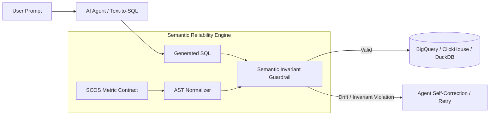

# Semantic-SQL-Bench & SCOS Reference Framework

[](https://github.com/anandkrshnn-ai/semantic-reliability-engine/actions)
[](LICENSE)
[](https://www.python.org/downloads/)
[](spec/SCOS_V1_SPECIFICATION.md)

**Adversarial Benchmark for Business-Semantic Correctness in Text-to-SQL AI Agents.**

> *An AI-assisted research prototype evaluating business-semantic correctness in AI-generated SQL. Its frozen-corpus mutation results are reproducible against a minimal structural baseline; broader baseline comparisons, live-agent evaluation, production integrations, and security claims remain active research directions.*

---

## 📌 The Problem: The Silent Semantic Failure Gap

Autonomous AI agents generate syntactically valid SQL that executes cleanly on warehouse engines (BigQuery, Snowflake, Databricks, DuckDB), yet **violates core business definitions** (e.g., dropping required active-cohort filters, omitting refund deductions, or miscalculating financial grain).

Standard out-of-the-box structural data quality tests (`not_null`, `unique`, `row_count_bounds`) verify table shapes and nullity, but cannot detect when dynamic SQL logic drops domain arithmetic. **Semantic-SQL-Bench** evaluates agents against explicit, contract-grounded business invariants.

---

## 🏗️ Architecture & Control Plane



### 📐 How SRE Calculates Semantic Drift ($D_{sem}$)
Instead of probabilistic LLM-as-a-judge patterns, SRE uses deterministic **Abstract Syntax Tree (AST) normalization**. The semantic invariant distance between candidate SQL and the metric contract is computed as:

$$D_{sem} = 1 - \frac{\vert{} N_{agent} \cap N_{contract} \vert{}}{\vert{} N_{agent} \cup N_{contract} \vert{}}$$

Where $D_{sem} \in [0, 1]$. A score of $0.0$ indicates strict adherence to business invariants, while $D_{sem} > 0.0$ triggers an immediate block or feedback loop before execution.

---

## 🚀 Quickstart

### 1. Python SDK (5-Line Guardrail)
```python
from semantic_reliability import SemanticGuardrail

# Load your immutable business metric contract
guard = SemanticGuardrail.from_contract("benchmark_corpus/dev/net_revenue/contract.yaml")

# Evaluate agent-generated SQL prior to execution
result = guard.verify("SELECT SUM(amount) FROM transactions WHERE status = 'active'")

if not result.is_valid:
    print(f"Semantic Drift Detected (Score: {result.drift_score:.2f}):")
    for violation in result.violations:
        print(f" - {violation}")
```

### 2. LangChain & LangGraph SQL Agent Tool Wrapper
Automatically intercepts agent queries and provides self-correction diagnostics to the LLM scratchpad:
```python
from langchain_community.agent_toolkits import create_sql_agent
from semantic_reliability.integrations.langchain import SREGuardrailToolWrapper

# Wrap any database execution tool
guarded_sql_tool = SREGuardrailToolWrapper(
    base_tool=db_tool,
    contract_path="benchmark_corpus/dev/net_revenue/contract.yaml",
    raise_on_drift=False  # Returns feedback directly to agent for self-correction!
)
```

### 3. LiteLLM Proxy Middleware
Enforce zero-code-change semantic guardrailing across your enterprise LLM proxy:
```python
import litellm
from semantic_reliability.integrations.litellm import SRELiteLLMGuardrail

guardrail = SRELiteLLMGuardrail(contract_path="benchmark_corpus/dev/net_revenue/contract.yaml")
litellm.callbacks = [guardrail]
```

---

## 💻 CLI & MCP Server Usage

### Validate a Metric Contract
```bash
sre compile --contract benchmark_corpus/dev/net_revenue/contract.yaml
```

### Launch the Read-Only SCOS MCP Server
```bash
sre mcp-serve --contracts benchmark_corpus/dev --port 8000
```

### Run Live Agent Benchmark & Trajectory Replay
```bash
# Run paired evaluation with an LLM provider (OpenAI, Anthropic, Ollama, or mock scaffolding)
sre benchmark-live --provider mock --rollouts 3 --output benchmark_scorecard.json --trajectories-out runs/trajectories.jsonl

# Zero-compute offline trajectory replay against updated contracts
sre benchmark-replay --trajectories runs/trajectories.jsonl --contracts benchmark_corpus --output replay_scorecard.json
```

---

## 📚 Key Artifacts & Documentation

| Document | Purpose |
| :--- | :--- |
| [**SCOS v1.0 Specification**](spec/SCOS_V1_SPECIFICATION.md) | Formal standard defining semantic invariants, grain, and probes. |
| [**SCOS JSON Schema**](spec/scos-v1.schema.json) | Draft 2020-12 machine-readable contract validation schema. |
| [**Enterprise Architecture & CISO Whitepaper**](docs/ENTERPRISE_ARCHITECTURE_AND_CISO_WHITEPAPER.md) | Technical control plane reference with STRIDE threat matrix and Appendix A empirical results. |
| [**MCP Security & Threat Model**](docs/MCP_SECURITY_AND_THREAT_MODEL.md) | Read-only boundary specifications and signed cryptographic audit checkpoints. |
| [**BigQuery & dbt FinOps Guide**](docs/DBT_AND_BIGQUERY_FINOPS_GUIDE.md) | Pre-execution compute cost estimation and CI/CD GitHub Action integration. |
| [**Research Paper (LaTeX)**](paper/main.tex) | Complete academic research paper for peer-reviewed evaluation tracks. |
| [**Launch Manifesto**](docs/SCOS_LAUNCH_MANIFESTO.md) | Public vision for open semantic contract governance in agentic analytics. |

---

## 🧪 Testing & Verification

The test suite contains **112 automated unit tests** covering the AST compiler, mutation operators, reality probes, BigQuery dry-run adapter, MCP JSON-RPC server, signed checkpoints, and trajectory replay:

```bash
pytest tests/ -v
```

---

## 📜 Provenance & AI-Assisted Development Disclosure

This repository was developed with substantial AI-assisted coding in an exploratory session. Human review and independent empirical verification are ongoing. 

- **Verified Core:** The AST mutation engine (`semantic_reliability/mutations`), DuckDB fixture test harness, 14-contract benchmark corpus, and the 112-test unit test suite have been independently executed and verified. The reported holdout mutation catch rate (+61.1 pp) reflects code-path reproducibility against the specified minimal structural baseline (`not_null`, `unique_key`, `row_count_bounds`).
- **Experimental / Scaffolding Modules:** The `gym/` dataset formatting module, live agent loop adapters (`adapters/`), and enterprise governance collateral (CISO whitepaper, cryptographic audit envelope, and FinOps guides) represent research scaffolding and exploratory prototypes. They should not be treated as externally audited enterprise platforms or live model evaluations beyond the exact procedures documented in the repository.

---

## 📄 License

Apache License 2.0. See [LICENSE](LICENSE) for details.
