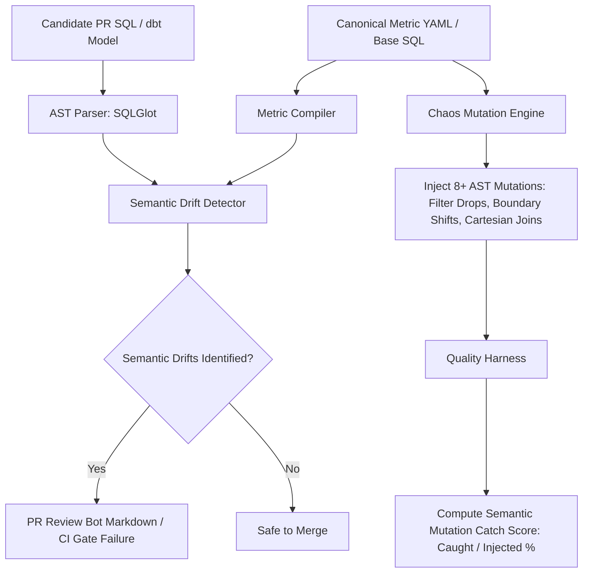

<div align="center">

# 🛡️ Semantic Reliability Engine
**AST-Level Semantic Drift Detection, Centralized Metric Compilation, and Chaos Mutation Testing for SQL Pipelines & Data Contracts**

[](https://www.python.org/downloads/)
[](https://github.com/tobymao/sqlglot)
[](https://opensource.org/licenses/MIT)

*Does your data CI/CD pipeline catch silent metric mutations, Cartesian joins, and population filter shifts — or are your dbt tests passing while your Looker dashboards show 40% wrong revenue?*

[⚡ Quickstart](#-quickstart) • [🔍 3 Core Pillars](#-the-3-core-pillars) • [🧬 Chaos Mutation Testing](#-chaos-mutation-testing-for-data) • [🤖 CI/CD PR Bot Integration](#-github-pr-bot-integration) • [📚 CLI Reference](#-cli-reference)

</div>

---

## 💥 The Problem: The "Silent Green Build"

Traditional data quality testing tools (dbt tests, Great Expectations, Monte Carlo) focus on **syntactic, volumetric, and schema health**:
- ✅ Table exists and columns match schema.
- ✅ Null rates are below 1%.
- ✅ Output keys are unique.
- ✅ Row volume didn't fluctuate beyond thresholds.

**The Blind Spot:** A developer modifies `fct_net_revenue.sql` in a PR, inadvertently dropping `WHERE status = 'active'` or inverting the refund deduction (`+` instead of `-`).

The standard test suite runs, all schema, unique, and not-null tests **PASS (Green Build)**, the PR is merged, and Finance reports wrong numbers to leadership.

### 🏆 Multi-Model Scientific Mutation Benchmark (Dual-Track Protocol)

```
$ sre benchmark-corpus --corpus benchmark_corpus/ --split all --json-out corpus_results.json

╭────── 🏆 Multi-Model Semantic Mutation Benchmark & Scientific Validity ──────╮
│ Corpus Root: benchmark_corpus                                                │
│ Track Selection: ALL (Development + Frozen Holdout)                          │
│ Scientific Policy: Validity Policy v1.0 (OASIS Analytics Standard)           │
╰──────────────────────────────────────────────────────────────────────────────╯

                 Benchmark Matrix: Development Track (8 Models)                 
┏━━━━━━━━━━━━━━━━━┳━━━━━━━┳━━━━━━━━━┳━━━━━━━━━┳━━━━━━┳━━━━┳━━━━┳━━━━━━━━━━━━━━━━━┓
┃ Model / Metric  ┃   Mut ┃     Std ┃     Sem ┃ Gain ┃ C… ┃ A… ┃ Validity &      ┃
┃                 ┃ (Val) ┃   Catch ┃   Catch ┃  (Δ) ┃    ┃    ┃ Confidence      ┃
┡━━━━━━━━━━━━━━━━━╇━━━━━━━╇━━━━━━━━━╇━━━━━━━━━╇━━━━━━╇━━━━╇━━━━╇━━━━━━━━━━━━━━━━━┩
│ Net Revenue     │ 5 / 5 │   20.0% │  100.0% │ +80… │ 6… │ 1… │ CONCLUSIVE(HIGH)│
│ SLA Compliance  │ 3 / 3 │    0.0% │   66.7% │ +66… │ 6… │ 1… │ CONCLUSIVE(HIGH)│
│ Monthly Active U│ 3 / 3 │   33.3% │  100.0% │ +66… │ 5… │ 1… │ QUALIFIED(MED)  │
│ Customer Retenti│ 3 / 3 │    0.0% │    0.0% │ 0.0% │ 4… │ 6… │ QUALIFIED(MED)  │
│ Customer Churn  │ 3 / 3 │   33.3% │  100.0% │ +66… │ 2… │ 5… │ INCONCLUSIVE(LOW│
│ Average Order Va│ 2 / 3 │    0.0% │   50.0% │ +50… │ 2… │ 5… │ INCONCLUSIVE(LOW│
│ Inventory Turnov│ 3 / 3 │    0.0% │   33.3% │ +33… │ 2… │ 1… │ INCONCLUSIVE(LOW│
│ Checkout Convers│ 3 / 3 │   33.3% │   33.3% │ 0.0% │ 2… │ 5… │ INCONCLUSIVE(LOW│
├─────────────────┼───────┼─────────┼─────────┼──────┼────┼────┼─────────────────┤
│ Track Average   │     - │   15.0% │   60.4% │ +45… │  - │  - │ SUMMARY         │
└─────────────────┴───────┴─────────┴─────────┴──────┴────┴────┴─────────────────┘

               Benchmark Matrix: Frozen Holdout Track (6 Models)                
┏━━━━━━━━━━━━━━━━━┳━━━━━━━┳━━━━━━━━━┳━━━━━━━━━┳━━━━━━┳━━━━┳━━━━┳━━━━━━━━━━━━━━━━━┓
┃ Model / Metric  ┃   Mut ┃     Std ┃     Sem ┃ Gain ┃ C… ┃ A… ┃ Validity &      ┃
┃                 ┃ (Val) ┃   Catch ┃   Catch ┃  (Δ) ┃    ┃    ┃ Confidence      ┃
┡━━━━━━━━━━━━━━━━━╇━━━━━━━╇━━━━━━━━━╇━━━━━━━━━╇━━━━━━╇━━━━╇━━━━╇━━━━━━━━━━━━━━━━━┩
│ B2B SaaS ARR    │ 3 / 3 │    0.0% │  100.0% │ +10… │ 1… │ 1… │ CONCLUSIVE(HIGH)│
│ Cloud Compute B…│ 4 / 4 │    0.0% │  100.0% │ +10… │ 1… │ 1… │ CONCLUSIVE(HIGH)│
│ Fintech Chargeb…│ 2 / 3 │    0.0% │  100.0% │ +10… │ 6… │ 1… │ CONCLUSIVE(HIGH)│
│ Ad Campaign ROAS│ 3 / 3 │    0.0% │   33.3% │ +33… │ 6… │ 1… │ CONCLUSIVE(HIGH)│
│ Hospital Readmi…│ 3 / 3 │    0.0% │    0.0% │ 0.0% │ 6… │ 1… │ CONCLUSIVE(HIGH)│
│ Marketplace Tak…│ 3 / 3 │    0.0% │   33.3% │ +33… │ 6… │ 5… │ INCONCLUSIVE(LOW│
├─────────────────┼───────┼─────────┼─────────┼──────┼────┼────┼─────────────────┤
│ Track Average   │     - │    0.0% │   61.1% │ +61… │  - │  - │ SUMMARY         │
└─────────────────┴───────┴─────────┴─────────┴──────┴────┴────┴─────────────────┘
```

> **Key Empirical Finding:** The semantic catch advantage generalizes to fresh, independently designed metrics and Tier-2 realistic fixtures. On the frozen holdout track, standard dbt checks missed **100% of injected valid defects (0.0% catch rate)**, whereas policy-driven semantic assertions caught **61.1%** (+61.1 percentage point incremental gain).

---

## 🏗️ Architecture



---

## 🚀 Quickstart

### 1. Install via pip
```bash
git clone https://github.com/monika/semantic-reliability-engine.git
cd semantic-reliability-engine
pip install -r requirements.txt
```

### 2. Inspect Semantic Drift between Baseline and Candidate SQL
```bash
python -m semantic_reliability.cli check \
  --base examples/models/fct_net_revenue_baseline.sql \
  --candidate examples/models/fct_net_revenue_drifted.sql
```

### 3. Generate Chaos Mutations for a Model
```bash
python -m semantic_reliability.cli mutate \
  --sql examples/models/fct_net_revenue_baseline.sql \
  --output-dir mutations_output/
```

### 4. Benchmark your Data Test Suite (Mutation Score)
```bash
python -m semantic_reliability.cli benchmark \
  --sql examples/models/fct_net_revenue_baseline.sql \
  --report mutation_report.md
```

---

## 🔍 The 4 Core Pillars

### 1. Centralized Business Metric Compiler (`compiler/`)
Define metrics in declarative YAML with **Policy Invariants**. The compiler parses canonical SQL into ASTs and transpiles dialect-agnostically across Snowflake, BigQuery, Postgres, and DuckDB:

```yaml
metric: net_revenue
description: Recognized revenue minus refunds for active enterprise customers
owner: finance
grain: customer_month
dialect: postgres
invariants:
  population:
    required_filters:
      - "status = 'active'"
      - "region = 'NA'"
  grain:
    required_dimensions:
      - customer_id
      - "date_trunc('month', transaction_date)"
  aggregation:
    required_function: SUM
    positive_components:
      - "type = 'invoice'"
    negative_components:
      - "type = 'refund'"
  time:
    timezone: UTC
sql: |
  SELECT
    customer_id,
    DATE_TRUNC('month', transaction_date) AS reporting_month,
    SUM(CASE WHEN type = 'invoice' THEN amount ELSE 0 END) -
    SUM(CASE WHEN type = 'refund' THEN amount ELSE 0 END) AS net_revenue
  FROM transactions
  WHERE region = 'NA' AND status = 'active'
  GROUP BY customer_id, DATE_TRUNC('month', transaction_date)
```

### 2. Multi-Vector AST Semantic Drift Detector & Equivalence Engine (`drift/`)
- **AST Canonicalization (`normalizer.py`):** Automatically normalizes commutative predicates (`WHERE status = 'active' AND region = 'NA'` $\equiv$ `WHERE region = 'NA' AND status = 'active'`) and strips redundant parentheses to ensure **zero false positives** on cosmetic edits.
- **Structural Anomaly Vectors:** Detects `FILTER_REMOVAL`, `SEMANTIC_LOGIC_SHIFT`, `AGGREGATION_FUNCTION_SHIFT`, `JOIN_PREDICATE_MUTATION`, `GRAIN_DRIFT`, `NULL_HANDLING_DRIFT`, and `TABLE_TARGET_SHIFT`.

### 3. Empirical DuckDB Fixture Execution & Equivalent Mutation Exclusion (`harness/`)
Executes baseline and mutated models on real fixture datasets in DuckDB to measure empirical data variance:
- **`Row Δ`**: Exact row count shifts caused by mutated filters or Cartesian joins.
- **`Metric Variance %`**: Mathematical divergence in numerical totals.
- **`Equivalent Mutation Exclusion`**: If an injected mutation causes zero data variance on fixture datasets, it is classified as an **Equivalent Mutation** and excluded from the denominator.

$$\text{Effective Semantic Catch Score} = \frac{\text{Caught Real Defects}}{\text{Total Injected Mutations} - \text{Equivalent Mutations}} \times 100\%$$

### 4. CI/CD Governance & SARIF 2.1.0 Export (`harness/sarif_exporter.py`)
Generates native SARIF 2.1.0 reports for GitHub Code Scanning / Security Tab annotations and PR review comments.

---

## 🤖 GitHub Actions & PR Integration

Run in CI to fail pull requests on contract violations and export SARIF:

```bash
python -m semantic_reliability.cli check \
  --metric examples/metrics/net_revenue_contract.yaml \
  --candidate target/compiled/fct_net_revenue.sql \
  --sarif code_scanning_results.sarif \
  --fail-on-drift
```

---

## 🤖 GitHub PR Bot Integration

Generate markdown PR comments in your GitHub Actions CI workflow:

```bash
python -m semantic_reliability.cli pr-comment \
  --base models/marts/fct_net_revenue.sql \
  --candidate target/compiled/fct_net_revenue.sql \
  --output pr_comment.md
```

### Example PR Comment Output:
> ## 🚨 Semantic Drift Alert: `fct_net_revenue.sql`
> **Highest Severity:** `CRITICAL` | **Drifts Identified:** `2`
> 
> | Severity | Drift Type | Component | Business Impact |
> | :--- | :--- | :--- | :--- |
> | **`CRITICAL`** | `SEMANTIC_LOGIC_SHIFT` | WHERE Clause (Population Definition) | Population criteria modified. Dashboards will silently exclude active users. |
> | **`HIGH`** | `AGGREGATION_EXPRESSION_SHIFT` | SELECT Clause (Mathematical Payload) | Refund subtraction omitted. Net revenue will be inflated. |
> 
> ```diff
> - Baseline:  WHERE region = 'NA' AND status = 'active'
> + Candidate: WHERE region = 'NA' AND last_login >= CURRENT_DATE - INTERVAL '30' DAY
> ```

---

## 📚 CLI Reference

| Command | Usage | Description |
| :--- | :--- | :--- |
| `compile` | `sre compile --metric <yaml> [--target-dialect <d>]` | Compiles YAML metric into formatted SQL |
| `check` | `sre check --base <sql> --candidate <sql> [--fail-on-drift]` | Detects semantic drift between two SQL models |
| `mutate` | `sre mutate --sql <sql> --output-dir <dir>` | Injects AST chaos mutations into a model |
| `benchmark` | `sre benchmark --sql <sql> [--report <md>]` | Evaluates test suite catch rate against mutations |
| `pr-comment` | `sre pr-comment --base <sql> --candidate <sql> --output <md>` | Outputs formatted markdown comment for CI bots |

---

## 🧪 Testing

Run the test suite with pytest:
```bash
pytest tests/ -v
```

---

## 📄 License
MIT License.
